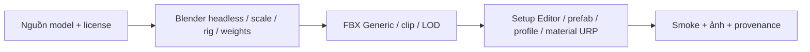

# 01 — Công nghệ và công cụ

## Mục lục
- [Phiên bản và nền tảng](#phiên-bản-và-nền-tảng)
- [Rendering và chữ](#rendering-và-chữ)
- [Input và navigation](#input-và-navigation)
- [AR và plugin nhận cử chỉ](#ar-và-plugin-nhận-cử-chỉ)
- [Pipeline asset và giấy phép](#pipeline-asset-và-giấy-phép)
- [Pipeline nội dung học](#pipeline-nội-dung-học)
- [Công cụ phát triển](#công-cụ-phát-triển)

## Phiên bản và nền tảng

Các bản dưới lấy từ [ProjectVersion.txt](../ProjectSettings/ProjectVersion.txt), [manifest.json](../Packages/manifest.json), không phải suy từ tên brief. `packages-lock.json` là nơi xem dependency đã resolve; manifest MCP trỏ nhánh `main`, vì vậy không coi đó là version cố định.

| Công nghệ | Bản trên đĩa | Là gì, dùng ở đâu và vì sao |
|---|---|---|
| Unity | 6000.6.2f1 | Engine quản lý scene, component, renderer, physics, serialization; chung runtime PC/Android |
| URP | 17.6.0 | Universal Render Pipeline; pipeline rendering có renderer và feature riêng PC/mobile/AR |
| Input System | 1.20.0 | Lớp input action thống nhất bàn phím, chuột, joystick và touch qua CampusInput |
| AI Navigation | 2.0.14 | Bake NavMeshSurface, NavMeshAgent và link; campus nhiều tầng và đĩa AR runtime |
| uGUI | 2.6.0 | Canvas, RectTransform, EventSystem, Button; UI chủ yếu dựng bằng code |
| Timeline | 6.6.0 | Điều phối shot cinematic P21; không làm lõi quyết định combat |
| Test Framework | 1.8.0 | Hạ tầng test Unity; phần lớn smoke riêng là MonoBehaviour harness |
| AR Foundation / ARCore | 6.6.2 / 6.6.2 | API AR đa provider và provider Android nhận mặt phẳng/pose/depth |
| XR Management | 4.7.0 | Lifecycle loader; AR bật theo scene, không tự mở camera ở game thường |
| Unity MCP | Git URL `#main` | Bridge editor để tool bên ngoài đọc trạng thái/gọi C#; không thuộc game phát hành |
| MediaPipe Tasks Vision | 1.0.0 | Dependency Android trong mainTemplate.gradle; recognizer chạy trên máy |

TextMeshPro (TMP, renderer chữ dùng signed distance field) xuất hiện trong `Assets/TextMesh Pro/` và code dùng namespace `TMPro`; không có package TMP riêng trong manifest hiện hành. Không gán một version TMP độc lập không được khai báo.

## Rendering và chữ

**Renderer** là bộ dựng một frame của URP; **renderer feature** thêm pass vào quy trình đó. [ComicInkFeature](../Assets/CampusRiftUI/Runtime/ComicInkFeature.cs) tạo nét mực; [PC_Renderer](../Assets/Settings/PC_Renderer.asset) có Comic Ink và SSAO (screen-space ambient occlusion, làm tối tiếp xúc). [Mobile_Renderer](../Assets/Settings/Mobile_Renderer.asset) giảm tính năng để bớt GPU cost. ComicInk không phù hợp nền camera AR nên renderer AR dùng feature background của AR.

| Cấu hình asset | PC | Mobile |
|---|---:|---:|
| [Render pipeline](../Assets/Settings/PC_RPAsset.asset) / [mobile](../Assets/Settings/Mobile_RPAsset.asset): renderScale | 1 | 0,8 |
| MSAA serialized | 1 (tắt) | 1 (tắt) |
| Main light shadow map | 2048 | 1024 |
| Shadow distance | 50 m | 50 m |
| Cascades | 4 | 1 |
| Additional light shadows / soft shadows | bật / bật | tắt / tắt |

Render scale giảm kích thước ảnh 3D trung gian, không chia đôi camera viewport. [ARXRLoaderControl.Start](../Assets/ARRift/Runtime/ARXRLoaderControl.cs) tạo bản sao pipeline cho phiên AR, chọn renderer 0, đặt camera rect `(0,0,1,1)` và bỏ targetTexture. [ARAdaptiveQuality.Update](../Assets/ARRift/Runtime/ARAdaptiveQuality.cs) có thể hạ scale phiên AR xuống 0,85; không ghi đè asset gốc.

TMP dùng font asset/atlas để đọc tiếng Việt ở nhiều cỡ. [Accessibility](../Assets/CampusRiftUI/Runtime/Accessibility.cs) và [ComicTextAudit](../Assets/CampusRiftUI/Validation/ComicTextAudit.cs) xử lý cỡ chữ, overflow và ký hiệu hệ. Bài học cần font đứng, rõ, không mang cách viết toàn chữ hoa của nút comic sang nội dung câu hỏi. Lỗi đã gặp: thiếu glyph/dấu, text wrap và rect quá nhỏ; xem [P20](../task/p20/REPORT-P20.md), [UI round3](../task/ui-comic/REPORT-round3.md).

## Input và navigation

| Mục | Dùng ở đâu → lựa chọn → cấu hình → lỗi |
|---|---|
| Input actions | [CampusInput](../Assets/Controls/Runtime/CampusInput.cs): ánh xạ action thành phím/touch, tránh runtime kỹ năng tự biết vị trí ô. PlayerSettings `activeInputHandler: 1`. Các identity Wall/Hand/Phantom được adapter ánh xạ sang 4 slot. Pause reset touch/latch để tránh nút giữ bị kẹt |
| Mobile touch | [MobileControlsHUD](../Assets/Controls/Runtime/MobileControlsHUD.cs), [MobileTouchZone](../Assets/Controls/Runtime/MobileTouchZone.cs): giữ pointer ID độc lập cho joystick và BOOST. POLISH 2 bỏ auto sprint mặc định; giữ là chạy, thả là dừng. Có migration setting cũ một lần |
| NavMesh | [MinionMotor.Place/MoveTo](../Assets/Enemies/Runtime/MinionMotor.cs): chọn đường trên mặt đi được, không phải raycast thẳng xuyên tường. Stairs dùng link; Shaban có planner thang máy riêng. Đĩa AR có agent type theo scale và bake một lần |
| RoomGraph | [RoomGraph](../Assets/MonsterShaban/Scripts/RoomGraph.cs), [RoomPathfinder](../Assets/MonsterShaban/Scripts/RoomPathfinder.cs): graph semantic Door/StairLanding/Junction/Outdoor bổ sung NavMesh. Tránh nhầm tầng khi chỉ so khoảng cách XZ |

## AR và plugin nhận cử chỉ

AR Foundation không phân loại bàn tay. ARCore cung cấp pose/plane/camera; MediaPipe làm inference (chạy mô hình để suy ra landmark/nhãn). Phân tách này cho phép đổi chất lượng inference mà giữ combat Unity. Luồng chi tiết ở [chương 05](05-AR-VA-DEEP-LEARNING.md).

| Thành phần | Nơi dùng / cấu hình quan trọng / lý do và lỗi |
|---|---|
| ARSession và XR loader | [ARSessionBootstrap](../Assets/ARRift/Runtime/ARSessionBootstrap.cs) xin consent/quyền; [ARXRLoaderControl](../Assets/ARRift/Runtime/ARXRLoaderControl.cs) đợi surface landscape rồi InitializeLoader. Loader-owned cleanup khi thoát giúp game thường không tiếp tục giữ camera |
| Kotlin bridge | [GestureBridge.kt](../Assets/Plugins/Android/GestureBridge.kt): HandlerThread, LIVE_STREAM, một tay, confidence 0,4; GPU/CPU thử 30 frame mỗi loại; trả kết quả qua Listener. Không có AAR tự viết được chứng minh trong source: bridge `.kt` được build processor copy vào generated Gradle project |
| Model | `Assets/StreamingAssets/gesture_recognizer.task`, bundle model TFLite; report fix3 xác minh 8.373.440 byte, ZIP APK dạng STORED. Không sửa/train model trong project |
| Gradle | [mainTemplate.gradle](../Assets/Plugins/Android/mainTemplate.gradle): Tasks Vision 1.0.0, Java 17, noCompress gồm StreamingAssets. [launcherTemplate.gradle](../Assets/Plugins/Android/launcherTemplate.gradle) là app module. Comment template ghi AGP 9 tích hợp Kotlin; không tự thêm plugin Kotlin cũ |
| Generated project hook | [ARAndroidBuildProcessor.OnPostGenerateGradleAndroidProject](../Assets/ARRift/Editor/ARAndroidBuildProcessor.cs): copy bridge kể cả incremental, chặn duplicate source, keep class qua ProGuard, manifest sensorLandscape và VIBRATE. Template có thể bị Unity ghi lại, phải kiểm generated output/APK |
| ABI/backend/API | [ProjectSettings](../ProjectSettings/ProjectSettings.asset): ARM64 (`AndroidTargetArchitectures: 2`), min SDK 26, target SDK 0 = automatic, GLES3-only, pre-transform tắt. [fix3 report](../task/ar/REPORT-AR-fix3.md) xác minh APK IL2CPP; không suy target API cụ thể từ số 0 |

IL2CPP chuyển C# qua C++ trước native build; ARM64 là kiến trúc 64 bit, gói Android dùng ABI (giao ước nhị phân) `arm64-v8a`; GLES3 là API đồ họa Android. Đây là lựa chọn cấu hình project và APK lịch sử, không có nghĩa mọi máy ARM64 đều hỗ trợ ARCore.

Lỗi nền đen: [fix2](../task/ar/REPORT-AR-fix2.md) thấy Manual Vulkan→GLES3, thiếu `ARCommandBufferSupportRendererFeature` cần cho đường Vulkan; đã chuyển GLES3-only và khóa landscape trước XR. Không có chứng minh riêng pre-transform là nguyên nhân duy nhất trên thiết bị. [Tài liệu Unity ARCore 6.6 về graphics API](https://docs.unity3d.com/Packages/com.unity.xr.arcore@6.6/manual/project-configuration-arcore.html#graphics-api) là nguồn kỹ thuật được report đối chiếu.

## Pipeline asset và giấy phép

**FBX** là interchange cho mesh/rig/animation Unity; **GLB** là glTF dạng nhị phân thường nhận từ nguồn tải. Blender headless (không mở giao diện) chuyển/chuẩn hóa asset theo script, không phải Unity tự rig model GLB.

| Pipeline | Nguồn cụ thể, vì sao chọn và lỗi cần tránh |
|---|---|
| Model campus/quái/rồng | [GameReadyModels README](../Assets/GameReadyModels/README_VI.md), [Dragons README](../Assets/GameReadyDragons/README_Dragons_VI.md), [monsters_convert.py](../Tools/monsters_convert.py). Giữ prefab GUID và collider/navigation root khi thay visual; nguồn người dùng không tự gán CC 0 |
| Nhân vật SchoolGirl | [README nguồn](../Assets/Characters/SchoolGirl/README.md): Generic rig/clip chạy gốc, Idle từ bind pose, visual khoảng 1,68 m; texture remap sang URP. CharacterController sở hữu movement, Animator không root motion. README này còn phím E/R và walk 3,2 của phiên cũ; input/tốc hiện hành phải theo CampusInput/CampusExplorer |
| P19 bổ sung | [PIPELINE](../task/models/PIPELINE.md), [models_p19_pipeline.py](../Tools/models_p19_pipeline.py): Blender 5.2.1, tối đa 4 weights, 24 clip chung +4 clip vai, FBX Generic 30 FPS, decimate. Script pipeline nguồn bên ngoài workspace là dependency người dùng; không chép đường dẫn tài khoản vào tài liệu |
| PBR | Albedo/normal/metallic/smoothness/emission; P19 ASTC 6×6, Android 1024 px, PC 2048 px theo pipeline. Chuyển specular→smoothness là heuristic, không phải vật liệu đo quang học. Re-run giảm bão hòa phải bắt đầu từ texture source để tránh cộng dồn |
| Tài nguyên miễn phí | Kế hoạch ưu tiên Poly Pizza/Quaternius/Kenney; không gọi mọi model hiện hành là Poly Pizza. [Replacement LICENSES](../Assets/Enemies/Models/ReplacementP19/LICENSES.md): Night Demon CC-BY 3; Mage CC-BY-SA 3; Bat/Golem CC 0. [MODELS report](../task/models/REPORT-MODELS-P19.md) ghi cụ thể nguồn/tác giả |
| Share-alike | Với Mage, giữ attribution/license và source dẫn xuất mesh/rig/clip/LOD theo LICENSES. Phạm vi giấy phép asset không tự mở rộng sang toàn code game. Đây là mô tả provenance repository; quyết định pháp lý phát hành cần kiểm riêng |
| Âm thanh | [Audio README](../Assets/Audio/README.md), [LICENSES-P17](../Assets/Audio/LICENSES-P17.md), [P21 LICENSES](../Assets/Audio/Resources/P21/LICENSES.md). GameSfx ánh xạ Resources, LevelMusicDirector/mixer đặt trạng thái. POLISH 2 chỉ còn quai-nho-2/quai-nho-3, không tham chiếu clip 1 đã xóa |

## Pipeline nội dung học

Nguồn giáo trình được chuyển văn bản → CSV giữ ID/trang nguồn → importer Editor → `CourseData`, `LessonData`, `QuestionBankData` → validation → gói duyệt giảng viên. [content_build.py](../Tools/content_build.py), [p20_content.py](../Tools/p20_content.py) và [p20_export_content.py](../Tools/p20_export_content.py) là công cụ dữ liệu; không chạy trong APK.

Tách nội dung khỏi combat giúp sửa câu hỏi mà không sửa runtime. Chỉ import lại sau kiểm ID, đáp án, giải thích, nguồn trang và encoding UTF-8. PowerShell 5.1/reader cp1252 đã gây tiếng Việt sai; [PERF report](../task/perf/REPORT-PERF-FIRE.md) ghi sửa reader UTF-8. Validation cấu trúc không thay việc giảng viên duyệt nội dung; gói P23 vẫn chờ duyệt.

## Công cụ phát triển

| Công cụ | Cách dùng trong project / lựa chọn / lỗi |
|---|---|
| Unity MCP qua HTTP | [ar_rpc.py](../Tools/ar_rpc.py), [ar_session.py](../Tools/ar_session.py) và các helper Tools điều phối Editor có trạng thái. Dùng để truy vấn/gọi C#, tránh dựa vào ảnh đoán component. Không chạy helper hot reload khi XR đang Play: báo cáo AR ghi mất managed state |
| Codex CLI runner | `task/run-*.ps1` phân job, log và tài khoản đã cấu hình bên ngoài tài liệu. Job DOCS không thay runner, không đưa nội dung cấu hình tài khoản vào Docs. PROGRESS nằm cạnh brief để tiếp quản sau ngắt |
| Harness PlayMode | MonoBehaviour chạy fixture và ghi JSON/DONE/screens; xem [V2RegressionRunner](../Assets/Levels/Validation/V2RegressionRunner.cs). Giúp kiểm deterministic logic/pipeline thật; phải đáp ứng precondition, không bỏ assertion để biến FAIL thành PASS |
| Gate | [TEST-POLICY](../task/TEST-POLICY.md), [ReleaseContentGate](../Assets/Learning/Editor/ReleaseContentGate.cs): quy tắc phạm vi test/phát hành. Đọc kết quả thô và baseline; bằng chứng Editor không tự thành bằng chứng Android |

Job này chỉ kiểm tài liệu và file trên đĩa. Lệnh build/Play trong các chương là hướng dẫn cho công việc tương lai, không được thực thi trong job DOCS.
