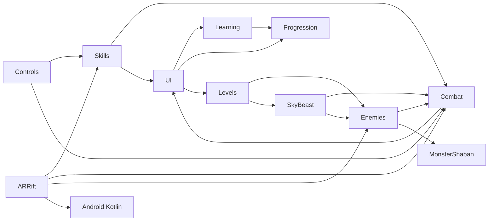
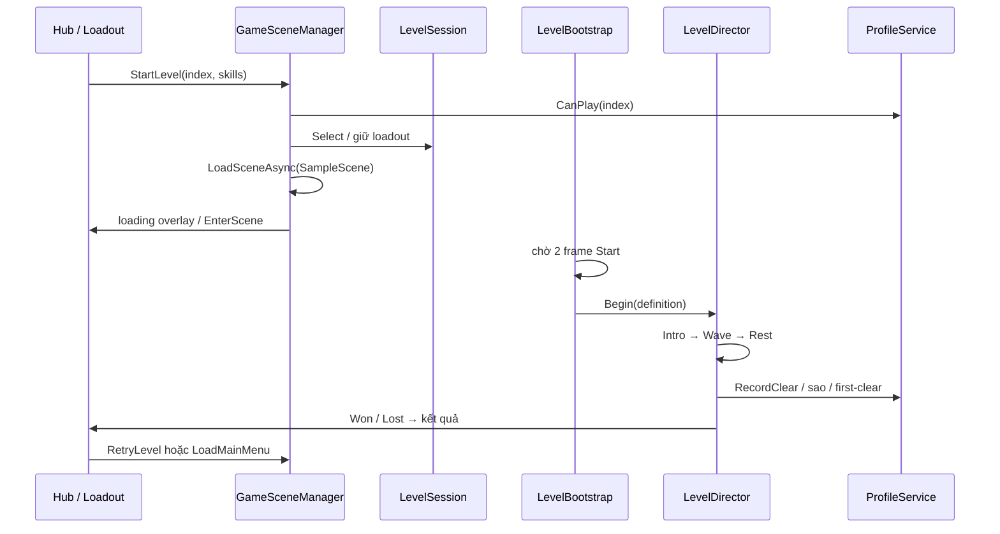

# 02 — Kiến trúc và luồng game

## Mục lục
- [Module và assembly](#module-và-assembly)
- [Scene và vòng đời màn](#scene-và-vòng-đời-màn)
- [Service và sự kiện](#service-và-sự-kiện)
- [Dữ liệu ScriptableObject](#dữ-liệu-scriptableobject)
- [Save và profile](#save-và-profile)
- [Dev Mode](#dev-mode)
- [Pool và vòng đời đối tượng](#pool-và-vòng-đời-đối-tượng)
- [Localization và settings](#localization-và-settings)
- [Ranh giới AR và game thường](#ranh-giới-ar-và-game-thường)

## Module và assembly

Source game trong `Assets/` không có `.asmdef`; runtime biên dịch chung `Assembly-CSharp`, code dưới `Editor/` vào `Assembly-CSharp-Editor`. Namespace là cách tổ chức, chưa phải ranh giới dependency compiler. Các package có assembly riêng; không suy rằng cả Unity chỉ có hai assembly.

| Module | Trách nhiệm | Điểm vào |
|---|---|---|
| Controls / Scripts / Characters | Input, di chuyển CharacterController, energy/boost, camera, visual nhân vật | [CampusInput](../Assets/Controls/Runtime/CampusInput.cs), [CampusExplorer](../Assets/Scripts/CampusExplorer.cs) |
| Combat | Damage, targeting, trạng thái, đánh thường/né, reaction và feedback | [PlayerCombat](../Assets/Combat/Runtime/PlayerCombat.cs), [DamageInfo](../Assets/Combat/Runtime/DamageInfo.cs) |
| Skills | Data kỹ năng, adapter 3 skill cũ, runtime mới, loadout và pool VFX | [SkillLoadout](../Assets/Skills/Core/Runtime/SkillLoadout.cs) |
| Enemies | Registry, quái thường, phối hợp, model driver, affix, pool | [EnemyDirector](../Assets/Enemies/Runtime/EnemyDirector.cs), [EnemyPool](../Assets/Enemies/Runtime/EnemyPool.cs) |
| MonsterShaban | Perception, memory/belief, hunt/search, navigation/lift và combat Shaban | [MonsterBrain](../Assets/MonsterShaban/Scripts/MonsterBrain.cs) |
| Levels | Catalog, wave, spawn queue/cap, rest, sao/kết quả, hậu kết | [LevelDirector](../Assets/Levels/Runtime/LevelDirector.cs) |
| SkyBeast | Orbit, fire/shelter, scheduler cự thú, Kiếm Ý, cinematic Thiên Kiếm | [SkyBeastScheduler](../Assets/SkyBeast/Runtime/SkyBeastScheduler.cs) |
| Learning | Nội dung, quiz/grader, exam, review, thẻ, câu sai, Linh Bia | [LearningEngine](../Assets/Learning/Runtime/LearningEngine.cs) |
| Progression | Hồ sơ v2, Tu Vi, wallet, inventory/buff/artifact, endgame/telemetry | [ProfileService](../Assets/Progression/Runtime/ProfileService.cs) |
| CampusRiftUI / Localization / Audio | Luồng UI, comic builder, settings, text/font, mixer/music/SFX | [UIStateManager](../Assets/CampusRiftUI/Runtime/UIStateManager.cs) |
| CampusLook / Collision / AutomaticDoors / Elevators | Look campus, collider clearance, cửa và cabin; không phải bộ điều phối trận | [CampusAutomaticDoor](../Assets/Scripts/CampusAutomaticDoor.cs), [CampusElevator](../Assets/Scripts/CampusElevator.cs) |
| ARRift / Plugins/Android | XR lifecycle, plane/anchor, camera inference và AR combat context | [ARBattlefield](../Assets/ARRift/Runtime/ARBattlefield.cs) |



Các mũi tên mô tả lời gọi thực tế, có chiều ngược về UI cho feedback. Kiến trúc chưa thuần dependency inversion: Combat/Skills tham chiếu UI và một số module biết singleton nhau. Khi tách asmdef phải xử lý vòng phụ thuộc, không chỉ thêm file assembly vào mỗi thư mục.

## Scene và vòng đời màn

[EditorBuildSettings](../ProjectSettings/EditorBuildSettings.asset) bật bốn scene: [MainMenu](../Assets/Scenes/MainMenu.unity), [SampleScene](../Assets/Scenes/SampleScene.unity), [ARRiftBattle](../Assets/ARRift/Scenes/ARRiftBattle.unity), [ARGestureDebug](../Assets/ARRift/Scenes/ARGestureDebug.unity). Không có mười scene tương ứng mười màn: cùng campus nhận `LevelDefinition` khác nhau. Sảnh là UI state trong scene menu, Sandbox là SampleScene không chọn LevelSession.



[GameSceneManager.LoadRoutine](../Assets/CampusRiftUI/Runtime/GameSceneManager.cs) vẽ overlay một frame trước khi load, chuẩn hóa progress Unity 0–0,9 thành 0–1, giữ tối thiểu 0,35 s. `StartNewGame()` đi màn 1; `ContinueGame()` dùng màn chưa qua tiếp theo, không khôi phục world position. `LoadMainMenu()` cắm `OpenHubOnLoad`, vì về sau trận nên mở Sảnh. Retry giữ màn/loadout.

[LevelBootstrap.Loaded/Begin](../Assets/Levels/Runtime/LevelBootstrap.cs) không khởi động nếu `LevelSession.Current == null`; có chọn màn thì đợi hai frame để UI/player Start xong. [LevelDirector.Begin](../Assets/Levels/Runtime/LevelDirector.cs) reset queue/pending/alive, seed, pool, voice, player/items/loadout, sky/event và subscriptions. `End()` dừng fire/cinematic, pool/rift, dọn telegraph và phục hồi Shaban nền. Đây là lý do không tạo song song hai director cho một scene.

## Service và sự kiện

**Singleton** là một instance được tìm qua static; **service** là đối tượng làm nhiệm vụ dùng chung. Service logic như CultivationService không cần MonoBehaviour. `Ensure()` tạo khi thiếu; `DontDestroyOnLoad` chỉ dùng nơi cần sống qua scene, không áp dụng mọi director.

| Đối tượng | Lifecycle và API |
|---|---|
| ProfileService | Boot BeforeSceneLoad, persistent, default order−600; `Ensure`, `MarkDirty`, `Flush`, `UseTransient`, `EndTransient` |
| LocalizationService | Boot BeforeSceneLoad, persistent; sceneLoaded/Settings Changed kích `Discover` và `Preview` |
| UIStateManager | Scene UI sở hữu; Changed thông báo panel/input. `Set` tập trung timeScale, audio pause và cursor |
| EnemyDirector | Registry theo scene; order−50, static spawn/death, token, squad và voice |
| LevelDirector | order−40, lifecycle run; `LevelEvents` là bus cho UI/sky/telemetry |
| LearningEngine | Logic quiz/reward không phụ thuộc frame trực tiếp; clock/store được truyền để kiểm thử |

Sự kiện tách người phát và listener: `EnemyDied` làm Level/SwordIntent cập nhật, `ProfileService.Changed` làm UI refresh, `ReactionResolver.Feedback` làm chữ/âm/VFX. Đăng ký trong OnEnable/Begin phải hủy trong OnDisable/End/OnDestroy; đối tượng pool không bị destroy mỗi lần chết, nên subscription sai dễ nhân đôi thưởng/âm.

`RuntimeInitializeOnLoadMethod(SubsystemRegistration)` reset static ở nhiều module để lần Play tiếp không giữ Instance/event cũ, kể cả khi cấu hình Enter Play Mode không reload domain. Tuy vậy AR provider/hot reload còn có state native; không coi reset static là cách sửa mọi lỗi XR.

## Dữ liệu ScriptableObject

ScriptableObject là asset chứa cấu hình được serialize bằng Unity, không phải prefab thực thi. Hành vi ở component runtime, bảng số ở asset; `Resources.Load` dùng path bỏ `Resources/` và extension.

| Data | Asset / nơi giải quyết ID |
|---|---|
| Kỹ năng | [SkillDefinition](../Assets/Skills/Core/Runtime/SkillDefinition.cs), [SkillCatalog](../Assets/Skills/Core/Resources/SkillCatalog.asset), `Core/Data/*.asset`; runtime hiện gắn component, không có `runtimePrefab` như ví dụ kế hoạch |
| Màn | [LevelDefinition](../Assets/Levels/Runtime/LevelDefinition.cs), [LevelCatalog](../Assets/Levels/Resources/LevelCatalog.asset), [LevelSpawnTable](../Assets/Levels/Runtime/LevelSpawnTable.cs) |
| Quái / AI | [EnemyArchetype](../Assets/Enemies/Runtime/EnemyArchetype.cs), [AITierProfiles](../Assets/Enemies/Resources/AITierProfiles.asset), animation/affix asset |
| Tu luyện / kinh tế | [CultivationTable](../Assets/Progression/Resources/CultivationTable.asset), [EconomyConfig](../Assets/Progression/Resources/EconomyConfig.asset), [ItemCatalog](../Assets/Progression/Resources/ItemCatalog.asset) |
| Học | [LearningCatalog](../Assets/Learning/Resources/LearningCatalog.asset), Course/Lesson/QuestionBank |
| AR | [ARModeSettings](../Assets/ARRift/Settings/ARModeSettings.asset), GestureSkillMapper, AR pipeline/renderer |

ID kỹ năng/bài/câu/item lưu trong hồ sơ là giao kèo lâu dài. Không đổi ID chỉ để đổi tên hiển thị; enum serialized như Element/StatusType cần append, không đảo thứ tự. Khi điều tra một tham số: tìm field C# → asset reference/GUID → value asset → runtime multiplier. Một số field rank tồn tại trong asset nhưng runtime dùng công thức riêng; xem chương 03.

## Save và profile

[ProfileData](../Assets/Progression/Runtime/ProfileData.cs) `CurrentVersion=2`, lưu `cultivation`, `wallet`, `learning`, `skills`, `loadouts`, `inventory`, `carry`, `artifacts`, `levels`, `daily`, `migration`, `tutorial`, `endgame`, cinematic flags, `seenReactions`. JsonUtility không serialize dictionary nên key/count và level là list; JSON mẫu dictionary trong kế hoạch không phải schema thật. `stars` là bitmask: hoàn thành 1, thời gian 2, thử thách 4; ba sao là 7, không phải 3.

```text
Thay đổi logic → MarkDirty (ghi thời điểm lần đầu)
Update: qua 1 giây unscaled → Flush
pause/quit/destroy → Flush
Save: JSON → .tmp → File.Replace(main, .bak) hoặc File.Move lần đầu
Load: thử main → thử .bak → recovery hoặc WriteBlocked
```

[JsonProfileStore.Load](../Assets/Progression/Runtime/JsonProfileStore.cs) kiểm version, cultivation/learning/levels/tier. Save hỏng hoặc version không hỗ trợ được giữ, `WriteBlocked` ngăn ghi đè; backup hợp lệ được copy về main. `File.Replace` an toàn hơn ghi trực tiếp main nhưng không đồng nghĩa chống mọi mất điện/filesystem lỗi. `ProfileService.SaveError` phải được kiểm, không giả định Flush thành công.

[ProfileMigration.ArchiveLegacy](../Assets/Progression/Runtime/ProfileService.cs) copy `learning-v1.json` sang `learning-v1.backup.json` nếu chưa có. Đây là lưu trữ v1 rồi hồ sơ v2 mới, không tự chuyển điểm Algorithms thành Tu Vi. File nằm dưới `Application.persistentDataPath`; không cần hardcode thư mục tài khoản Windows.

`UseTransient()` giữ store/data thật, dùng hồ sơ trong RAM và không ghi disk; `EndTransient()` khôi phục. Harness nên dùng chế độ này rồi khôi phục settings/PlayerPrefs riêng, vì profile transient không bao hết các setting AR đã lưu ở prefs.

## Dev Mode

[DevMode](../Assets/Progression/Runtime/DevMode.cs) là chính sách dùng chung (`Active`, `Changed`), bật trong Cài đặt → Nhà phát triển. Editor/development hiện công tắc; release cần chạm dòng phiên bản 7 lần. Trạng thái và hai tùy chọn Bất tử/Bỏ hồi chiêu lưu ở PlayerPrefs, mặc định hai tùy chọn tắt. Nhãn ComicTheme “DEV MODE” hiện ở Sảnh/HUD khi đang bật.

Khi bật, service đẩy bản sao sâu của hồ sơ lên stack transient trong RAM; truy vấn trả mở khóa/rank tối đa/tài nguyên vô hạn, vẫn giữ bốn ô kỹ năng. Hồ sơ thật và store được giữ nguyên dưới lớp overlay, LearningEngine đọc lớp đang hoạt động qua ProfileLearningStore. Flush chặn ghi dev; thưởng, thành tựu, kỷ lục, nhiệm vụ ngày và LocalTelemetry bị vô hiệu. Tắt ở Sảnh khôi phục ngay hồ sơ trước đó; tắt trong trận giữ overlay đến khi scene cũ dọn xong và đưa về Sảnh rồi mới khôi phục. Hồi chiêu vẫn chạy trừ khi bật tùy chọn Bỏ hồi chiêu; ràng buộc vật lý/ngắm/VFX đang thực thi vẫn được giữ.

## Pool và vòng đời đối tượng

**Object pool** giữ object để tái dùng thay Instantiate/Destroy liên tục. [EnemyPool](../Assets/Enemies/Runtime/EnemyPool.cs) cấp object theo archetype; [EnemyInstance.Configure](../Assets/Enemies/Runtime/EnemyInstance.cs) reset vitality/status/elite/motor/brain/animation/voice mỗi đời. Chết có hai mốc: bỏ registry và phát death event ngay, visual vanish rồi mới trả pool. Level đếm chết không cần chờ dissolve.

[SkillVfxPool](../Assets/Skills/Core/Runtime/SkillVfxPool.cs), [DamageNumberPool](../Assets/Combat/Runtime/DamageNumberPool.cs), [ReactionLabelPool](../Assets/Combat/Runtime/ReactionLabelPool.cs), [SkyStrikePool](../Assets/SkyBeast/Runtime/Attacks/SkyStrikePool.cs) có lifetime/reset riêng. Không giả định mọi pool có cùng policy khi cạn. Telemetry/pool metrics giúp thấy cạn thật; capacity không tự chứng minh không GC.

Lỗi tái dùng đã ghi trong AI/AR REPORT: target/gate còn từ đời trước, coroutine/explosion win-hold chưa release, component campus chạy trên scale AR, âm nearest cũ không mute. Khi thêm field runtime, luôn đặt giá trị trong ResetLife/Configure/OnDisable thích hợp.

## Localization và settings

[LocalizationService.RebuildDictionary](../Assets/Localization/Runtime/LocalizationService.cs) nhập catalog và tên/nội dung data, xếp phrase dài trước và regex có biên chữ. `Translate()` ưu tiên exact match, cache tối đa 2048 entry rồi clear; `Discover()` mỗi 0,4 s tìm cả TMP inactive, bỏ InputField. Chi phí quét phụ thuộc số text, không phải dịch miễn phí cho mọi frame. Nội dung TTHCM có thể chỉ Việt; UI EN/VN độc lập.

[SettingsManager](../Assets/CampusRiftUI/Runtime/SettingsManager.cs) sở hữu GameSettings, apply mixer/render/input, save riêng. `UIStateManager.Set()` là nơi game thường đổi timeScale: Paused/Course/GameOver/Victory đóng băng; Modal thang máy chỉ khóa input, cabin vẫn chạy. `OpenCourse()` chỉ từ Hub; **ngoại lệ Linh Bia** `OpenShrine()` dùng Course trong Gameplay khi có Pending, tạm đóng băng combat. Không diễn giải luật “không học giữa trận” thành cấm Linh Bia.

## Ranh giới AR và game thường

[ARCombatContext](../Assets/ARRift/Runtime/ARCombatContext.cs) cung cấp `scale`, `Now`, `Paused`, mở sẵn năm skill. Set1/status/reaction/animation dùng đồng hồ phiên; [ARSkillCaster](../Assets/ARRift/Runtime/ARSkillCaster.cs) đặt proxy ở Linh Trận, không điều khiển nhân vật campus. ARMinionBrain thay MinionBrain, EnemyDirector ở chế độ registry/voice không squad. Tách đồng hồ cho AR pause không làm trôi cooldown/status của phiên.

AR không ghi unlock/loadout vào hồ sơ thường; prefs Bàn/Sàn/occlusion/delegate/help và telemetry opt-in là setting riêng. Khi thoát phải dọn root/NavMesh/anchor trước stop XR, rồi khôi phục pipeline/orientation. Đây là ranh giới ownership, không phải một game engine combat mới.
