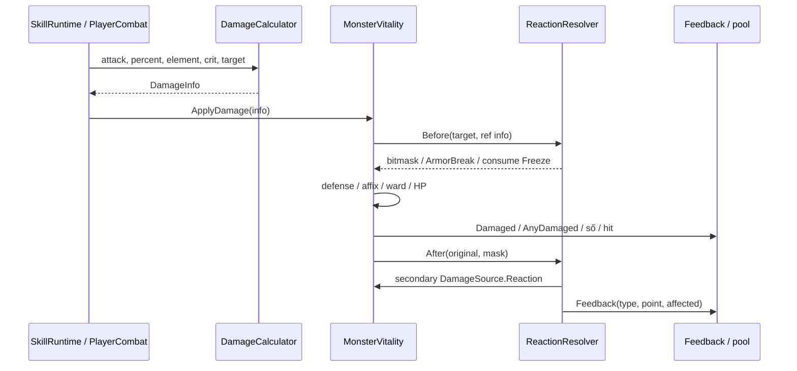

# 03 — Chiến đấu, kỹ năng và VFX

## Mục lục
- [Luồng một đòn trúng](#luồng-một-đòn-trúng)
- [Ngũ hành và trạng thái](#ngũ-hành-và-trạng-thái)
- [Đánh thường, ngắm và né](#đánh-thường-ngắm-và-né)
- [Bốn ô và tài nguyên](#bốn-ô-và-tài-nguyên)
- [Toàn bộ kỹ năng](#toàn-bộ-kỹ-năng)
- [Phản ứng và combo](#phản-ứng-và-combo)
- [Kiếm Ý và Thiên Kiếm](#kiếm-ý-và-thiên-kiếm)
- [VFX và chất lượng](#vfx-và-chất-lượng)
- [Điểm lệch và giới hạn](#điểm-lệch-và-giới-hạn)

## Luồng một đòn trúng

[DamageInfo](../Assets/Combat/Runtime/DamageInfo.cs) mang amount, element, source, point/direction, attacker, skillId, attackPower, critical, isArea, isHeavy và ignoreInvulnerability. **DamageCalculator.Compute** tính:

```text
amount = max(0, attackPower) × max(0, percent)
amount *= ElementChart.Multiplier(attackingElement, target.Element)
nếu rng.NextDouble() < critChance: amount *= max(1, critDamage)
receiver.ApplyDamage(info)
```

`percent=3` là 300%, không phải số 3%. Công đưa vào calculator có thể đã nhân DamageDealt/rank/chain; không nhân lại bên nhận. `AfterDefense(amount,d)` bỏ `clamp(d,0,0.8)` phần damage, nên defense tối đa 80%. Modifier buff/shield/affix xử lý ở receiver, không nằm hết trong Compute.



Receiver quái nằm ở [MonsterVitality.ApplyDamage](../Assets/Skills/GiantHandSeal/Runtime/MonsterVitality.cs); người chơi ở [PlayerMonsterHealth.ApplyDamage](../Assets/MonsterShaban/Scripts/PlayerMonsterHealth.cs). `DamageInfo.Create` tự đặt bỏ i-frame (khoảng miễn thương sau hit) cho Environment và Reaction. Đây là cách Thiên Hỏa tick 0,5 s không bị nuốt bởi miễn thương; Environment/Reaction cũng bị resolver loại khỏi việc kích phản ứng mới để tránh đệ quy.

`isHeavy` là trọng lượng impact tác giả định nghĩa, không suy từ amount lớn/chí mạng. Faction (phe) và control immunity thuộc receiver/skill; hãy kiểm target còn sống/đúng phe trước hit. Một lần TryCast thành công và một lần HP giảm không phải cùng sự kiện: đòn có thể trượt/chặn, shield hấp thụ hoặc mục tiêu chết trước khi kiếm tới.

## Ngũ hành và trạng thái

[ElementChart](../Assets/Combat/Runtime/Element.cs) giữ enum: None 0/Kim 1/Mộc 2/Thủy 3/Hỏa 4/Thổ 5/Lôi 6/Âm 7/Không Gian 8. Không đổi thứ tự vì asset/save dùng số.

| Quan hệ | Công thức thật |
|---|---|
| Khắc: Kim→Mộc→Thổ→Thủy→Hỏa→Kim | attack khắc target ×1,5; target khắc attack ×0,75 |
| Lôi đánh Âm | ×1,5 |
| Kim đánh Âm | ×0,8 |
| Vô Hệ/Không Gian/cặp khác | ×1 |
| Sinh: Mộc→Hỏa→Thổ→Kim→Thủy→Mộc | phục vụ GenerationChainTracker; không tự tăng mọi damage |

[StatusEffectHost.Apply](../Assets/Combat/Runtime/StatusEffectHost.cs) dùng mảng 8 slot với `until`, magnitude và source. Áp lại kéo dài tới max(oldUntil, now+duration), giữ magnitude mạnh hơn khi còn hiệu lực; không tạo stack vô hạn. `SessionNow` theo ARCombatContext hoặc Time.time.

| Status | Nghĩa và tham số |
|---|---|
| Burn | magnitude là damage mỗi 0,5 s, không phải DPS; source Reaction |
| Freeze | tốc 0, Immobilized; boss có resistHardControl đổi sang Chill magnitude 0,5 |
| Chill | slow fraction;0,4 nghĩa còn 60% speed, chọn min với Domain slow |
| Shock | Immobilized, duration ít nhất 0,5 s |
| Stun | Suppress và interrupt; boss cap 1 s |
| ArmorBreak | magnitude mặc định 0,3; giảm defense trong receiver |
| Wet | cờ phục vụ Điện Lưu; không tự gây damage |
| Pulled | cờ gom quái, motion do BlackHole runtime xử lý; ARBrain kiểm riêng |

`Immobilized` chỉ Freeze/Shock; Stun được vitality Suppressed xử lý. Không đồng nhất tất cả control thành một enum FSM. `Clear()` gỡ suppression/tint/domainSlow khi trả pool. `Consume(Freeze)` để phản ứng phá băng, không tự consume mọi Chill/Burn/Wet.

## Đánh thường, ngắm và né

[PlayerCombat.AcquireTarget](../Assets/Combat/Runtime/PlayerCombat.cs) ưu tiên lock hợp lệ; nếu không, quét `MonsterVitality.Active`, lọc range/LOS/nón rồi tối thiểu hóa:

```text
score = 0,6 × angle/halfCone + 0,4 × planarDistance/range
range=12m; coneAngle=60° (half=30°)
```

Mục tiêu rất gần≤1,5 m được nới kiểm góc. [TargetLock](../Assets/Combat/Runtime/TargetLock.cs) quản lý khóa; [CombatLine](../Assets/Combat/Runtime/CombatLine.cs) kiểm vật cản, [FlyingSword](../Assets/Combat/Runtime/FlyingSword.cs) bay/va chạm/trở về. Không damage ngay khi nhấn nếu kiếm chưa chạm.

| Tham số | Giá trị và nguồn |
|---|---|
| Combo | 1 /1 /1,6 Công, cửa 0,9 s; swing interval 0,32 s |
| Hold | 0,8 s để Kiếm Xuyên 2,5 Công; dài 15 m, radius 0,6 m, speed 45 m/s |
| Sword | 3 thanh, flight 30 /return 26 m/s |
| Phí swing /pierce /refund hit | 8 /20 /2 LL trong [P10RainConfig](../Assets/Skills/Core/Data/P10RainConfig.asset), code [NguKiemConfig](../Assets/Combat/Runtime/NguKiemConfig.cs) |
| Né | [DodgeAbility](../Assets/Combat/Runtime/DodgeAbility.cs):5 m trong 0,18 s;25 Energy; CD 0,6 s; i-frame 0,3 s |

Lần press gọi TrySwing, giữ đủ 0,8 s gọi thêm TryPierce; giữ nút không có nghĩa auto swing mỗi 0,32 s. Không có input né thì lướt lùi; đang riding elevator hoặc dash/dead thì từ chối. Côn Bằng Active miễn phí né. Dash chuyển động vẫn do CampusExplorer và va chạm, không teleport qua tường.

## Bốn ô và tài nguyên

[SkillLoadout.SlotCount](../Assets/Skills/Core/Runtime/SkillLoadout.cs)=4. `Equip` chuyển skill khỏi ô cũ nếu trùng, cancel skill bị thay, phát LoadoutChanged. `EquipDuringRest` mới kiểm LevelDirector.CanChangeSkills và unlock; API Equip cấp thấp không tự chứa mọi luật UI.

Runtime kỹ năng là component trên caster; [SkillDefinition](../Assets/Skills/Core/Runtime/SkillDefinition.cs) giữ ID/element/role/castType/cost/CD/unlock/ranks. Ba adapter [GiantHandRuntime](../Assets/Skills/Core/Runtime/GiantHandRuntime.cs), [VoidWallRuntime](../Assets/Skills/Core/Runtime/VoidWallRuntime.cs), [PhantomRuntime](../Assets/Skills/Core/Runtime/PhantomRuntime.cs) giữ logic skill cũ sau IdentityAction. Chiêu mới dùng [Set1SkillRuntime](../Assets/Skills/Core/Runtime/Set1SkillRuntime.cs) hoặc [Set2SkillRuntime](../Assets/Skills/Core/Runtime/Set2SkillRuntime.cs).

```text
BeginAim → ngắm / xác nhận điểm hữu hạn + range + LOS
TryCast → unlock, Allowed, cooldown, LL → chi LL
CommitCast → telemetry / AoE history / sound / chain multiplier
OnCast → anticipation, đăng ký DangerZone
TickCast → action / hit(s) / follow-through
Finish/Cleanup → gỡ vùng / buff / motion override / trả visual
```

CancelAim không nhất thiết ngắt skill đã Casting; xem override. Cast tại AR dùng SessionNow/WorldScale ở Set1; Set2 chủ yếu Time.time và phụ thuộc explorer, nên không mở tùy tiện cả 21 chiêu trong AR.

Ba tài nguyên khác nhau: HP là sống; LL ở [SpiritPower](../Assets/Combat/Runtime/SpiritPower.cs)/PlayerStats dùng cho combat; Energy ở [CampusExplorer](../Assets/Scripts/CampusExplorer.cs) dùng boost/né. Energy default 100, boost 20/s, hồi 15/s sau 1,5 s; prefab/settings/progression có thể override. `SpiritPower.gainPerBasicHit=5` còn field nhưng PlayerCombat.ResolveHit gọi `Restore(config.hitSpiritRefund)`=2, không `OnBasicHit()`. Bảng kế hoạch “mỗi hit+5” không phải hành vi đánh thường hiện hành.

[CampusExplorer.MoveCharacter/UpdateEnergy/UpdateCamera](../Assets/Scripts/CampusExplorer.cs) đổi input sang hướng tương đối camera, tăng/giảm planar velocity rồi gọi CharacterController.Move. Default đi 6/chạy 10 m/s, acceleration 30 m/s²; nhảy cao 1,05 m với vận tốc đầu `sqrt(jumpHeight * -2 * gravity)`, gravity −25 m/s², vận tốc rơi giới hạn −50 m/s. Cạn Energy khóa boost đến hồi đủ 30%; giữ BOOST khi đứng yên không tiêu hao. Đây là default C#, cần kiểm override prefab trước tuning. Camera cập nhật LateUpdate, pivot làm mượt theo `1-exp(-18*dt)`, spherecast bán kính 0,18 m với buffer 32 hit để co khoảng cách khi gặp tường; bỏ collider player/quái/VoidWall. Camera rất sát sẽ ẩn visual nhân vật để vẫn nhìn được cửa cabin.

Rank 1–5: `EffectMultiplier=1+0,12×(rank−1)`, `CooldownMultiplier=1−0,05×(rank−1)`; `Mastered=rank>=4`. Chi phí/unlock do [SkillProgressService](../Assets/Skills/Core/Runtime/SkillProgressService.cs) và [SkillUnlockService](../Assets/Skills/Core/Runtime/SkillUnlockService.cs); `ranks[]` không có nghĩa mọi runtime đọc trực tiếp hai multiplier trong asset.

## Toàn bộ kỹ năng

Bảng data dưới trích asset hiện hành; CD gốc chưa nhân rank/buff. Kết Giới CD 0,35 s là khoảng triển khai, khác hồi charge 12 s.

| ID / asset | Tên | Hệ | Vai trò serialized | CD gốc (s) | Linh Lực | Mở khóa |
|---|---|---|---|---:|---:|---|
| [am-binh-quy-hon](../Assets/Skills/Core/Data/am-binh-quy-hon.asset) | Âm Binh Quy Hồn | Âm | Triệu hồi | 40 | 60 | Luyện Hư 1 |
| [anh-phan-than](../Assets/Skills/Core/Data/anh-phan-than.asset) | Ảnh Phân Thân | Âm | Tiện ích | 18 | 20 | Luyện Khí 1 |
| [bac-minh-than-cong](../Assets/Skills/Core/Data/bac-minh-than-cong.asset) | Bắc Minh Thần Công | Thủy | Hỗ trợ | 16 | 30 | Nguyên Anh 1 |
| [banh-truong-lanh-dia](../Assets/Skills/Core/Data/banh-truong-lanh-dia.asset) | Bành Trướng Lãnh Địa | Không Gian | Khống chế | 60 | 80 | Độ Kiếp 1 |
| [con-bang-cuc-toc](../Assets/Skills/Core/Data/con-bang-cuc-toc.asset) | Côn Bằng Cực Tốc | Mộc | Di chuyển | 25 | 25 | Nguyên Anh 1 |
| [dai-thu-an](../Assets/Skills/Core/Data/dai-thu-an.asset) | Đại Thủ Ấn | Thổ | Khống chế | 18 | 30 | Luyện Khí 1 |
| [hac-dong-than-la](../Assets/Skills/Core/Data/hac-dong-than-la.asset) | Hắc Động Thần La | Không Gian | Khống chế | 22 | 50 | Nguyên Anh 1 |
| [han-bang-phong-an](../Assets/Skills/Core/Data/han-bang-phong-an.asset) | Hàn Băng Phong Ấn | Thủy | Khống chế | 14 | 30 | Trúc Cơ 1 |
| [hang-long-thap-bat-chuong](../Assets/Skills/Core/Data/hang-long-thap-bat-chuong.asset) | Hàng Long Thập Bát Chưởng | Kim | Bộc phá | 10 | 35 | Kết Đan 1 |
| [hu-khong-ket-gioi](../Assets/Skills/Core/Data/hu-khong-ket-gioi.asset) | Hư Không Kết Giới | Không Gian | Phòng thủ | 0.35 | 15 | Luyện Khí 1 |
| [kim-chung-trao](../Assets/Skills/Core/Data/kim-chung-trao.asset) | Kim Chung Tráo | Kim | Phòng thủ | 30 | 40 | Kết Đan 1 |
| [moc-linh-hoi-xuan](../Assets/Skills/Core/Data/moc-linh-hoi-xuan.asset) | Mộc Linh Hồi Xuân | Mộc | Hỗ trợ | 35 | 40 | Hóa Thần 1 |
| [phat-no-hoa-lien](../Assets/Skills/Core/Data/phat-no-hoa-lien.asset) | Phật Nộ Hỏa Liên | Hỏa | Bộc phá | 20 | 45 | Trúc Cơ 1 |
| [tam-muoi-chan-hoa](../Assets/Skills/Core/Data/tam-muoi-chan-hoa.asset) | Tam Muội Chân Hỏa | Hỏa | Bộc phá | 14 | 40 | Kết Đan 1 |
| [than-kiem-ngu-loi](../Assets/Skills/Core/Data/than-kiem-ngu-loi.asset) | Thần Kiếm Ngự Lôi Chân Quyết | Lôi | Bộc phá | 12 | 35 | Trúc Cơ 1 |
| [than-thuc-linh-nhan](../Assets/Skills/Core/Data/than-thuc-linh-nhan.asset) | Thần Thức Linh Nhãn | Vô Hệ | Tiện ích | 30 | 20 | Hóa Thần 1 |
| [thien-loi-dan](../Assets/Skills/Core/Data/thien-loi-dan.asset) | Thiên Lôi Dẫn | Lôi | Bộc phá | 20 | 45 | Hóa Thần 1 |
| [tich-lich-nhat-thiem](../Assets/Skills/Core/Data/tich-lich-nhat-thiem.asset) | Tích Lịch Nhất Thiểm | Lôi | Di chuyển | 8 | 20 | Luyện Khí 3 |
| [tru-tien-kiem-tran](../Assets/Skills/Core/Data/tru-tien-kiem-tran.asset) | Tru Tiên Kiếm Trận | Kim | Khống chế | 28 | 60 | Luyện Hư 1 |
| [van-kiem-quyet](../Assets/Skills/Core/Data/van-kiem-quyet.asset) | Vạn Kiếm Quyết | Kim | Bộc phá | 18 | 50 | Hóa Thần 1 |
| [vo-hon-chan-than](../Assets/Skills/Core/Data/vo-hon-chan-than.asset) | Võ Hồn Chân Thân | Thổ | Bộc phá | 75 | 100 | Độ Kiếp 1 |

Bảng hành vi dưới ở rank 1, trước hệ số rank/crit/ngũ hành. R là bán kính tính bằng mét; phần trăm là tỷ lệ Công dùng cho hit, không phải phần trăm HP mục tiêu. Mỗi source là class trùng tên file; điểm chính OnCast/TickCast/Cleanup hoặc adapter API.

| ID | Runtime / hàm | Tham số gameplay chính; Viên Mãn |
|---|---|---|
| dai-thu-an | [GiantHandSkill.Confirm](../Assets/Skills/GiantHandSeal/Runtime/GiantHandSkill.cs) / MonsterVitality.ReceiveSeal | R2,8;300%; stun 3 s/boss 1 s; tầm xem config/targeting; Ngũ Chỉ Sơn 5 s |
| hu-khong-ket-gioi | [VoidWallSkill](../Assets/Skills/VoidWall/Runtime/VoidWallSkill.cs) | 3 charge,12 s/charge, tường 40%maxHP, phía sau 3 m bán che; rank4 phản đạn |
| anh-phan-than | [PhantomDecoySkill](../Assets/Skills/PhantomDecoy/Runtime/PhantomDecoySkill.cs) | phân thân 6 s, nổ 150% từ rank3; rank4 hai actor |
| tich-lich-nhat-thiem | [LightningFlashRuntime](../Assets/Skills/LightningFlash/Runtime/LightningFlashRuntime.cs) | 10 m,180%, Shock 0,5 s, i-frame 0,2 s; rank4 lần 2 miễn LL trong 2 s |
| phat-no-hoa-lien | [FireLotusRuntime.Explode](../Assets/Skills/FireLotus/Runtime/FireLotusRuntime.cs) | charge 1,2 s, flight 0,65 s, R7,450%, field 4 s tick 0,5 s×20%; Burn 3 s; rank4 ba hoa 150%/hoa |
| han-bang-phong-an | [IceSealRuntime.TickCast](../Assets/Skills/IceSeal/Runtime/IceSealRuntime.cs) | nón 90°×10 m,120%, Freeze 2,5 s; rank4 Chill zone lúc vỡ |
| than-kiem-ngu-loi | [ChainLightningRuntime.TickCast/NextTarget](../Assets/Skills/ChainLightning/Runtime/ChainLightningRuntime.cs) | đầu 25 m, nảy≤8 m;6 mục tiêu,200%×0,9^bounce; bắt đầu 0,2 s, cadence 0,08 s, finish 1,35 s; rank4 chín |
| kim-chung-trao | [GoldenBellRuntime.Absorb](../Assets/Skills/GoldenBell/Runtime/GoldenBellRuntime.cs) | shield 40%maxHP×power,6 s, reflect 20% incoming melee, fire resist 60%; rank4 vỡ nổ 200% R4; hết giờ không nổ |
| hang-long-thap-bat-chuong | [DragonPalmRuntime.TickCast](../Assets/Skills/DragonPalm/Runtime/DragonPalmRuntime.cs) | xuyên 15 m,350%, đẩy 3 m trên NavMesh; rank4 hai rồng±18° |
| tam-muoi-chan-hoa | [TrueFireRuntime.TickCast](../Assets/Skills/TrueFire/Runtime/TrueFireRuntime.cs) | nón 90°×8 m,12 tick 90%/0,25 s, di chuyển 35%; rank4 tường lửa 4 s |
| hac-dong-than-la | [BlackHoleRuntime.Gather/Move](../Assets/Skills/BlackHole/Runtime/BlackHoleRuntime.cs) | R9,3 s hút,250% hất 4 m; bossChill 50%; giữ collider trên NavMesh, rig orbit riêng; rank4 hút đạn |
| bac-minh-than-cong | [NorthernDrainRuntime.Acquire/TickCast](../Assets/Skills/NorthernDrain/Runtime/NorthernDrainRuntime.cs) | ba quái trong 12 m,6 tick 70%/0,5 s, Wet 3 s, hồi 50% damage thực; né/choáng ngắt; rank4+3 LL/tick trúng |
| con-bang-cuc-toc | [KunpengSpeedRuntime](../Assets/Skills/KunpengSpeed/Runtime/KunpengSpeedRuntime.cs) | 6 s,+40%×power movespeed, né miễn Energy, bóng lan Burn; rank4 bóng 60% |
| van-kiem-quyet | [SwordRainRuntime.SwordImpact](../Assets/Skills/SwordRain/Runtime/SwordRainRuntime.cs) | R8,30 kiếm,40%/kiếm tại R 0,85; finish 4,2 s; rank4 50 kiếm. Không đảm bảo 30 kiếm cùng hit một quái |
| thien-loi-dan | [HeavenThunderRuntime.TickCast](../Assets/Skills/HeavenThunder/Runtime/HeavenThunderRuntime.cs) | báo 1,2 s, R5;5 tia 220%, vùng trúng mỗi tiaR 2,5, cadence 0,1 s; rank4 tám |
| moc-linh-hoi-xuan | [WoodRenewalRuntime.TickCast](../Assets/Skills/WoodRenewal/Runtime/WoodRenewalRuntime.cs) | player 5 tick 5%HP, field R 5/8 s, ally 8 tick 3,125%; rank4 clear control/status |
| than-thuc-linh-nhan | [SpiritSightRuntime.TickCast](../Assets/Skills/SpiritSight/Runtime/SpiritSightRuntime.cs) | reveal 10 s, scan 0,4 s, crit damage×1,25; rank4 ba quái ít HP mark thêm×1,3 |
| tru-tien-kiem-tran | [ImmortalSwordArrayRuntime.TickCast](../Assets/Skills/ImmortalSwordArray/Runtime/ImmortalSwordArrayRuntime.cs) | R8,10 s,20 tick 60%/0,5 s,+0,2 crit chance khi caster trong vùng; rank4 15 s/30 tick |
| am-binh-quy-hon | [SoulSummonRuntime.Remember/OnCast](../Assets/Skills/SoulSummon/Runtime/SoulSummonRuntime.cs) | buffer 24 xác, window 8 s, tối đa 3 ally/20 s, chỉ số 60% qua SoulAlly; rank4 năm; không boss/đếm kiếm lần 2 |
| banh-truong-lanh-dia | [DomainRuntime.TickCast](../Assets/Skills/Domain/Runtime/DomainRuntime.cs) | R12/8 s, slow 40%; caster trong vùng cooldown advance thêm dt thành×2; rank4 suppress abilities |
| vo-hon-chan-than | [MartialAvatarRuntime.Sweep](../Assets/Skills/MartialAvatar/Runtime/MartialAvatarRuntime.cs) | 10 s,+50%×power dealt,−30%taken, sweep R 4, camera≥7,5 m; rank4 control immune |

Chain Lightning hiện dùng `while` bù nhiều bounce khi elapsed vượt nhiều mốc; không ghi lại mô tả `if` một bounce/frame của probe P23 cũ. P23 đang tiến hành nên trạng thái report/smoke mới của nhánh này cần đọc PROGRESS, không suy mọi suite đã hoàn tất.

## Phản ứng và combo

[ReactionResolver.Before/After](../Assets/Combat/Runtime/ReactionResolver.cs) dùng bitmask để một hit có nhiều điều kiện độc lập. `readyAt[9]` là internal cooldown (ICD) theo receiver và đời sống; config mặc định 1 s. Extended reaction đi `PublishExtended`. Dùng snapshot 128 target trước secondary hit vì hit lethal có thể bỏ phần tử khỏi Active.

| Phản ứng | Điều kiện và kết quả | Nơi chốt |
|---|---|---|
| Băng Lôi Liệt | Freeze+Lôi; consume Freeze, bonus 150% hit, R3; hệ từng nạn nhân được tính lại | Before/After |
| Điện Lưu | Chill hoặc Wet+Lôi; Shock 0,5 s, R5; Freeze ưu tiên | Before/After |
| Bạo Viêm | Burn+Hỏa; bonus 80%attack, R4 | Before/After |
| Tụ Sát | Pulled+isArea; bonus 40%hit trên target | Before/After |
| Phá Giáp | Stun+Kim; ArmorBreak 0,3 trong 8 s; breakMetalBody; ảnh hưởng ngay hit Kim | Before |
| Phong Hỏa Liệu Nguyên | bóng Côn Bằng đi qua Burn; lan status cùng damage/duration R4 cóLOS | SpreadBurn |
| Kiếm Hồn | SoulAlly trong Tru Tiên damage×1,5 | [SoulAlly](../Assets/Skills/SoulSummon/Runtime/SoulAlly.cs) |
| Hộ Thể Hấp Nguyên | Kim Chung shield Active khi Bắc Minh tick; hồi từ 50% thành 100% damage thực | NorthernDrainRuntime |
| Lãnh Địa Cộng Hưởng | caster cast trong Domain; chốt×1,2 vào CastDamageMultiplier | SkillRuntime.CommitCast |

Số rule ở [ReactionConfig](../Assets/Combat/Runtime/ReactionConfig.cs) và asset tham chiếu [ReactionConfigReference](../Assets/Combat/Runtime/ReactionConfigReference.cs). Cửa “combo 3 s” trong kế hoạch không phải một timer chung áp cho mọi phản ứng: runtime kiểm status còn sống và ICD. Hắc Động consume Pulled trước hit hất riêng; muốn Tụ Sát phải AoE đánh lúc đang hút.

**Tương Sinh Liên Hoàn** khác bảng phản ứng: [GenerationChainTracker.Record](../Assets/Combat/Runtime/GenerationChainTracker.cs) theo *cast thành công*, ba hệ liên tiếp trong 6 s, skill thứ 3×1,3 và hồi 20 LL. Sai hệ/ngoài vòng sinh/hết window reset. Ví dụ Mộc→Hỏa→Thổ. Không cần hit cả ba; cast bị từ chối không Commit. Multiplier được chốt, không mất khi caster bước khỏi Domain.

## Kiếm Ý và Thiên Kiếm

[SwordIntent](../Assets/SkyBeast/Runtime/SwordIntent.cs) denominator gồm cả queued/pending. `Full=WaveCleared && PlannedCount>0 && DefeatedCount>=PlannedCount`. Trước Full, Fraction tối đa 0,99 dù tổng weight đã đủ. `Track` lưu weight lúc spawn; elite4, archetype weight1/2 hoặc đặc thù. `SpawnFailed` giảm denominator/count để không kẹt; summon/drops có countsForSwordIntent=false.

```text
BeginWave(weight, count) → Track mọi quái tính điểm
Died(tracked) → +weight, +count
LevelDirector queue/pending/countableAlive hết → MarkWaveCleared
nếu Full: ready signal, dissolve summon không gây hit/nổ/thưởng
TryChannel ngoài trời + unlock + inputAllowed + không Fury
niệm thành công → cinematic → scheduler nhận một Sword Hit
hit thành công mới Consume và CompleteSkySword
```

[HeavenSwordUltimate.TryChannel/Update/Damage](../Assets/SkyBeast/Runtime/HeavenSwordUltimate.cs) dùng nútV riêng, không chiếm 4 ô. Visible ở 8–10 và realm≥Hóa Thần. Channel theo [HeavenSwordConfig](../Assets/SkyBeast/Runtime/HeavenSwordConfig.cs):2,5/2/1,5 s Hóa Thần/Luyện Hư/Độ Kiếp; Kiếm Tâm buff giảm tối đa 40%. Đứng yên, dịch>0,3 m/đổi shelter/blocked hủy. Chỉ damage Environment `thien-hoa` ngắt niệm trong hàm Damage, trừ shield Bell hoặc ConsumeUninterrupted; không mô tả mọi hit đều ngắt.

Màn 10 pha 3 chờ Long Nộ warning/active/completed, không dùng kiếm để bỏ qua thử thách. [HeavenSwordCinematic](../Assets/SkyBeast/Runtime/HeavenSwordCinematic.cs) và [HeavenSwordShotTrack](../Assets/SkyBeast/Runtime/HeavenSwordShotTrack.cs) sở hữu shot; đầu 6 s/lặp 3 s, sword 150 m, mesh kiếm trang trí High 2400/Low 1600/Mobile 960, rest 15 s. Realm≥Luyện Hư sau chém được fire resist 0,5 trong 10 s. Trang trí hàng nghìn kiếm không phải hàng nghìn damage callback.

## VFX và chất lượng

[SkillVfxPool](../Assets/Skills/Core/Runtime/SkillVfxPool.cs) prewarm/tái dùng node particle/mesh/line/audio. [SkillSet2VisualBatch](../Assets/Skills/Core/Runtime/SkillSet2VisualBatch.cs) P18 gom shape vào renderer chung,32 slot; mobile giảm mesh trang trí, không giảm ally gameplay. [SkillImpact](../Assets/Skills/Core/Runtime/SkillImpact.cs) dùng hold local/animator để hit-stop, không tự đổi Time.timeScale ngoài UIStateManager. AR impact dùng border để còn nhìn camera.

[FireVisualQuality](../Assets/SkyBeast/Runtime/FireVisualQuality.cs), [FireMeteorBatch](../Assets/SkyBeast/Runtime/FireMeteorBatch.cs) và [SkyStrikeRibbonBatch](../Assets/SkyBeast/Runtime/Attacks/SkyStrikeRibbonBatch.cs) giảm số renderer/particle; mưa cosmetic quanh camera còn hazard được FireBreathCycle tính độc lập. PERF-FIRE phân High/Low/Mobile: meteor cap 72/48/36, rate 44/30/22. Việc tắt bớt VFX không được làm người chơi nhận ít damage hơn.

[CharacterAfterimageTrail.Tick/TriggerDash/ClearTrail](../Assets/Scripts/CharacterAfterimageTrail.cs) chụp pose SkinnedMesh bằng BakeMesh ở LateUpdate rồi tái dùng 6 slot. Default sample 0,065 s, lifetime 0,36 s, minimumSpacing 0,24 m, opacity 0,48; chỉ phát khi sprint/dash có chuyển động thật, không phát lúc đứng hoặc đẩy tường. Dịch quá 4 m/frame hoặc disable sẽ clear trail. Bóng không collider/đổ bóng, shader có depth test và alpha cutout tóc; BakeMesh vẫn có CPU skinning, pool không làm chi phí chụp pose bằng 0. README Afterimage mô tả dash hook trước khi có DodgeAbility; hook hiện là VFX, movement nằm ở hệ né.

Motion/aim/VFX AR phải scale cả range, speed, line width, offsets, audio distances và particle simulation space. Fix 1 sửa nhiều hiệu ứng chỉ scale mesh nhưng offset/trail chưa scale. Chữ damage AR bỏ ký hiệu trước số để nhỏ mà đọc rõ; màu hệ vẫn giữ. [AR fix1](../task/ar/REPORT-AR-fix1.md) là evidence, không phải xác nhận camera máy thật.

## Điểm lệch và giới hạn

- Đánh thường tốn 8/20 LL và refund 2, khác kế hoạch free/+5.
- Definition không giữ runtime Prefab; adapter/component quyết định runtime. Một số tham số gameplay hardcode trong TickCast, không ở asset.
- Kết Giới có CD triển khai 0,35 s bên cạnh hồi charge 12 s; bảng “không CD” thiếu chi tiết này.
- Viên Mãn từ rank 4, phản ứng dựa status/ICD, không timer 3 s chung.
- Smoke P18 chứng minh 21 skill/9 reaction trong fixture; [P18 report](../task/p18/REPORT-P18.md) ghi chưa cân bằng thực chiến/Android thật. P23 và nguồn hiện hành có thể chứa sửa mới hơn artifact lịch sử; đọc [P23 PROGRESS](../task/p23/PROGRESS.md) trước tuyên bố regression sạch.
