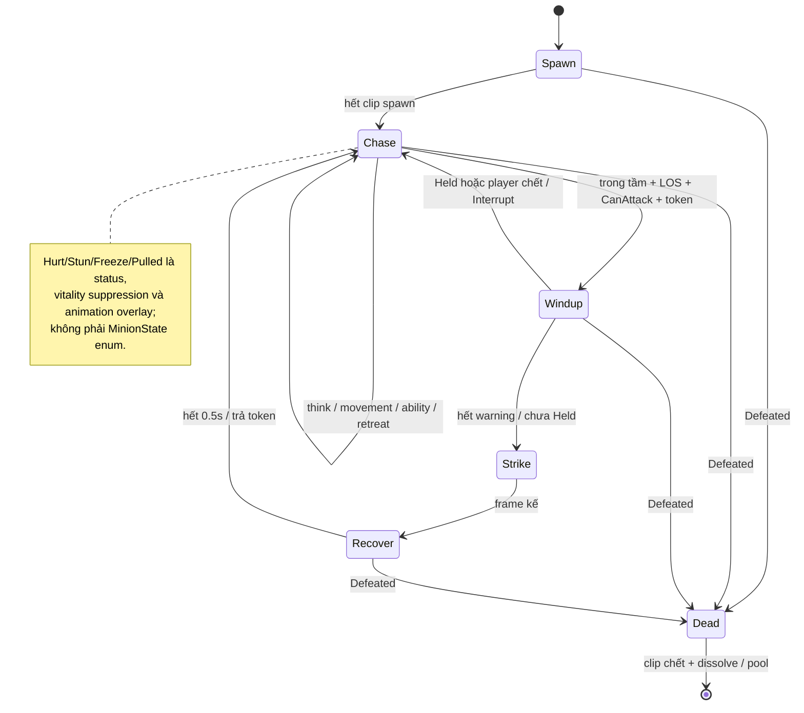
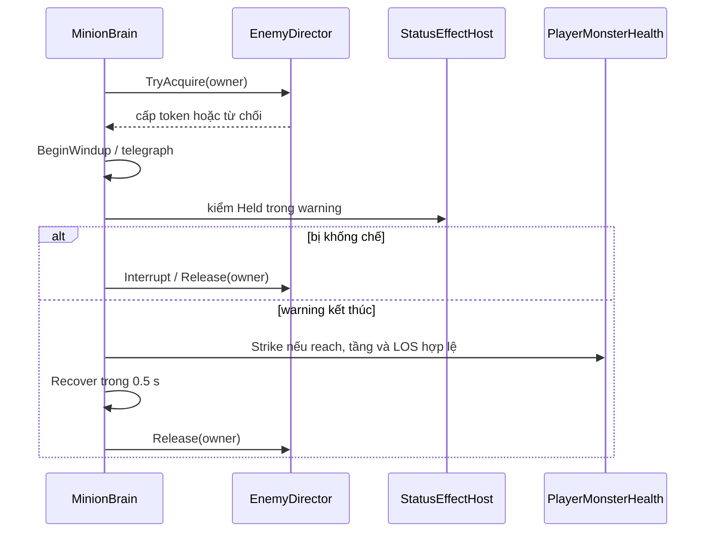
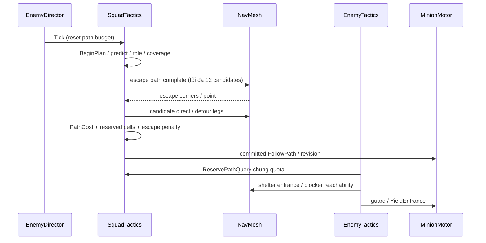
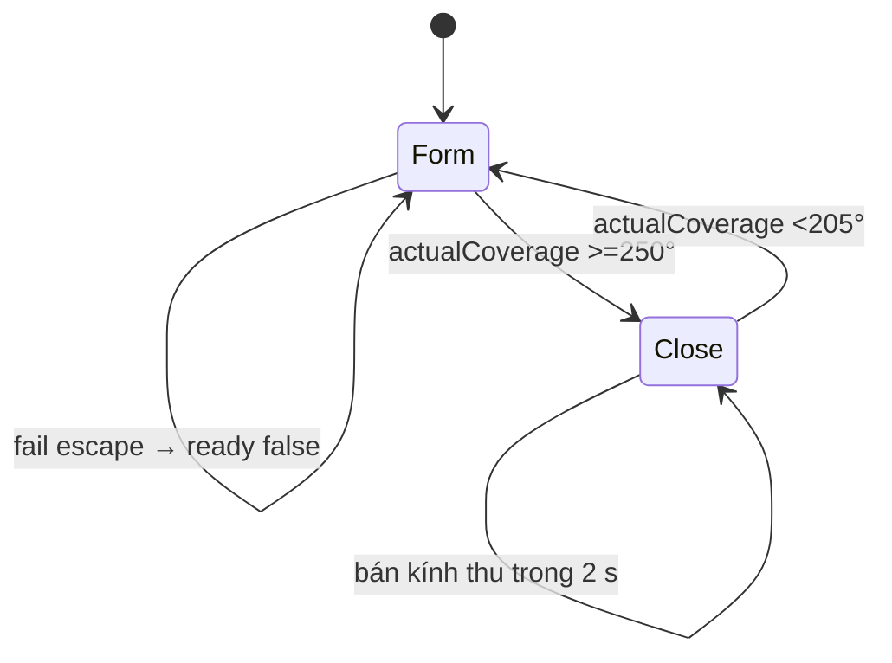
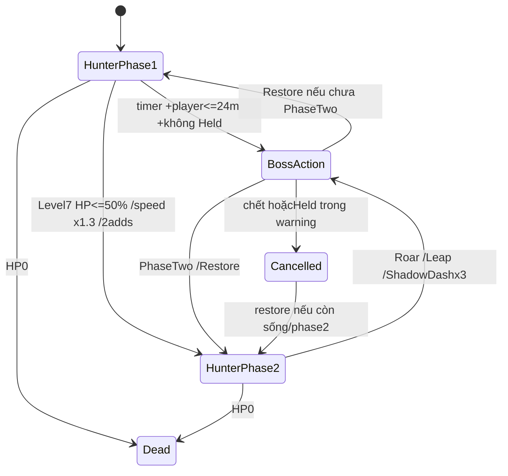
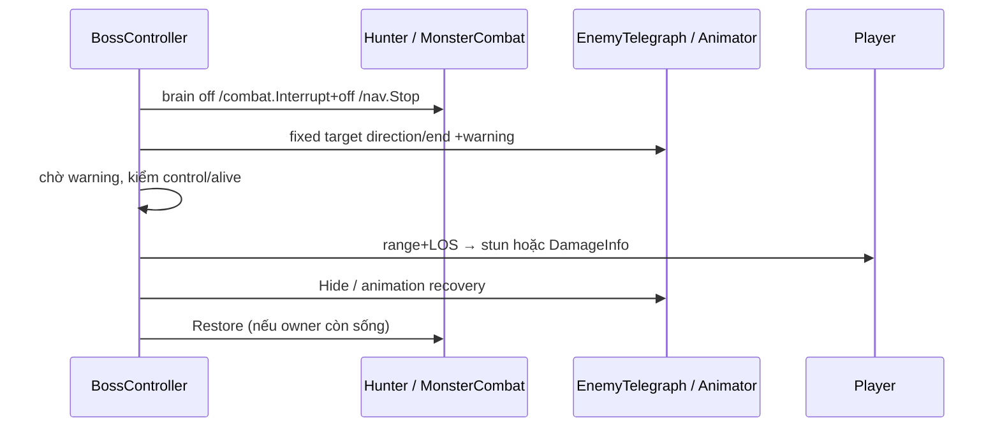

# 04 — Thuật toán quái

## Mục lục
- [Quy ước và bản đồ source](#quy-ước-và-bản-đồ-source)
- [1. Spawn, roster và scaling](#1-spawn-roster-và-scaling)
- [2. Máy trạng thái quái thường](#2-máy-trạng-thái-quái-thường)
- [3. AI-SQUAD vây, lùa và chặn đầu](#3-ai-squad-vây-lùa-và-chặn-đầu)
- [4. Navigation, cửa, cầu thang và thang máy](#4-navigation-cửa-cầu-thang-và-thang-máy)
- [5. Shaban Hunter và belief](#5-shaban-hunter-và-belief)
- [6. Boss hai pha](#6-boss-hai-pha)
- [7. Kỹ năng quái và telegraph](#7-kỹ-năng-quái-và-telegraph)
- [8. Tinh anh và phụ tố](#8-tinh-anh-và-phụ-tố)
- [9. Cự thú bầu trời và Thiên Hỏa](#9-cự-thú-bầu-trời-và-thiên-hỏa)
- [10. Một tiếng quái mỗi màn và nearest voice](#10-một-tiếng-quái-mỗi-màn-và-nearest-voice)
- [11. Animation driver và LOD](#11-animation-driver-và-lod)
- [12. Quái AR](#12-quái-ar)
- [Đối chiếu kế hoạch và bằng chứng](#đối-chiếu-kế-hoạch-và-bằng-chứng)

## Quy ước và bản đồ source

N là số actor đang hoạt động, R là số loại trong roster, Q là tổng quái của đợt, G/E là node/edge graph, C là số corner hoặc mẫu trên path. Độ phức tạp dưới là phân tích vòng lặp **từ source**, không phải benchmark. NavMesh.CalculatePath/physics/native renderer có chi phí riêng phụ thuộc mesh/map; không gán chúng O(1) hay số mili giây không được đo.

`EnemyDirector` là registry, attack token, squad và âm thanh; **LevelDirector mới điều phối spawn theo đợt**. Có hai hệ AI: MinionBrain biết vị trí player phục vụ horde; Shaban dùng evidence/perception/memory. AR có brain riêng. Không lấy một mô tả FSM áp cho cả ba.

## 1. Spawn, roster và scaling

**Mục đích:** đủ số quái theo đợt, loại có đa dạng/giới hạn, không spawn mọi quái cùng lúc, còn thông báo khe nứt trước khi actor xuất hiện.

**Đầu vào:** LevelDefinition.waves/spawnTable/zones, RunSeed, vị trí player, cap theo control mode. **Đầu ra:** EnemyInstance từ pool, alive/pending/queue, event wave/killed/clear và denominator Kiếm Ý.

**Source:** [LevelDirector.StartNextWave/TickSpawns/SpawnNow/PickPosition](../Assets/Levels/Runtime/LevelDirector.cs); [LevelSpawnTable.Generate/AssignElites/CanSpawn](../Assets/Levels/Runtime/LevelSpawnTable.cs); [EnemyPool.Spawn](../Assets/Enemies/Runtime/EnemyPool.cs); [EnemyInstance.Configure](../Assets/Enemies/Runtime/EnemyInstance.cs).

```text
Begin:
  RunSeed = override hoặc level.index*977 + attempt*104729
  TotalPlanned = TotalMonsters + (level3 ? 1 : 0) + bosses.Count
StartNextWave:
  entries = spawnTable.Generate(wave.TotalCount,waveIndex,seed,isFinal)
  final dùng finalWave cố định; đợt khác dùng weighted random có constraint
  nếu level3/đợt3: thêm ShabanElite
  expand thành queue, Fisher–Yates shuffle với seed
  Kiếm Ý BeginWave tổng weight và số planned
TickSpawns:
  pending tới at → SpawnNow
  nếu queue còn, tới nextSpawn, alive+pending < cap:
    chọn request thỏa CanPromise (heavy/bomber tính cả pending)
    PickPosition → Open rift → pending hứa một slot
SpawnNow:
  pool đặt lên NavMesh / flying outdoor
  thất bại → giảm TotalPlanned và SwordIntent denominator
  thành công → scaling/elite, Track, alive.Add
queue/pending/countableAlive đều 0 → WaveCleared
```

Generate khởi tạo `minPerWave`, rồi từng quái chọn ứng viên chưa max và chưa vi phạm bomber/ranged fraction, trọng số tối thiểu 0,01. Bốc roulette theo `System.Random(seed+wave*7919)`. AssignElites dùng seed+wave*113. FinalWave được copy trước gán elite, không sửa asset trong runtime.

| Tham số | Giá trị thật / nơi |
|---|---|
| Queue cap | PC 14/mobile 9 trong LevelDirector; chọn bởi CampusInput.Mobile, không chỉ Application.platform |
| Spawn cadence / portal lead | 0,4 s /0,35 s; Intro 2,5 s, first queue delay 0,25 s |
| MinSpawnDistance | 9 m phẳng; nếu không có zone đủ xa chọn xa nhất |
| Roster heavy/bomber concurrent default | 2/2 trong LevelSpawnTable (asset có thể khác) |
| Fraction defaults | bomber≤0,2; ranged≥0,15/≤0,45 |
| Phân bố offset zone | angle đều[0,2 π), radius=sqrt(U)×zone.radius để đều diện tích |
| BaseHP/scale | xem bảng trích roster dưới; MaxHealth=baseHP×levelHP×lateHP(L≥6)×elite3 |
| Damage | baseDamage×levelDamage; attack cooldown nhân `(1−0,4×clamp01((level−1)/9))` |
| Speed | baseSpeed×levelSpeed×BloodMoon outdoor 1,15×FireState×Berserk 1,3; formation sprint là multiplier riêng |

| ID / asset roster thật | Tên | Element enum | HP gốc | ST gốc | m/s | HP từ L6× | Weight |
|---|---|---:|---:|---:|---:|---:|---:|
| [anh-yeu](../Assets/Enemies/Data/anh-yeu.asset) | Ảnh Yêu | 7 | 80 | 14 | 6.5 | 1 | 1 |
| [bao-thi](../Assets/Enemies/Data/bao-thi.asset) | Bạo Thi | 7 | 50 | 8 | 6 | 0.92 | 1 |
| [doc-nhan](../Assets/Enemies/Data/doc-nhan.asset) | Độc Nhãn Xạ Thủ | 2 | 45 | 8.5 | 4 | 0.92 | 1 |
| [duc-yeu](../Assets/Enemies/Data/duc-yeu.asset) | Dực Yêu | 2 | 40 | 8 | 7 | 1 | 1 |
| [hoa-linh](../Assets/Enemies/Data/hoa-linh.asset) | Hỏa Linh | 4 | 150 | 16 | 5 | 1 | 1 |
| [hoa-trung](../Assets/Enemies/Data/hoa-trung.asset) | Hoa Trùng | 2 | 60 | 8 | 4.5 | 0.92 | 1 |
| [liem-hon](../Assets/Enemies/Data/liem-hon.asset) | Liêm Hồn | 7 | 60 | 8 | 4.5 | 0.92 | 1 |
| [quang-ma](../Assets/Enemies/Data/quang-ma.asset) | Quang Ma | 4 | 60 | 8 | 3.8 | 0.92 | 1 |
| [thiet-giap-nguu](../Assets/Enemies/Data/thiet-giap-nguu.asset) | Thiết Giáp Ngưu | 1 | 220 | 18 | 4 | 1 | 2 |
| [tieu-yeu](../Assets/Enemies/Data/tieu-yeu.asset) | Tiểu Yêu | 2 | 60 | 8 | 5.5 | 0.92 | 1 |
| [trieu-hon-su](../Assets/Enemies/Data/trieu-hon-su.asset) | Triệu Hồn Sư | 7 | 120 | 6 | 3.5 | 1 | 2 |

Element enum theo chương 03; ví dụ Tiểu Yêu hiện Mộc 2, Bạo Thi Âm 7, Quang Ma Hỏa 4. Những giá trị khác bảng kế hoạch phải theo **archetype thật được spawnTable tham chiếu**, không theo asset Resources trùng ID mà chưa chắc là nguồn của mọi màn.

**Chi phí:** Generate có vòng Q, mỗi lần xét R và đếm ranged R → O(QR²), thêm check/list allocation ở lúc đổi đợt. TickSpawns kiểm constraint trên alive/pending O(N); PickPosition tạo list zone và FindAll, không zero-allocation. Reset pool có Instantiate lần thiếu, không đảm bảo mọi loại đã prewarm.

**Vì sao:** weighted roster tránh cùng một đợt cố định ở mọi lần chơi; final cố định đảm bảo cao trào/đủ loại, seed giúp tái hiện. Pending phải đặt trước actor để portal không hứa vượt cap. Quy tắc khoảng cách spawn giảm hit bất ngờ ngay cạnh player.

**Biên/lỗi:** constraint không thỏa gây InvalidOperationException thay vì loop vô hạn; prefab/NavMesh thiếu làm spawn thất bại và giảm denominator để không kẹt. Cap 14/9 được enforce trên queue; các lời gọi summon/boss trực tiếp có đường riêng, nên không tuyên bố mọi nguồn đều tuyệt đối≤cap. [P19](../task/p19/REPORT-P19.md) và [AI fix1](../task/ai/REPORT-AI-SQUAD-fix1.md) có roster 95/0 trong fixture, chưa mọi seed/thực chiến. Level 7 waves hiện 29 rồi boss 1, khác mô tả 30+boss trong kế hoạch; Level 3 waves 13+elite 1=14.

## 2. Máy trạng thái quái thường

**Mục đích:** chase/attack dễ đọc, attack có báo trước và hồi phục; bầy đông không cùng đánh một frame.

**Đầu vào:** enemy data/scaling, player position/health, motor/status, director token, ability Busy, danger/hearing/squad. **Đầu ra:** State, MoveTo/Stop/Face, telegraph, projectile/melee DamageInfo, chết/dissolve/pool.

**Source:** [MinionBrain.Configure/Tick/ThinkMelee/ThinkRanged/BeginWindup/Strike/Interrupt/OnDefeated](../Assets/Enemies/Runtime/MinionBrain.cs), [MinionMotor.Held](../Assets/Enemies/Runtime/MinionMotor.cs), [EnemyDirector.TryAcquire/Release](../Assets/Enemies/Runtime/EnemyDirector.cs).





```text
Tick Spawn: chờ SpawnSeconds profile → Chase
Tick Chase khi tới nextThink:
  nếu dodge danger → đi ra vùng
  nếu HP thấp có support reachable → retreat
  Expanded special → ability/teleport/dive/summon
  T3+ yield free entrance / guard / hearing khi không có squad
  EnemyAbilityRunner.TryUse
  ranged: giữ band/LOS; melee: squad destination/ring/stop trong reach
  trong range+LOS+ready+token → BeginWindup
Tick Windup: Held/playerDead → Interrupt; tới stateUntil → Strike
Strike: kiểm lại reach/tầng/LOS → Damage hoặc Fire projectile
Recover: hết 0,5 s → Release token → Chase
Defeated: unregister ngay, collider/agent off, clip/death dissolve, pool sau
```

| Tham số | Giá trị |
|---|---|
| Think | gần 0,2 s+random[0;0,05]; xa>40 m 0,5 s+jitter |
| Spawn fallback | 1 s; profile thật có thể khác |
| Recover / retry khi interrupt | 0,5 s /0,6 s |
| Attack initial delay | Spawn 1 s+random 0,4–1,2 s |
| ReachDistance | nếu dy<1,8 m dùng flat; khác thì flat+3×dy |
| Impact melee | dy<2 m, LOS lại; Liêm Hồn nửa góc cone 60°; reach Hoa Trùng 3/Liêm Hồn 4/khác 1,4×range |
| Dodge | T2 asset 0,4; T4 code 0,6;64 danger slots;4 hướng, cooldown 3 s/travel window 0,8 s |
| Minion hearing T3+ | bỏ Walk; range=min(45,12+loudness×8), nhớ 4 s |
| Token T0→T4 melee/ranged | 2/2;3/2;3/3;4/3;4/4 |
| Windup T0→T4 | 0,8;0,6;0,5;0,5;0,5 s; ngoại lệ Liêm Hồn 0,6/Hoa Trùng 0,8/Quang Ma 0,9 |
| T3+ coordinated beat | thêm 0,3/0,4/0,5 s luân phiên khi acquire |

**Chi phí:** Tick state O(1) ngoài think; mỗi think có quét danger≤64/retreat support N và native navigation. Không đúng nói “AI xa hoàn toàn không chạy mỗi frame”: Update/motor/animation vẫn chạy, chỉ phần think được giảm. [EnemyDirector.AddAiTicks](../Assets/Enemies/Runtime/EnemyDirector.cs) đo brain/squad CPU window 1 s, không bao mọi Animator/physics/GPU.

**Vì sao:** FSM đơn giản đủ horde; không chạy 320 belief particle cho mỗi con. Token giới hạn tổng windup/strike trong khi giữ cảm giác đông; telegraph khóa hướng vùng cho né ngang hợp lệ, nhưng một số Face vẫn xoay model để nhìn player.

**Biên/lỗi:** player chết dừng; cùng XZ khác tầng không được đánh xuyên sàn; windup bị control trả token; pool đời mới reset timers/gate/collider. Hurt không giành animation khi strike/control. MinionBrain có nhánh ally/SoulAlly, không coi mọi Instance là hostile. AI report giữ lượt precondition playerDead invalid, không tính như game FAIL đã sửa.

## 3. AI-SQUAD vây, lùa và chặn đầu

**Mục đích:** chia hướng tiếp cận để không đuổi thành hàng một; chặn phía trước thay chạy mãi sau lưng; vẫn giữ lối thoát có đường thật.

**Đầu vào:** director.Active, AITierProfile, player PlanarVelocity/pose, RoomGraph, NavMesh paths, lịch sử escape, AoE gần đây và Warning shelter. **Đầu ra:** Assignment role/target/waypoint/path/ready, phase Form/Close, Prediction/EscapePoint, route reservations và movement/reach gating.

**Source:** [SquadTactics.Tick/BeginPlan/AssignRoles/AssignSectors/Target/SectorTarget/PlanEscapeStep/EvaluateStep/PathCost/Commit/Move](../Assets/Enemies/Runtime/SquadTactics.cs); [EnemyTactics.ScanStep/BlockStep/YieldEntrance](../Assets/Enemies/Runtime/EnemyTactics.cs); [AITierProfiles](../Assets/Enemies/Resources/AITierProfiles.asset).

### 3.1 Phân vai và dự đoán

Member giữ role trong windup/recover; Eligible chỉ những con có thể di chuyển/plan, không token/Held/Busy/boss. Điều này tránh role vừa tấn công bị “mất khỏi nhóm” và slot được cấp hai lần. Trong 80 m mới vào squad.

```text
BeginPlan:
  đo player velocity hoặc explorer.PlanarVelocity; bỏ spike>14m/s; clamp12
  heading = velocity khi >1m/s; đứng yên giữ heading cũ
  Prediction = center + clampMagnitude(v×predictionSeconds,28)
             + up×clamp(verticalSpeed×predictionSeconds,-4,4)
  đổi vai khi actor mới/count đổi/heading xoay>50°
  T1/T2: chaser1–2; flyer/support/ranged; interceptor nếu đủ điều kiện; flank xen trái/phải
  T3/T4: sectors ổn định 4 cung; chọn rear chaser và hai fast actors gần front wings
  Coverage actor thật → Form/Close
  reset reservation, chọn escape trước, rồi plan từng actor
```

Vai Chaser giữ áp lực hậu phương; FlankerLeft/Right đi cánh; Interceptor ra phía trước; Ambusher chọn topology corner/door; Ranged/Support giữ sau/sườn; Flyer chỉ target outdoor. Không phải tất cả vai đều melee, không ép support chạy vào tâm.

T3/T4 front angles±22,5°, rear chaser±157,5°; các cánh bổ sung sectors. ETA trong SectorTarget tính từ distance/(enemySpeed×formationSpeed−playerSpeed), clamp từ 2 tới predictionSeconds; khi đã tới giảm lead 0,35 s, chaser 0,2 s. Interceptor giữ point 4 s có điều kiện heading/floor; landing guard 8 s khi đổi tầng. Đây là look-ahead theo ETA và topology, không nghiệm intercept ballistic chính xác.

### 3.2 Đường đi khác nhau và giữ escape



Mỗi Assignment có 12 NavMeshPath làm hai bank 6 để plan mới không ghi đè path đang follow. Ba candidates: direct và hai đường qua waypoint, mỗi detour có hai legs. Chỉ chấp nhận PathComplete; EvaluateStep chia frame và Commit chọn bestScore. PathLength tách khỏi PathCost.

```text
cost = tổng độ dài path
mỗi mẫu cách~2m: used(cell)×routePenalty
mẫu gần center<6m và gần escape segment<1,7m: +12
actor khác trong 2 m và cùng hướng path(dot>.75): +18, SplitCount++
detour: +1; chaser ưu tiên direct: +6×candidate
ranged/support LOS kém: +18; ally actor chặn lane<.8m: +4 mỗi con
T3/T4 detour dài>direct×1.3+1m → bỏ
```

Cell reservation là `(floor(x/3),round(y/2),floor(z/3))`; chỉ tăng **cost của candidate**, không carve/bake lại NavMesh hay chặn vật lý. Native local avoidance NavMeshAgent tách các thân sát nhau; AR steering có separation vector riêng. Source không có một global separation force duy nhất dành mọi minion campus.

Escape được tìm trước reservation: PathComplete, điểm cuối cách actor>2,2 m trừ case Warning. 12 hướng quanh hướng chọn, mỗi 30°. T3/T4 giữ hướng 7 s rồi đổi phía±135°; Warning ưu tiên FreeEntrance gần nhất. `ProtectEscape` chừa cone≥30° ở gần≤4 m, xa hơn là passage 2 m; gần free entrance 4,5 m thì đẩy goal ra 5 m. Giữ lại y khi xoay point để không làm mất tầng.

Nếu không tìm escape sau 12 candidate: assignment.ready=false; không ép cả nhóm vào vòng khóa kín. HasEscape là chứng cứ planner, không đảm bảo người chơi miễn va chạm hay luôn thoát đòn.

### 3.3 Form/Close, lùa và chống AoE



Coverage=360°−khoảng trống góc lớn nhất của **actor hiện tại**, không target. Sort góc rồi xét wrap. T3/T4 radius 4,3 m→max(2,7 m, attackRange×1,15) trong 2 s Close. Nonchaser melee phải tới sector, không approaching, Close và đúng góc<45° mới nhận attack; interceptor không đánh sớm khi player còn chạy>1,5 m/s. Sprint lên wing×2 trên FollowPath, về bình thường khi tới slot/attack/retreat/door.

T4 herding ghi 12 sector escape hướng 30° khi player thật đi>4 m và dot với escape>.7; dùng từ hướng thoát≥2 lần để ambusher/interceptor ưu tiên chặn. Bộ nhớ không train ML. T4 `AreaCastsLastMinute>=3` trong 60 s mở radius≥8 m; MinionBrain dodge chance 0,6. Ranged/support/flyer vẫn giữ vai riêng.

| Tuning | T1 /T2 /T3 /T4 |
|---|---|
| squadRefresh | 0,5 s tất cả; thực tế hoàn tất có thể trễ do queue |
| chasers | 1 /2 /2 /2 |
| predictionSeconds | 2 /2 /4 /3,5 |
| flankRadius | 4,5 /7 /8 /9 m |
| escapeDegrees | 90 /70 /35 /35° |
| routePenalty | 2 /5 /6 /7 |
| explicit CalculatePath budget | asset 3, code clamp 1–3/frame; Warning chia quota qua ReservePathQuery |
| closeCoverage /formationSpeed | T3/T4 250° /2 |
| landing hold /escape hold | 8 s /7 s |
| role signal | dừng 0,25 s, cooldown cue 5 s; Spawn không hủy spawn |

**Chi phí:** BeginPlan role scan O(N²) và Coverage insertion sort O(N²), topology scan O(G); PathCost O(C+samples×N) và đường native. Tick giới hạn ba explicit path query/frame, không giới hạn mọi query toàn project hay chi phí implicit SetDestination. Buffer 128 corners/angles,12 paths mỗi actor tái dùng; dictionary reservation lớn và graph scan vẫn có cost. Token/voice/animation không nằm trọn quota này.

**Vì sao:** direct shortest path cho mọi con khiến tuyến trùng; slot đơn quanh vị trí hiện tại không đón player chạy. ETA/sector cộng reservation giải quyết cả mục tiêu lẫn tuyến. Phased coverage thật tránh thu vòng theo timer trước khi cánh tới.

**Biên/lỗi và evidence:** [AI bản1](../task/ai/REPORT-AI-SQUAD.md) giữ 24 PASS/2 FAIL; fix1 sửa gate cũ pool, lead 1,5 s bị vượt, attack sớm, escape đẩy front guard và mất y. [fix1](../task/ai/REPORT-AI-SQUAD-fix1.md): sân 248,12°/Warning 248,94° **trung bình**, không ngưỡng cấu hình 248°. Hành lang 210,07°/thang 224,50°; escape 100% mẫu, không phải mọi tình huống. Warning fix1 chặn 1/7 cửa bằng rear, giữ owner qua scan 2 s; cap BlockLimit gốc≤3/≤nửa cửa/luôn còn 1. Sprint×2/fairness và mọi tốc player cần chơi thử; chưa đo thực chiến.

## 4. Navigation, cửa, cầu thang và thang máy

**Mục đích:** đi được campus nhiều tầng, chọn lift khi nhanh hơn cầu thang, thoát kẹt mà không warp tới player.

**Đầu vào:** destination/evidence, NavMeshAgent+areaMask/type, RoomGraph/CampusNavGraph, cửa/lift knowledge, speed/status. **Đầu ra:** path/route, NavigationStatus, ride phases, reach ability/recovery counters.

**Source:** [MinionMotor.Place/MoveTo/FollowPath](../Assets/Enemies/Runtime/MinionMotor.cs); [MonsterNavigation.MoveToCore/WalkSeconds/StairsSeconds/ExpectedWait/ConsiderLift/Recover/TraverseLink/UpdateRide](../Assets/MonsterShaban/Scripts/MonsterNavigation.cs); [RoomPathfinder.FindNodes/Attach](../Assets/MonsterShaban/Scripts/RoomPathfinder.cs); [MonsterDoorInteraction](../Assets/MonsterShaban/Scripts/MonsterDoorInteraction.cs); [MonsterElevatorAwareness](../Assets/MonsterShaban/Scripts/MonsterElevatorAwareness.cs).

### 4.1 Path và graph

```text
Minion: SamplePosition spawn≤3m → Warp chỉ khi đặt đời mới
         MoveTo: SetDestination; FollowPath: SetPath đã squad plan
Shaban MoveTo:
  Held/config/offmesh/ride → xử lý đúng owner
  xét lift nếu RideLifts
  giữ route strategic nếu goal còn gần; throttled PathRefreshRate
  SamplePosition goal≤2m và cùng tầng≤1,5m
  Agent.CalculatePath complete → Direct
  không complete: mỗi 0,75 s RoomPathfinder tìm graph route
  partial usable → tới điểm gần nhất; không path → fail để brain chọn goal khác
```

RoomPathfinder A* dùng heap Score=g+Euclidean heuristic, cost của edge để chọn route; `metres[]` cộng Distance riêng để ETA không nhầm weighted cost thành mét. Attach xét node cùng cao độ<1,5 m, trong 30 m, sort gần và tối đa 12 native complete path. Chi phí A* theo graph sparse thường O((G+E)logG), thêm Attach O(GlogG)+truy vấn path; điều kiện heuristic tối ưu phụ thuộc edge cost, không chứng minh mọi asset là admissible chỉ từ tên A*.

### 4.2 WalkSeconds và lựa chọn lift

```text
WalkSeconds = pathLength/speed
            + Σ(angleXZ/180) × 2 × speed/max(1,acceleration)
không path nhưng cùng cao độ<1,5m: distance×1,6/speed
khác tầng không path: -1
StairsSeconds fallback = graphMetres/speed
                      + |dy|/3,5 ×4×speed/max(1,acceleration)
LiftETA = walkIn + expectedWait + lift.Seconds[from,to] +3 +walkOut
take lift nếu LiftETA + advantage < StairsETA
```

`ExpectedWait` dùng knowledge đã đọc display/chime, quá cũ/không biết dùng average Wait. Lift chờ sẵn cùng tầng được giảm advantage xuống min(1 s, config); bình thường 4 s. Boarding→Riding→Exiting không được Stop tùy tiện giữa cửa; agent tắt khi đi cabin, body được đăng ký giữ cửa, Riding cộng chính xác dy cabin. Ra lobby mới Sample/Warp nhỏ để gắn lại NavMesh; không phải teleport truy đuổi.

### 4.3 Link, cửa và recovery

Shaban TraverseLink đi thủ công 0,6×agentSpeed clamp 1,6–3,2 m/s; mở cửa trên đoạn, đợi tối đa 3 s, hoàn tất link rồi gán vận tốc/plan từ phía kia tránh quay ngược link. Freeze giữ route/link, không ResetPath làm CompleteOffMeshLink bất ngờ. Cửa không mở>4 s kích Recover. VoidWall carving có độ trễ nên revision invalidates ngay và sau 0,18 s, swept guard chặn xuyên trước khi NavMesh update.

```text
không tiến>0,35m khi muốn đi, timer>=StuckSeconds:
  stage0: fresh path
  stage1: thử 4 sidestep,angle55°,radius1,5–2,5m,hold1,2s
  vẫn fail: nhớ failedDestination quanh 2,5 m trong 10 s,Stop,LastMoveFailed
```

| Config Shaban | Asset /giá trị |
|---|---|
| [MonsterAIConfig](../Assets/MonsterShaban/MonsterAIConfig.asset): path/decision/vision | 0,15 /0,15 /0,1 s |
| stuck /door timeout | 1,6 s /4 s code |
| lift advantage/thời gian chờ tối đa/board speed | field C#4 s/35 s/2,2 m/s; kiểm runtime clone bridge khi boss |
| StrategicRefreshRate | 0,75 s; graph strategy throttle cùng giá trị trong MoveToCore |

**Chi phí:** native path theo mesh; graph tìm đường khi thất bại, không mọi frame; recovery≤4 query trong một escalation. Door check quét danh sách cửa cache O(D). Lift đánh giá lift/floor kèm path/cost, nặng hơn minion. Minion **không đi thang máy**, chỉ stairs/link; không viết “mọi elite T2 đi lift” khi chưa có component tương ứng.

**Vì sao:** đường XZ thẳng sai tầng/tường; tính thời gian turn tránh đánh giá cầu thang 180° là nhanh phi thực. Lift chọn theo quan sát tránh “biết cabin bí mật”. Recovery tăng cấp tránh loop replan và warp chữa kẹt.

**Biên/lỗi:** vị trí mái/ngoài NavMesh dùng MoveNear thay truy target vô hạn; floors dy gate tránh Sample lên tầng khác; ResetPath Unity 6 có thể clear isStopped nên Stop áp isStopped sau Reset. Report AI fix1 giữ landing 8 s/y, report STABILIZE giữ geometry/NavMesh và baseline Shelter; không khẳng định chưa có collision edge ở mọi cửa/thang.

## 5. Shaban Hunter và belief

**Mục đích:** quái săn theo những gì nó nhìn/nghe/quan sát lift; mất sight vẫn có giả thuyết, không đọc transform player kín để omniscient chase.

**Đầu vào:** sight scans, âm từ SoundEventBus, trail quan sát, memory, lift display/chime, negative sight, graph. **Đầu ra:** chosen visual target, confidence, pursuit/intercept/mục tiêu tìm kiếm, MonsterState, distribution particle và Intent debug.

**Source:** [MonsterBrain.Observe/Decide/ChooseIntercept/StartSearch/Patrol](../Assets/MonsterShaban/Scripts/MonsterBrain.cs), [MonsterPerception](../Assets/MonsterShaban/Scripts/MonsterPerception.cs), [MonsterTargetAssessment](../Assets/MonsterShaban/Scripts/MonsterTargetAssessment.cs), [MonsterMemory](../Assets/MonsterShaban/Scripts/MonsterMemory.cs), [MonsterPrediction](../Assets/MonsterShaban/Scripts/MonsterPrediction.cs), [MonsterBelief.Step/ObserveSighting/ObserveSound/NormalizeAndResample](../Assets/MonsterShaban/Scripts/MonsterBelief.cs), [MonsterSearch](../Assets/MonsterShaban/Scripts/MonsterSearch.cs), [InterceptionPlanner.Plan](../Assets/MonsterShaban/Scripts/InterceptionPlanner.cs).

### 5.1 Evidence và decision

```text
Observe scan → Assessment chọn player hoặc phantom theo evidence
nếu visual giả bị bác: memory.RejectPhantom → forceSearch
visual được chọn → Memory.ObserveVisual → Belief.ObserveSighting
Decide:
  suppressed / offmesh / đangcombat → ưu tiên lifecycle
  barrier tactics nếu có evidence
  visible: attack nếu reach và không xuyênkính; khác chase predicted/intercept
  vừa glimpse giữa2decision vẫn giữ memory sighting
  mất sight <LostSightGrace 1,5 s: PredictLost(memory), không đọc hidden player
  lâu hơn → Search
  sound mới hơn sight → Investigate sound
  hết search window 90 s từ evidence mới nhất → ReturnToPatrol
  roam likely areas 60 s rồi fixed patrol
```

Minion omniscient và Shaban evidence-based là lựa chọn khác nhau. Shaban có thể thấy qua kính trong giới hạn GlassVision nhưng không strike xuyên kính; đi vòng cửa. Phantom được assessment xét riêng, không gửi player-only sight event vào belief để làm lộ player thật qua phân thân.

### 5.2 Particle filter

Particle là **giả thuyết vị trí**, không phải ParticleSystem VFX. Node/Next/Progress/Speed/Heading/Vertical/Weight/Mode (Moving/Holding/InLift) mô phỏng người chạy/đi/ẩn/lift. Sighting reseed quanh node quan sát, sound reweight theo Gaussian vị trí và replace 1/4 particle yếu, chỗ thấy trống giảm weight, lift evidence đổi hypotheses theo thông tin nhìn/nghe.

```text
Step(dt): xử lý sound mới → propagate mọi hypothesis
           → negative evidence ray budget → normalize
ESS = 1 / Σ(normalizedWeight²)
nếu sum<1e-6: Reseed từ evidence cuối (rate limit 2 s)
nếu ESS <N/2: systematic resampling
  u ~ Uniform(0,1/N); target_j=u+j/N
  quét cumulative weights một lượt, copy hypothesis tương ứng
```

Belief không “học” weights bằng neural network; đây là Bayesian-style state estimation/heuristic motion model. Search tích probability mass theo node, xét reachable/travel/visited/negative evidence, chọn goal có giá trị thay đi random toàn campus. Đọc score cụ thể trong MonsterSearch/ SearchCandidate khi chỉnh search, không thay bằng gần nhất rồi gọi utility AI.

### 5.3 Interception Shaban

[InterceptionPlanner.ArrivesFirst](../Assets/MonsterShaban/Scripts/InterceptionPlanner.cs): ETA player=playerDistance/max(0,5, playerSpeed), ETA monster=monsterDistance/max(0,5, monsterSpeed), nhận nếu monsterETA+margin<playerETA. `Plan` yêu cầu speed≥2m/s, confidence≥0,55, target grounded; pETA0,6–10s. Score=gain×0,4+topology×0,25+confidence×0,25+direction×0,1; thiếu player route thì conservative Euclidean và score×0,7, thiếu monster route thì bỏ. Brain chỉ chọn khi player speed≥0,9×chaseSpeed và distance≥7m; giữ intercept 1,5 s khi còn cách>5 m.

| Tham số Shaban | Asset/default source |
|---|---|
| visionDistance/angle | [config asset](../Assets/MonsterShaban/MonsterAIConfig.asset); default 65 m/140° |
| trackingDistance/angle/retention | default 90 m/220°/10 s |
| memory/search/roam | 40/90/60 s |
| belief particles/tick/rays | asset 320 /0,2 s /40 rays per tick |
| prediction default/time clamp/distance | 0,8 s /0,25–1,5 s /18 m |
| reaction delay/turn | 0,18 s /45° |
| intercept confidence/safety/range | 0,55 /0,45 s /35 m |
| search candidates /travel horizon | default 48 /12 s |

**Chi phí:** propagation/resample O(P), negative evidence theo ngân sách ray và cache; ObserveSound replace yếu bằng Lowest lặp P/4 có worst O(P²), reseed còn mô phỏng thời gian elapsed. Intercept K candidate×native path/A*, search node scans/cost graph; hợp lý chỉ một Shaban, không nhân toàn horde. [ShabanEnemyBridge.Configure](../Assets/Enemies/Runtime/ShabanEnemyBridge.cs) clone config theo actor và áp 320 particle PC / 160 mobile; không sửa asset 320 dùng chung.

**Vì sao:** memory gần nhất đơn giản bỏ lỡ người chạy qua tầng khác/đi lift; belief nhiều giả thuyết giữ search hợp lý khi không chắc. Intercept cần ETA path thật, tránh shortcut không reachable.

**Biên/lỗi:** rejected decoy không xóa toàn evidence; sight-through-glass khác hit LOS; quá nhanh/vertical/airborne có predictor riêng; belief không ground truth từ engine khi hidden. AI-SQUAD fix1 giữ 179 file MonsterShaban nguyên, nên không nói fix1 viết lại hunter. Các Shaban smoke 15/0+19/0 không chứng minh mọi chiến thuật/phòng thang máy.

## 6. Boss hai pha

**Mục đích:** dùng Shaban Hunter khi di chuyển, tạm trao quyền cho chuỗi telegraph/attack lớn; pha 2 có tăng áp lực và adds.

**Đầu vào:** owner HP/MaxHealth/level, player trong 24 m, timer, control status, sequence. **Đầu ra:** PhaseTwo, Roar/LeapSlam/ShadowDash, adds, music, damage/control và trả brain/combat.

**Source:** [BossController.ResetLife/Update/Execute/SpawnAdds/Restore/Cancel](../Assets/Enemies/Runtime/Boss/BossController.cs), [ShabanEnemyBridge.Configure](../Assets/Enemies/Runtime/ShabanEnemyBridge.cs), [EnemyTelegraph](../Assets/Enemies/Runtime/EnemyTelegraph.cs). Các asset/lớp RoarAbility/LeapSlamAbility tồn tại nhưng BossController.Execute là chỗ chuỗi thực thi chính.





```text
Update: chỉ activeBoss/alive
Level7 HP<=.5Max và chưa PhaseTwo → +30%ChaseSpeed,spawn 2 Ảnh Yêu,phasePendingRoar
timer đủ và không Busy/Suppressed/Immobilized/player<=24:
  phasePending?Roar : phase2 và sequence%3==2?ShadowDash : even?Roar:LeapSlam
Execute: cố định end lên NavMesh không xuyên navwall
  warning → nếuHeld/dead Restore và dừng
  Roar: R8+LOS,stun1s trừ KimChung shield
  Leap: travel tới end, slam R3
  Shadow: 3dash, mỗi dash hit một lần R1,8
  nghỉ 0,35 s từng lượt +0,6s cuối → Restore
```

| Parameter | Roar | LeapSlam | ShadowDash |
|---|---:|---:|---:|
| warning | 1,2 s | 0,8 s | 0,4 s |
| distance | đứng tại chỗ | ≤12 m | ≤10 m/lần |
| hit radius | 8 m/control | 3 m/damage | 1,8 m/damage |
| travel | — | 0,65 s/visual arc 2,8 m | 0,38 s×3 |
| next action | phase 1 5 s /phase 2 3,5 s; đầu 4 s | cùng | cùng |

**Chi phí:** action mỗi frame O(1)+LOS/truy vấn NavMesh tại đầu; adds spawn 2 và pooling. Không chạy thêm heavy planner trong khi action chiếm quyền brain. Animation/VFX dash có chi phí native riêng.

**Vì sao:** hunter liên tục + coroutine skill giúp tái dùng AI và nhịp lớn đọc được. Telegraph kết thúc trước impact, target cố định để né có ý nghĩa.

**Biên/lỗi:** không end reachable thì giữ start; wall cắt travel; suppression trong warning cancels, nhánh travel có guards riêng, không khẳng định mọi skill luôn interrupt ở mọi frame. Restore không enable brain trên owner chết; pool Cancel trả local pose/speed. Adds không count Kiếm Ý. [P12](../task/p12/REPORT-P12.md), [P16](../task/p16/REPORT-P16.md) dùng smoke/DEV, boss 60–90 s/90–120 s là mục tiêu chưa đo.

## 7. Kỹ năng quái và telegraph

**Mục đích:** mở kỹ năng theo màn, báo hình vùng và chặn hit xuyên tường/control; specials support/flying hoạt động riêng FSM cơ bản.

**Đầu vào:** AbilityUnlock/minLevel/data range/cooldown/warning, player, token, owner status/Domain. **Đầu ra:** Busy, telegraph, movement/projectile/explosion/control, timer nextAbility và counters.

**Source:** [EnemyAbilityRunner.TryUse/Execute/MoveStrike/Fuse/DeathExplosion/Finish](../Assets/Enemies/Runtime/Abilities/EnemyAbilityRunner.cs), [ExpandedEnemyRuntime.Think/Execute/HealAllies/ShieldAllies](../Assets/Enemies/Runtime/ExpandedEnemyRuntime.cs), [FlyingMotor](../Assets/Enemies/Runtime/FlyingMotor.cs), [EnemyConcealment](../Assets/Enemies/Runtime/EnemyConcealment.cs).

```text
TryUse: !Busy +Alive +!Held +!DomainSuppressed +timeReady
  chọn ability đầu tiên unlocked, range>=distance>=2,3
  bomber L7 distance<=2 lấy token → fuse 0,8 s
  lấy token → cooldown×eliteInterval×levelFactor → Execute
Execute: Stop, fixed direction/end; Circle/Cone/Capsule warning
  chờ, mỗi frame hủy nếu dead/Held
  Charge: swept physics +NavMesh +VoidWall →Move+hit 1 lần
  Leap: arc visual, hit khi tới landing
  Spread:3 projectile±18°
  recovery 0,5 s →Finish:Hide/Release token
```

| Skill cụ thể | Tham số /hành vi |
|---|---|
| Charge | speed 14 m/s trong Execute, hitR 1,3; Thiết Giáp L6 phá wall bằng health hiện tại, rồi dừng |
| Leap | speed 10 m/s, visual arc 1,1 m, landing R 1,5 |
| Spread shot | ba tia−18/0/+18°, projectileSpeed từ archetype |
| Bạo Thi tự nổ | khi chết warning 0,4 s, R3,5; player 30×levelDamage; quái 15×levelDamage; only-once `exploded` |
| Bạo Thi L7 fuse | player≤2 m, warning 0,8 s, lấy token; self lethal sau Explode |
| Ảnh Yêu | teleport L6, range<25 m, interval 8 s, warning 0,5 s; L8 conceal ngoài 5 m, hit/Linh Nhãn reveal |
| Triệu Hồn Sư | summon 2 Tiểu Yêu/12 s; L8 heal 3%maxHP/s R6 cóLOS; L10 nearest 3 ward 20%HP; Owned cleanup khi chủ chết |
| Dực Yêu | outdoor special, dive/fireball; cooldown special 6 s; warning 0,6 s; fireball từL 9; FlyingMotor chặn tường/nhà |
| Hỏa Linh | vệt lửa khi di chuyển>1,2 m, interval 1,2 s; FireEnemyState immune/buff |

Các field authored của bốn [ability asset](../Assets/Enemies/Data/Abilities/) gồm telegraphSeconds/range/cooldown/clip/impactSeconds; đọc asset trước đổi tuning. `travelSpeed` tồn tại trong data nhưng Execute Charge/Leap dùng 14/10 hardcode, không giả định field đó có tác dụng. **Không tìm thấy một `SporeAbility`/`GroundSlamAbility` riêng được runner dispatch**: Hoa Trùng cơ bản range 3 và boss LeapSlam là slam hiện có. Tên Roar/Spore trong brief là yêu cầu cần đối chiếu, không được bịa một pipeline đã triển khai.

**Chi phí:** scan unlock O(A), movement native spherecast 24 buffer/ray NavMesh mỗi frame, explosion snapshot N với LOS; support heal/ward O(N)/sort O(N log N); RetreatTarget hiện tạo NavMeshPath khi kiểm support, chưa không cấp phát GC. Floating motor có spherecast/shelter/throttling riêng.

**Vì sao:** runner Busy tạm khóa brain tránh vừa đi vừa cast; fixed telegraph rõ hơn instant hit. Support heal/shield chỉ pose khi có tác dụng, không giành Spawn/control/attack. Domain suppress chặn cast thay chỉ slow.

**Biên/lỗi:** death bomber giữ win-hold tới nổ xong để không thắng trước damage; Cancel/OnDisable phải ReleaseWin/Token. Owned summons tan không gây hit/death reward thứ hai. Pool phải reset exploded/nextAbility/owned/animation. P19 MODELS chỉnh Bat visual/footplant/supportpose không đổi roster ID/chỉ số; chưa device/balance.

## 8. Tinh anh và phụ tố

**Mục đích:** quái cùng archetype có biến thể mạnh và quy tắc riêng, đọc được qua name/aura/outline.

**Đầu vào:** level, seed, forced kinds tùy kiểm thử; EliteAffixDefinition có minLevel/color/name. **Đầu ra:** Affixes distinct, IsElite, HP/scale/speed, ward/reflect/heal/split/fire immunity và nameplate.

**Source:** [EliteAffix.Configure/Reduce/DamagePlayer/Died/Explode/ResetLife](../Assets/Enemies/Runtime/EliteAffix.cs), [EliteAffixDefinition](../Assets/Enemies/Runtime/EliteAffixDefinition.cs), [P19/Affixes](../Assets/Enemies/Resources/P19/Affixes/).

```text
ResetLife → available=Resources.LoadAll(minLevel<=level),sort enum
seeded random chọn không lặp: L6–7 một, L8+ hai
scale×1,3;MaxHP×3;fireHeartFlag;outline/nameplate
Reduce incoming: MetalBody intact×.6
  nếu guardian khác trong R6+LOS×.7 (chỉ một lần)
  EnemyWard.Absorb phần còn lại
Died: Split 2 children hoặc Explosion warning;cleanup events/lifetime
```

| Phụ tố | Giá trị thật |
|---|---|
| Berserk | speed×1,3; interval÷1,3 |
| MetalBody | incoming×0,6; ArmorShatter gọi BreakMetalBody |
| Split | hai child scale 0,55, HP 30%maxHP elite; countsForIntent=false |
| Vampiric | heal 20% `DamageReceived.info.amount` khi attacker đúng owner |
| Explosion | warning 0,6 s, R4, damage của owner×1,5; winhold |
| Invisible | EnemyConcealment, giữ outline off khi Hidden |
| Guardian | allyR 6+LOS incoming×0,7, không nhân theo mọi guardian |
| FireHeart | FireEnemyState immunity; visual flame 24 particle sát thân ở STABILIZE |

Vampiric dùng event amount, không tự suy nó là damage HP sau mọi shield. Attack Damage property không tự×3 theo elite, ×3 chỉ MaxHP. FireHeart available minLevel trong asset, không tự cho phép từL 6.

**Chi phí:** Configure lúc spawn O(FlogF), Reduce mỗi hit quétN guardian; aura mỗi 0,8 s; split 2 spawn. LINQ setup/ward chọn nearest có allocation, không phải vòng lặp thường xuyên hoàn toàn pool.

**Vì sao:** phụ tố nhỏ kết hợp tái dùng archetype và tăng lựa chọn khắc chế; distinct sampling tránh hai cùng loại. Guardian không stack vô hạn để độ trâu có giới hạn.

**Biên/lỗi:** ResetLife gỡ event Player.DamageReceived, scales/outlines/name/flags; split không lấp Kiếm Ý; explosion hold phải release nếu pool sớm. FireHeart outline chỉnh 0,012/flame alpha 0,28 theo [STABILIZE](../task/stabilize/REPORT-STABILIZE.md); chỉ polish visual không đổi immunity. P19 88/0 là smoke, không balance mọi cặp phụ tố.

## 9. Cự thú bầu trời và Thiên Hỏa

**Mục đích:** cự thú luôn hiện trên campus, bay có nhịp sà/thăng và chu kỳ lửa gây áp lực trú; đủ sword hit đổi pha/chết.

**Đầu vào:** SkyBeastDefinition period/radius/altitude/center/pathType/roar clips, level/phase, FireBreathProfile, player/enemy shelter, SwordIntent. **Đầu ra:** transform/animation/socket mouth, warning/breath/afterfire/rest, fixed hazard ticks, sky/audio, scheduler phase.

**Source:** [SkyBeastController.Path/Update/Roar/BeginWarning/RequestBreath](../Assets/SkyBeast/Runtime/SkyBeastController.cs), [SkyBeastScheduler](../Assets/SkyBeast/Runtime/SkyBeastScheduler.cs), [FireBreathCycle.Advance/DealTick](../Assets/SkyBeast/Runtime/FireBreathCycle.cs), [ShelterDetector.Evaluate/ForFire](../Assets/SkyBeast/Runtime/ShelterDetector.cs), [BurningGround](../Assets/SkyBeast/Runtime/BurningGround.cs).

### 9.1 Orbit và animation

```text
angle=(seconds/period+phaseOffset)×2π
low=max(0,cos(angle))^8
height=altitude−28×low+5×sin(2angle)
figure8: (sin(angle)×R, height, sin(2angle)×R×.45)
oval: (sin(angle)×R, height, cos(angle)×R×(.8−.6×low))
Warning: thêm độ cao 18 m, MoveTowards với tốc độ 6 m/s
velocity sai phân → LookRotation +bank clamp±23° → Slerp exp2
```

Đây là quỹ đạo lượng giác C2 tuần hoàn, **không spline path asset** như kế hoạch. Low hẹp tạo pha sà thấp; state Glide khi vy<−2, bank khi curveRate>7, FlyFast khi Speed>1,4 cruiseSpeed, Hover khi Speed<1. Root motion off; LateUpdate reset rigRoot localPosition, MouthSocket giữ throat đúng miệng.

### 9.2 Fire và shelter

```text
Advance(dt): chia dt theo thời gian còn lại của phase; tối đa 32 lần chuyển vòng
Warning → Breath → Afterfire → Rest → Warning
Breath: mỗi 0,5 s DealTick (tick đầu ở 0,5 s, không tick lúc 0)
player: Profile.Total(shelter)/8
enemy Outdoor, không immune: outdoorDamage/8×.5
Long Nộ: 12 s, recommendedHP×(Outdoor .10 / Partial .04 / Indoor .01)×.5 mỗi tick
```

Shelter override IndoorVolume trước, rồi 3 ray up 60 m tại head 1,6 m, lệchX±0,6 m, mask Environment (không Roof riêng):3 hit Indoor,1–2 Partial,0 Outdoor. Player sample 5 Hz/quái 2 Hz lệch nhịp. `ForFire` xét phía sau tường VoidWall solid 3 m thành Partial nếu đang Outdoor. Fire trực tiếp có evaluate riêng; cached Current phục vụ UI/speed.

| Profile | Cycle | Warning | Tổng Outdoor/Partial/Indoor | Recommended HP |
|---|---|---|---|---:|
| L8 |45 s|6 s|280/126/34|500|
| L9 phases 1/2 |40/32 s|6 s|416/187/50|650|
| L10 phases 1/2/3 |20/28/25 s|6/6/4 s|600/270/72|820|

Breath 4 s=8 ticks; Afterfire 10 s. Indoor total asset 34/50/72 là giá trị đã làm tròn, không tính lại 12%raw rồi mô tả chính xác 33,6. Items/bell/defense/fireResistance tính trong receiver, ngoài trời có trần giảm 80% theo pipeline FireDamage. Mưa decorative không gọi damage mỗi meteor; DealTick quyết định hazard.

Scheduler L10:023 Giao+026 Chu Tước xen 20 s; hit 1→Chu Tước 28 s; hit 2→020 Long Vương 25 s; wave 3 clear→Long Nộ warning 5 s/breath 12 s; đủ Fury Completed mới sword cuối. Cự thú không nhận ordinary damage; SkyBeastVitality xử lý SwordHit. Feather/meteor có telegraph và roof hit, không xuyên mái; MeteorShower 6 điểm/15 s/R3/warning1,5 s/15%recommended HP theo P14.

| Tham số visual/audio | Nguồn |
|---|---|
| Roar random | Definition roarMin/roarMax 20–45 s; không chọn giống variant vừa rồi |
| Voice 3D | min 35/max 650 m, linear, doppler 0; rumble 2D để còn presence |
| Duck | music−10 dB ramp 6/s vào/1,5/s ra; ambient volume×(1−0,65 current) |
| Cosmetic meteor | High 72/44 s⁻¹, Low 48/30, Mobile 36/22; radius quanh camera 60 m |

**Chi phí:** Path/pose O(1)/cự thú, hướng xuống ray NonAlloc 24 hit/frame; DealTick O(N) với 3 ray shelter mỗi actor outdoor test; BurningGround queries thêm. Meteor/feather instances/batches native GPU không nằm trong O(N)brain. Duck lần đầu tìm AudioSource và cache volume, Update O(ambient A).

**Vì sao:** orbit lượng giác nhẹ/dễ periodic, phân cycle/hazard khỏi visual giúp quality mobile giảm mà damage không đổi. Shelter physics đúng mái thật hơn label Yard; override cho giếng/mái đặc biệt.

**Biên/lỗi:** sword cinematic giữ born để tiếp tục orbit không nhảy; roar ngẫu nhiên không giành charging/pose; death rơi/dissolve 2,2 s unscaled. [P13](../task/p13/REPORT-P13.md) audit 2126 node 98,1185%,40 lệch có lý do; không “sửa”physics để khớp nhãn. [P14fix1](../task/p14/REPORT-P14-fix1.md) ribbon batch/giới hạn flash sửa visual. Android/FPS nhiệt/balance chưa xác nhận toàn bộ.

## 10. Một tiếng quái mỗi màn và nearest voice

**Mục đích:** bầy nhiều con không thành nhiều loop ồn, đổi con gần nhất không nghe reset/giật phase.

**Đầu vào:** level nguồn/Towerfloor, active, alive, playerposition, AudioSettings.dspTime. **Đầu ra:** clip dùng chung, nguồn nearest audible 0/1, loop phase đồng bộ.

**Source:** [GameSfx.SmallMonsterForLevel](../Assets/Audio/Runtime/GameSfx.cs), [EnemyDirector.BeginLevelVoice/SelectVoice/UpdateVoices](../Assets/Enemies/Runtime/EnemyDirector.cs), [EnemyInstance.PlayVoice/SetVoiceAudible](../Assets/Enemies/Runtime/EnemyInstance.cs).

```text
nguồn = Tower?(floor−1)%10+1:level.index
clip = level lẻ?quai-nho-2:quai-nho-3
BeginLevelVoice giữ dspStart
spawn:voice.time=(dspNow−dspStart)%clip.length;mute;Play loop
UpdateVoices:argmin sqdistance trongalive+voiceplaying
  mute mọi actor khác trước; unmute nearest sau
death/release: mute/stop; frame kế chọn nearest mới
```

| Tham số | Giá trị |
|---|---|
| Clips hiện hành |2 clip,1 mỗi run; POLISH 2 xóa quai-nho-1 |
| Voice | spatialBlend 1, volume 0,6, min 4/max 45 m, Logarithmic, pitch 1, doppler 0, loop true |
| AR | audio distances×worldScale |
| AudibleVoices |0 hoặc 1 cho **minion voice registry**, không bao gồm Shaban/rồng/SFX |

**Chi phí:** hai lượt quét Active O(N)/frame; no sqrt vì sqrMagnitude. Loop của nguồn muted vẫn playing để giữ phase; một audible không có nghĩa chỉ có một AudioSource/native voice memory. Voice events Register/Unregister cũng cập nhật nearest.

**Vì sao:** mix 5–14 growl đồng thời khó đọc; cùng phase không pop khi đổi owner. **Biên/lỗi:** nearest chết/player null/không voice→0 audible; loại boss/Shaban bridge khỏi minion voice. Mapping ba clip trong báo cáo P23 cũ đã bị POLISH 2 thay bằng odd/even; [POLISH2report](../task/polish2/REPORT-AUDIO-MOVE.md) audioonly 28/0, không full Level 8 to 10/device mới.

## 11. Animation driver và LOD

**Mục đích:** clip in-place khớp movement/control/impact; ở xa giảm render và chi phí animation. Tắt root motion để animation không kéo lệch agent.

**Đầu vào:** Animation Profile clips/impact/stride/blend, motor/flying/AR velocity, status, hit direction, archetype/LOD/control mode. **Đầu ra:** Animator state, playback rate, head look, foot pose, dissolve và lựa chọn LOD.

**Source:** [EnemyAnimationDriver.BeginAttack/Hit/Update/LateUpdate/ResetLife](../Assets/Enemies/Runtime/EnemyAnimationDriver.cs), [EnemyAnimationProfile](../Assets/Enemies/Runtime/EnemyAnimationProfile.cs), [EnemyFootPlant](../Assets/Enemies/Runtime/EnemyFootPlant.cs), [EnemyQuality.Apply](../Assets/Enemies/Runtime/EnemyQuality.cs).

```text
priority: Dead → Freeze(animSpeed 0) → Pulled/Stun/Shock pose → attack/hit đang khóa → locomotion
attackRate=authoredImpact/max(.05,windup); bắt đầu clip tại time 0
idle nếu speed<.08; còn lại dùng local velocity chọn strafe/back/run/walk
run nếu speed>2.1; strafe nếu |x|>1.2*|z|
có FootPlant: rate=clamp(speed/(run?4:1.8),.45,1.8)
AR: chia velocity cho worldScale trước chọn cadence
LateUpdate: AirborneHeight additive theo world; head look yaw±35°/pitch±18°
```

| Tham số | Giá trị |
|---|---|
| profile default |blend 0,12 s; impact 0,55 s; spawn/death 2,47 s (asset override) |
| hit lock |heavy 0,45 s/normal 0,32 s |
| Head look |yaw±35°, pitch±18°, nhiều đầu lệch±6° |
| Animator |applyRootMotion false, CullUpdateTransforms |
| Mobile lodBias |min(prior,0,55); OnDestroy restore |
| ARForceLOD |min(1, lodCount−1), không khẳng định LOD 2 mặc định |

FootPlant giữ stance/swing theo chuyển động agent, driver undo additive hips cũ kể cả animator culled để không cộng offset mỗi frame. Shader dissolve bằng MaterialPropertyBlock, không clone mỗi material khi hit. LOD assets có nhiều ngân sách model khác nhau, không chung một tri count.

**Chi phí:** mỗi actor O(headbones+renderers) khi cần, animation native; FootPlant mỗi chân/raycast có cost; LOD native select dựa trên screenbounds. **Vì sao:** clip source bước nhỏ, rate=speed/authored stride đơn giản có thể 30×; footplant+rate clamp giữ torso đọc được. Culling/LOD giảm render dù AI vẫn biết vị trí player.

**Biên/lỗi:** rig axes khác cần world offset thay local Y; control hết không xóa recoil mới; pool Rebind/reset Death/tint/headrest. [MODELS](../task/models/REPORT-MODELS-P19.md) P19 LOD/28 clips, [STABILIZE](../task/stabilize/REPORT-STABILIZE.md) phụ kiện/footplant; ảnh static không chứng minh mọi nhịp animation.

## 12. Quái AR

**Mục đích:** horde mini neo trên bàn/sàn, đánh Linh Trận thay nhân vật campus; giữ scale combat/VFX đồng nhất và pause khi tracking mất.

**Đầu vào:** ARBattlefield.Root/Scale/Clock/Shrine/NavMesh, roster level 1–4, data/cap. **Đầu ra:**3 wave, actor AR, agent rất nhỏ hoặc fallback steering, damage Shrine, won/lost.

**Source:** [ARMonsterDirector.StartBattle/Update](../Assets/ARRift/Runtime/ARMonsterDirector.cs), [ARMinionBrain.Configure/Update/Died](../Assets/ARRift/Runtime/ARMinionBrain.cs), [ARBattlefield.Build/Update](../Assets/ARRift/Runtime/ARBattlefield.cs), [EnemyPool.SpawnAR](../Assets/Enemies/Runtime/EnemyPool.cs).

```text
Build đĩa cố định 64 segments, radius/scale → NavMeshSurface với agent type Bàn/Sàn
SpawnAR: instantiate dưới construction root inactive; disable component campus
  giữ health/status/animation/reaction; thêm ARCombatContext+ARMinionBrain
  reparent dưới Root, localScale 1, ConfigureAR; baseHP không nhân level/affix
ARDirector: roster unique từ SpawnTable L1–4 (không boss), waves 3/4/6
  cap=min(6,settings.maxMonsters), interval .85 s theo field.Clock
ARBrain:
  pause/control → Stop; hết spawn wait → Chase
  trong range đã scale → Windup → Shrine.TakeDamage → Recover
  NavMesh ready: SetDestination tới Shrine
  còn lại: steering=(delta.normalized+separation).normalized
           clamp trong 90% bán kính đĩa, localY=0
death: disable agent/collider, unregister, đếm kill; hết death clock → pool
```

| Tham số | Giá trị |
|---|---|
| Shrine HP |300 |
| Waves/concurrent/spawn |3+4+6 /≤6 /.85 s; first delay.5 s |
| NavMesh |voxel.04×Scale, tile 64, RenderMeshes/Children; đĩa cố định 64 segments |
| Agent |radius.28×s, height 1.8×s, speed owner Speed×s, acceleration 20×s, stop.6×s |
| Steering separation |neighbors<.7×s, contribution away×(1−d/(.7 s)); giới hạn trong đĩa.9 |
| Windup |profile.attackImpactSeconds hoặc fallback.55 s; strike inrange×1.5; recover attackCooldown |
| Clock/pause |field Clock chỉ tăng khi tracking stable 1 s, không user/menu/application pause; anchorNone>2 s pause |

**Chi phí:** NavMesh bake một lần tại Build, không every plane update; fallback O(N²)toàn horde≤6; AR agent SetDestination mỗi Update vẫn native cost, không có ngân sách squad. Status/reaction combat dùng chung nhưng AR Brain cận chiến Shrine cho cả archetype ranged; không tự có lifts/teleport/spore campus trong AR.

**Vì sao:** đĩa cố định tránh plane merge làm trôi geometry/shadow/nav; explicit AR pool bỏ Awake campus trên scale nhỏ; fallback đảm bảo trận vẫn chạy nếu không bake được. **Biên/lỗi:** agenttype/query filter phải khớp Scale; Pause freezes field Clock/cooldown/particles; cleanup root/nav/anchor trước XR stop. [ARfix3](../task/ar/REPORT-AR-fix3.md) nhỏ radius 0,18 m/scale0,054 đủ 5 runtime,25/0 AR smoke; device quality/latency/drift chưa xác nhận.

## Đối chiếu kế hoạch và bằng chứng

| Điểm | Code hiện hành / ý nghĩa |
|---|---|
| Màn 1–2 T0 và màn 7 T3 trong kế hoạch | Level asset 1–2 T1; Level 7 T2; không cho mốc 7 chạy phased T3 chỉ vì kế hoạch |
| 9 loại quái trong kế hoạch | roster 11 loại thường ở 8–10:7 gốc+4 P19; Shaban ngoài roster/boss |
| Quái thường FSM hurt/stun/freeze/pulled | actual enum Spawn/Chase/Windup/Strike/Recover/Dead; status overlay |
| Cự thú bay spline | Path lượng giác;3 model 023/026/020, không 1 model đổi màu MVP |
| Roof layer | Environmentlayer trong ShelterDetector;40 graph label mismatch được tuyên bố |
| Tiểu Yêu Thổ/Bạo Thi Hỏa | archetype spawn thật Mộc/Âm; damage/counter vì thế khác |
| Coverage 248° | số đo average, threshold config 250°; không claim phủ mọi lúc |
| Cap và escape | queue cap 14/9, AR 6; native escape complete không đồng nghĩa fairness chắc chắn |

Smoke đọc từ REPORT không được nâng thành “ship trên Android”. Tham số kỳ vọng thời lượng/par, prediction và speed vẫn cần người chơi thử. Không chạy test/game trong job tài liệu này.
