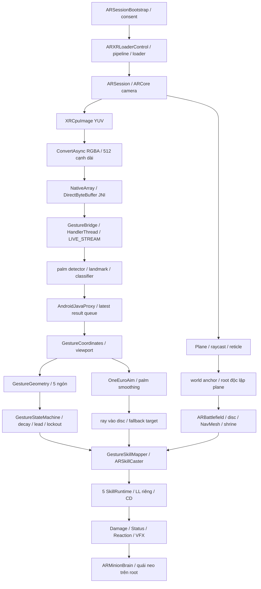
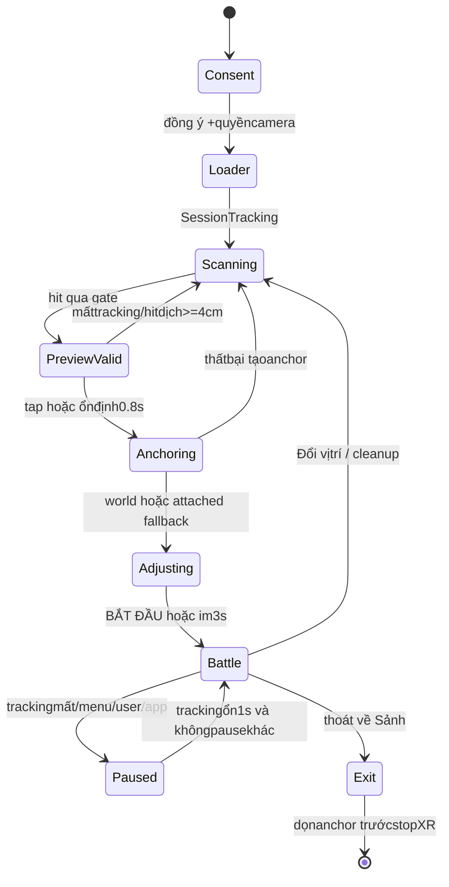

# 05 — AR và Deep Learning

## Mục lục
- [Ba tầng và pipeline](#ba-tầng-và-pipeline)
- [1. Tầng AR](#1-tầng-ar)
- [2. Tầng Deep Learning](#2-tầng-deep-learning)
- [3. Tầng quyết định](#3-tầng-quyết-định)
- [Năm cử chỉ và ba combo](#năm-cử-chỉ-và-ba-combo)
- [Hiệu năng và quyền riêng tư](#hiệu-năng-và-quyền-riêng-tư)
- [Lịch sử lỗi và các lần sửa](#lịch-sử-lỗi-và-các-lần-sửa)
- [Những phần chưa kiểm trên máy thật](#những-phần-chưa-kiểm-trên-máy-thật)

## Ba tầng và pipeline

**AR (Augmented Reality, thực tế tăng cường)** cung cấp pose camera, mặt phẳng, neo và nền video. **Deep Learning** chạy model nhận hình bàn tay. **Tầng quyết định** hợp nhất model với hình học và lịch sử rồi gọi Unity Skill System. ARCore không tự nhận cử chỉ; Gesture Recognizer không tự biết vị trí bàn thật hoặc gây damage.



## 1. Tầng AR

### 1.1 Session, hỗ trợ và camera

[ARHubEntry.Start](../Assets/ARRift/Runtime/ARHubEntry.cs) hỏi ARCore Java `checkAvailability` ở Hub khi loader chưa bật, tối đa 12 s với poll 0,5 s. Không khởi tạo XR ở Sảnh chỉ để kiểm hỗ trợ. Trong Editor coi Supported=true để XR Simulation dùng được. Ở scene AR, [ARSessionBootstrap](../Assets/ARRift/Runtime/ARSessionBootstrap.cs) có hai bước an toàn và quyền riêng tư, rồi xin Android Camera permission; denied hiện cách bật lại hoặc về Sảnh.

[ARXRLoaderControl.Start](../Assets/ARRift/Runtime/ARXRLoaderControl.cs) chờ consent, Android surface ngang, clone pipeline, chờ một frame, chọn renderer 0/camera rect toàn màn, InitializeLoader → CheckAvailability → StartSubsystems → bật sessionComponents. Unsupported hoặc thiếu provider/loader có Failure; không gọi Ready thành công để che lỗi.

Các ARSessionState cần hiểu: None (chưa xác định), Checking Availability, Unsupported, NeedsInstall, Installing, Ready, Session Initializing, SessionTracking. SessionTracking mới cho phép placement; một pose camera tồn tại trong Unity không tự nghĩa tracking đã tốt. `notTrackingReason` giúp phân biệt ít sáng/chuyển động quá mạnh/chưa có đặc trưng. NeedsInstall/Installing phụ thuộc provider; không có một màn tự cài ARCore tùy biến hoàn chỉnh được chứng minh chỉ từ CheckAvailability.

[RiftPlacementService.ConfigureCamera](../Assets/ARRift/Runtime/RiftPlacementService.cs) request autofocus, duyệt provider configs: bỏ resolution dưới 640×480, ưu tiên 30 FPS rồi gần 640×480 nhất. Cấu hình requested có thể không được máy hỗ trợ; phải đọc currentConfiguration thực. Fix 2 scene đã có autofocus bật, fix3 thêm request runtime rõ ràng, không nói fix2 vốn không có autofocus.

### 1.2 Plane, raycast và chấm điểm

ARPlaneManager nhận **HorizontalUp** có tracking, không subsumed (plane đã gộp sang plane khác). Boundary polygon là vùng provider đang tin là phẳng, không mesh mọi vật thật. [RiftPlacementService.Choose/Evaluate](../Assets/ARRift/Runtime/RiftPlacementService.cs) quét mỗi 0,05 s và bắn ray tại **giữa màn hình**, thứ tự theo supportedTrackableTypes:

| Kiểu hit | Ý nghĩa và cách runtime dùng |
|---|---|
| PlaneWithinPolygon | hit bên trong boundary mặt phẳng đã track; ưu tiên cao nhất |
| PlaneEstimated | mặt phẳng ước lượng; vẫn kiểm boundary/plane khi có ARPlane tương ứng |
| Depth | hit từ depth provider; fallback khi không có plane, cần normal gần up |
| FeaturePoint | hit điểm đặc trưng sparse; fallback cuối, không tự bảo đảm bàn đủ rộng |

Code chọn **hit hợp lệ đầu tiên theo ưu tiên**, không tối ưu argmax score qua mọi plane như SPEC ban đầu. [ARPlaneScoring.Score](../Assets/ARRift/Runtime/ARPlaneScoring.cs) hiện đóng vai trò gate nếu score < 0; điểm dương `2×area+3−distance+facing+convexity` không được dùng để xếp toàn bộ mặt phẳng trong Choose.

| Tham số fix3 / asset | Giá trị hiện hành |
|---|---:|
| Diện tích Bàn / Sàn tối thiểu | 0,15 /0,8 m² |
| Plane tracking ổn định | 0,3 s; reset nếu cao độ đổi>2 cm hoặc mất tracking |
| Khoảng camera-hit | 0,25–3 m |
| Góc nhìn xuống | 5–85° |
| Convexity tối thiểu | 0,6 |
| Facing | dot(camera.forward, delta.normalized)>0 |
| Bán kính danh định Bàn / Sàn | 0,5 /1,5 m |
| Bán kính tối thiểu | 0,18 m |
| Hit đứng yên để tự đặt | <4 cm trong 0,8 s |
| Depth/FeaturePoint normal | angle(up, hitNormal)<15° |

**Các thuật toán hình học** trong ARPlaneScoring:

```text
Area = abs(Σ(x_i*y_next − x_next*y_i))/2  // shoelace
Inside(q) = parity số giao cạnh với ray ngang  // ray crossing
EdgeDistance(q) = min distance(q, a+t*(b-a))
t=clamp01(dot(q-a,b-a)/max(1e-6,|b-a|²))
Incenter = điểm trong polygon có EdgeDistance lớn nhất trên lưới
step=max(.1m,max(width,height)/100)
Convexity=Area(boundary)/max(.001,Area(convexHull))
```

Incenter là xấp xỉ lưới, không nghiệm chính xác đường tròn nội tiếp polygon tùy ý. Grid thường 10 cm, mở step cho floor lớn để chặn chi phí; O(cells×edges). ConvexHull sort O(BlogB), monotone chain; diện tích/inside/edge distance O(B). Radius đặt `min(incenterRadius, edgeDistance tại hit, danh định)`: **giữ hit giữa màn hình**, không tự dời placement sang tọa độ incenter. Đây là khác biệt đáng kể với mô tả SPEC.

Reticle vàng khi hợp lệ/xám khi chưa đạt; chạm vùng trống hoặc nút đặt cho Confirm, không cần chờ tự đặt. Gợi ý sau 4 s theo light/tracking/distance/surface. Có tối đa 48 feature lạits thưa, không biến point cloud thành polygon giả. Fallback Depth/Feature không có boundary thật thì dùng radius danh định; cần kiểm trên thiết bị vì gate không chứng minh không gian trống vật lý.

### 1.3 Neo, điều chỉnh và chống trôi



[Confirm](../Assets/ARRift/Runtime/RiftPlacementService.cs) thử `TryAddAnchorAsync(pose)` **world anchor** trước; nếu thất bại và plane/provider supportsTrackableAttachments thì AttachAnchor fallback. Attached anchor theo trackable plane có thể bị update khi boundary/pose gộp; world anchor để provider giữ điểm thế giới độc lập plane. Không khẳng định world anchor tuyệt đối bất động: ARCore vẫn refine pose.

Root là GameObject riêng, không parent trực tiếp dưới ARPlane; FollowAnchor áp target anchor.position+offset và rotationOffset. Anchor nhảy>3 cm/frame thì Lerp/Slerp từ root hiện tại trong 0,15 s; đây là che bước nhảy ngắn, không sửa sai map tracking tích lũy. Sau neo tắt detection **và ARPlaneMeshVisualizer**, vì visualizer có thể tự bật Renderer dù manager disabled.

Điều chỉnh: một ngón drag trên plane toán học của root; hai ngón xoay quanh up và pinch scale0,7–1,3. Tự bắt đầu sau 3 s không chạm hoặc nút BẮT ĐẦU. Công thức:

```text
ActualScale = settings.Scale × radius/(Floor?1.5:.5) × adjustScale
settings.Scale = Table .15 /Floor .6
```

Không dùng luôn 0,15 cho mọi bàn nhỏ: radius 0,18 m cho scale0,054 trước pinch. Tất cả actor/range/audio phải dùng scale thực. Confirm có generation token tránh async anchor hoàn tất sau người chơi Reposition; stale anchor bị destroy.

[ARBattlefield.Update](../Assets/ARRift/Runtime/ARBattlefield.cs) pause khi root chưa có, adjusting, shrine null, user/menu/application pause, ARSession chưa tracking, hoặc tracking chưa ổn 1 s. Anchor tracking None kéo dài>2 s mới đánh AnchorLost; tracking Limited không bị đồng nhất với None. Field.Clock chỉ tăng khi không Paused; ParticleSystem Pause/Play theo chuyển trạng thái.

### 1.4 Light, shadow, depth và simulation

[ARBattlefield.LightFrame/Build](../Assets/ARRift/Runtime/ARBattlefield.cs) dùng mainLightDirection, intensityLumens/1000 clamp 0,2–2, fallback averageBrightness; ambientSH từ camera nếu có, khôi phục ambientProbe khi thoát. **Spherical harmonics (SH)** là biểu diễn ánh sáng môi trường bằng hệ số, không một ảnh HDRI mới được chụp đầy đủ.

[ARShadowCatcher shader](../Assets/ARRift/Shaders/ARShadowCatcher.shader) nhận bóng trên đĩa trong suốt để đồ 3D trông đặt trên mặt thật. Đĩa 64 segment riêng vừa shadow vừa NavMesh; không tiếp tục đổi theo boundary plane đã neo. Light estimation/shadow khác **occlusion** (vật thật che virtual): AROcclusionManager dùng environment Depth.Fastest nếu descriptor hỗ trợ, bật khi placement hoặc khi setting Occlusion trong battle; yếu/không hỗ trợ thì tắt. Có thể tay che quái khi depth provider đủ, chưa bảo đảm cho mọi điện thoại.

XR Simulation là provider Editor tạo session/plane/anchor để kiểm code đặt trận và lifecycle. [MockGestureSource](../Assets/ARRift/Runtime/MockGestureSource.cs) phát landmark/label giả để test combat/decision. Trong môi trường báo cáo, Simulation không cung cấp CPU camera image thực; preview/metrics ghi MOCK. Không dùng 14,27 Hz MOCK làm số inference MediaPipe.

### 1.5 Pipeline và Vulkan

[AR_RPAsset](../Assets/ARRift/Settings/AR_RPAsset.asset) chọn [AR_Renderer](../Assets/ARRift/Settings/AR_Renderer.asset) với ARBackgroundRendererFeature. Loader clone pipeline theo phiên, không ghi setting PC/mobile asset. Android Awake khóa LandscapeLeft, đợi `Screen.width>=height` và orientation đã áp trước khởi tạo XR; shutdown phục hồi orientation trước đó.

Fix 2 tìm cấu hình Manual Vulkan→GLES3 và pre-transform=true, AR renderer thiếu feature hỗ trợ command buffer cho Vulkan. Sửa GLES3-only, pre-transform false, landscape trước XR, viewport full và safe area UI riêng. Đây là kết luận cấu hình từ [fix2 REPORT](../task/ar/REPORT-AR-fix2.md), **chưa chứng minh lỗi nền đen trên máy đã được chữa**. CPU có ảnh preview không chứng minh GPU background full-screen hoạt động.

## 2. Tầng Deep Learning

### 2.1 Model làm gì?

MediaPipe Gesture Recognizer là model bundle nhận pose bàn tay và nhãn cử chỉ tĩnh. Canned labels gồm Closed_Fist, Open_Palm, Pointing_Up, Thumb_Down, Thumb_Up, Victory, ILoveYou và None; tracking dùng vùng từ frame trước để tránh chạy palm detector mỗi frame. Model `.task` đóng gói các model TFLite và metadata; bản được dẫn trong guide là float16. [Google Gesture Recognizer guide](https://developers.google.com/edge/mediapipe/solutions/vision/gesture_recognizer).

Hai giai đoạn **theo dõi bàn tay**: palm detector BlazePalm dùng detector một lượt kiểu SSD, anchor boxes hình vuông để đề xuất lòng bàn tay; crop có orientation cho hand landmark model dự đoán 21 điểm 3D. Landmark/tracking tốt thì frame sau tái dùng crop, thất bại mới detector lại. Anchor box của detector là prior 2D, **khác world anchor AR**. [Google Research về MediaPipe Hands](https://research.google/blog/on-device-real-time-hand-tracking-with-mediapipe/).

Sau đó gesture classifier là embedding network fully-connected residual, nhận screen/world landmarks cùng handedness, tạo vector 128 chiều; đầu classifier fully-connected (MLP, mạng nhiều tầng dense) phân 8 lớp. Classifier không trực tiếp đọc RGB, khác detector/landmarker trước nó. Độ sâu layer cụ thể không nằm trong Kotlin wrapper; không bịa kiến trúc tự train của game. [Model card chính thức](https://storage.googleapis.com/mediapipe-assets/gesture_recognizer/model_card_hand_gesture_classification_with_faireness_2022.pdf).

Landmark x/y normalized ảnh, z là chiều sâu tương đối; không lấy z đó như tọa độ world AR trên bàn. Model cũng có world landmarks nhưng bridge hiện chỉ gửi `result.landmarks()`63 float, nhãn/score/handedness/time/frameW/H; **không gửi world Landmarks vào game**. Camera→world aim do ray camera/disc giải quyết.

### 2.2Delegate và mode

[GestureBridge.create](../Assets/Plugins/Android/GestureBridge.kt) dùng model asset `gesture_recognizer.task`, TasksVision 1.0.0, LIVE_STREAM, numHands 1, detection/presence/tracking confidence 0,4. LIVE_STREAM nhận timestamp ms đơn điệu, `recognizeAsync` và listener; không chặn Update chờ inference. Classifier score game dùng ngưỡng khác 0,6/0,45, không nhầm với hand detector 0,4.

Delegate là backend thực thi model CPU hoặc GPU, không phải thread C# của game. Preferred cache theo `SystemInfo.deviceModel` ở PlayerPrefs. Nếu chưa có preferred: thử GPU 30 kết quả, thử CPU 30, so elapsed mean, recreate nhanh hơn; lỗi GPU fallback CPU. Khi cache CPU không cần thử GPU; preferred GPU bỏ trial nhưng vẫn có fallback. Phép đo gồm thời gian call/result trên bridge, không chỉ operator kernel; warmup/nhiệt/order có thể ảnh hưởng nên cần máy thật xác nhận.

Kotlin HandlerThread sở hữu recognizer/callback lifecycle. Không có setter ép CPU 2 threads trong API bridge hiện hành; không lặp lại yêu cầu SPEC như tính năng đã làm. Benchmark GPU trước không đồng nghĩa GPU luôn nhanh hơn CPU.

### 2.3 Pipeline ảnh, JNI và hàng đợi

**Source:** [FrameSampler.Update/RotationFor](../Assets/ARRift/Runtime/FrameSampler.cs), [GestureRecognizerBridge.Submit/Listener/Update/Receive](../Assets/ARRift/Runtime/GestureRecognizerBridge.cs), [GestureBridge.submit/releaseFrame/close](../Assets/Plugins/Android/GestureBridge.kt).

```text
ARCameraManager.TryAcquireLatestCpuImage → image YUV (ARCore giữ camera)
ConvertAsync RGBA32, giữ aspect, output cạnh dài 512 (low 384)
dispose XRCpuImage ngay sau tạo conversion; dispose conversion khi ready/error
copy conversion data sang persistent NativeArray của slot
JNI.NewDirectByteBuffer(NativeArray),CallBooleanMethod submit(buffer,w,h,rot,ts)
Kotlin copy một lần vào owned direct buffer trước return
worker recognizeAsync(MPImage +ImageProcessingOptions.rotationDegrees,ts)
listener → AndroidJavaProxy → ConcurrentQueue (giữ latest)
C#Update match timestamp với submitted, gắn displaymatrix/rotation,Result event
```

FrameSampler có hai buffer, một conversion đang chạy và tối đa một frame pending. Có thể convert N+1 khi inference N chạy; overwrite pending cũ bằng ảnh mới, không tạo backlog làm latency tăng. Kotlin AtomicBoolean busy chỉ cho một in-flight inference; MPImage.close giải phóng frame sau callback/error. Direct buffer JNI không biến pipeline thành zero-copy hoàn toàn: conversion→NativeArray và copy Unity→buffer Kotlin sở hữu vẫn có.

512 px giữ chi tiết cho landmark crop của tay nhỏ trước model tự resize; spec 256 px mất chi tiết khi crop. Camera 640×480 thành 512×384, nguồn 16:9 mới thành 512×288. Nominal 20 Hz/512; low 12 Hz/384 nếu slow>5 s hoặc thermal/reduced. `FrameSampler.slow` giảm dần khi frame nhanh, trong khi ARAdaptiveQuality cần chuỗi slow liên tục; không gộp hai timer thành một.

Timestamp `max(last+1,realtimeSinceStartupAsDouble×1000)`, nên duplicate/out-of-order bị chặn. Listener queue không gọi Unity API từ thread Java, main thread mới đọc. AndroidJavaProxy callbacks `[Preserve]` và keep ProGuard tránh stripping; submitmethod JNI signature `(Ljava/nio/ByteBuffer;IIIJ)Z`. Sau thoát scene accepting false, đóng worker/images/queue, dispose NativeArray. Không mở camera thứ hai bằng WebCam Texture.

### 2.4 Rotation và screen coordinates

[FrameSampler.RotationFor](../Assets/ARRift/Runtime/FrameSampler.cs): rotation=(sensorOrientation−displayDegrees+360)%360; display Portrait 0/LandscapeLeft 90/UpsideDown 180/LandscapeRight 270. Sensor orientation đọc CameraCharacteristics camera sau, fallback 90. Cái này là xoay input inference, không đồng nghĩa xoay camera viewport lần hai.

[GestureCoordinates.Viewport](../Assets/ARRift/Runtime/GestureCoordinates.cs) có ba đường:

1. Mock screenCoordinates: `(x,1−y)`.
2. Có AR displayMatrix: đảo affine mapping của phần 2×2 và translation, lấy ảnh `(x,1−y)`; không áp rotation nữa vì MediaPipe trả tọa độ về input ảnh gốc.
3. Không matrix: xoay normalized point 90/180/270, hiệu chỉnh aspect crop center rồi flip y vào Unity viewport.

```text
det = m00*m11 −m10*m01
x'=image.x−m20; y'=1−image.y−m21
viewport=((x'*m11−y'*m10)/det, (y'*m00−x'*m01)/det)
```

Nếu |det|≤1e−5 dùng fallback. Palm là trung bình landmark 0,5,9,13,17 rồi transform một lần. Double-rotation hoặc bỏ crop aspect làm chấm ngắm lệch khi máy landscape; fixture mock chỉ kiểm math, không xác nhận display matrix ARCore mọi máy.

## 3. Tầng quyết định

### 3.1 Hình học năm ngón

[GestureGeometry.Evaluate](../Assets/ARRift/Runtime/GestureGeometry.cs) nhận landmark 63 float và ARModeSettings. Chuyển **từng điểm sang viewport hiển thị**, kiểm hữu hạn và framing: cổ tay+≥15/21 điểm trong[0,03;0,97], bbox height≥0,08. Không lấy score cao để cho phép bàn tay ở sát mép/nhỏ không rõ.

```text
mcp/pip/tip mỗi ngón;ngón cái dùng indices2/3/4
angle = acos(dot(mcp-pip,tip-pip)/(|mcp-pip|*|tip-pip|))
ratio = distance(tip,wrist)/max(.001,distance(mcp,wrist))
Extended:angle>=150° AND ratio>=1.25 AND thumbDirectiongate
Folded:angle<=120° OR ratio<1.08
otherwise Neutral
palmWidth=max(.025,distance(indexMCP5,pinkyMCP17))
```

ThumbDirection gate loại ngón cái “thẳng” nhưng hướng dọc không phải mở rõ; dùng dot với cổ tay→middleMCP 9 và khoảng tip→9>0,85 palmWidth. Hình học 2D viewport dễ sai do foreshortening/che khuất; nó là guard/rescue cho model, không groundtruth 21 điểm.

| Nhãn geometry | Luật |
|---|---|
| Open_Palm | ≥4 ngón Extended |
| Victory | index+middle Extended, ring+pinky Folded, tip 8–12 distance>0,35 palmWidth |
| Pointing_Up | chỉ index Extended và tip 8 y>mcp 5 y+margin |
| Thumb_Down | chỉ thumb Extended và tip 4 y<wrist y−margin |
| Closed_Fist | ≤1 Extended, không thumbdown, index/middle/ring/pinky không Extended |
| clear/veryClear | Neutral≤1 /Neutral 0 và inFrame |
| directionmargin | 0,08×palmWidth |

`GeometryResult.Contradicts` chỉ phản bác khi clear. Geometry Neutral không tự chứng minh đúng/sai; code tránh loại mọi frame không khớp tuyệt đối.

### 3.2 Hợp nhất model và geometry

[GestureStateMachine.Process](../Assets/ARRift/Runtime/GestureStateMachine.cs) chỉ nhãn mapped và inFrame; mâu thuẫn rõ thì reject trước mọi ngưỡng:

```text
accepted = !contradiction AND inFrame AND
           (score>=.6 OR(score>=.45 AND geometryclear &&geometrylabel==model))
nếu modelNone và geometryveryClear thuộc Open/Fist/Victory:
  rescue với score=.35;Pointing/ThumbDown khôngNone-rescue
nếu palmSpeed>1.5normalizedviewportwidth/s:không cộng evidence
```

Threshold 0,6 là model decision confidence, 0,45 là rescue **khi khớp rõ**,0,4 là detector setting Kotlin. Không mô tả 0,45 như đủ để bắn khi geometry mâu thuẫn. None không tay hoặc không nhãn sau 0,2 s reset held; evidence vẫn decay theo thời gian.

### 3.3 Evidence, hysteresis và lockout

Không còn cửa sổ 4/5 mẫu như SPEC. Evidence 5 nhãn là memory liên tục, giảm theo dt; nhãn trượt một frame không reset ngay mọi tiến độ.

```text
now=timestampMs*.001;reject now<=lastTime
E_i *= exp(-dt/.25)
nếu accepted:
  gain=score*(geometrymatch?1.2:1)
  E_label=min(2*threshold,E_label+gain)
  E_other=max(0,E_other-.5*gain)
top=argmaxE;second=argmax không top
fire nếu acceptedlabel==top, E_top>=1.5, E_top−E_second>=.6
  và now>=lockedUntil và held!=top
fire:set held,lock.35s,clearEvidence,GestureFired
```

Hysteresis ở đây là tích lũy+decay+lead+held để tránh đổi quyết định do dao động nhãn, không một mạng lặp mới. Evidence gain theo **mẫu** chứ không nhân dt; cadence inference 12/20 Hz ảnh hưởng số mẫu/latency. Không suy “luôn 250 ms” từ threshold 1,5.

Giữ cùng nhãn sau fire không bắn lại dù cooldown xong. Nhãn accepted khác gỡ held ngay, cho phép combo sau lockout 0,35 s không cần bỏ tay ra; mất None/hand 0,2 s cũng gỡ held. Suspend clear Evidence; chỉ `resetHeld=true` khi cleanup. Caster pause/reposition không tiếp tục fire từ evidence cũ.

StateMachine phát fire vẫn trước validation runtime.IsReady/aim/cost; cast bị từ chối vẫn là cử chỉ đã fire/held. Người chơi cần đổi/nhả rồi giơ lại, không kỳ vọng cooldown xong tự bắn. Decision debug `idle/charging/geometry-reject/moving/lockout/held/fire/suspended` là chuỗi trạng thái quan sát, không enum Idle/Armed trong SPEC.

### 3.4 One-Euro filter và ngắm

[OneEuroAim.Filter](../Assets/ARRift/Runtime/OneEuroAim.cs) là low-pass thích nghi: khi đứng yên cutoff thấp giảm jitter, khi di chuyển nhanh cutoff cao giảm trễ.

```text
alpha(fc,dt)=1/(1+1/(2*pi*fc*dt))
vRaw=(nextRaw−rawPrevious)/dt
vHat=Lerp(vHat,vRaw,alpha(1,dt))
cutoff=1.4 +.02*|vHat|
aimHat=Lerp(aimHat,nextRaw,alpha(cutoff,dt))
```

dt min 0,001 s; gap>0,5 s hoặc lần đầu reset raw=value, velocity 0. ARSkillCaster truyền **pixel tọa độ màn hình**, nên beta 0,02 có ý nghĩa theo pixels/s, không scale bất biến normalized viewport. Bộ lọc làm mượt điểm ngắm. Score và evidence được xử lý riêng ở tầng quyết định.

[ARSkillCaster.FindAim](../Assets/ARRift/Runtime/ARSkillCaster.cs) ưu tiên ScreenPointToRay giao plane toán học root/disc, khoảng tới root≤1,3 radius; nếu không thì ARray Polygon selectedplane, cuối cùng quái AR gần tâm view nhất. Vì plane detection dừng sau neo, ngắm không phụ thuộc boundary mới. Runtime/ARCombatContext constrain điểm/radius trong đĩa trước VFX/hit.

### 3.5 Từ quyết định đến skill

[ARSkillCaster.Build/Fire](../Assets/ARRift/Runtime/ARSkillCaster.cs) tạo ARCaster inactive, CharacterController stepOffset 0 và disabled **trước parent scale nhỏ**, health/stats/spirit/chain/VFX/impact/aim/input legacy disabled. Clone GiantHandConfig và scale range/radius/verticalTolerance/height. Tạo đúng 5 runtime và definition theo map, allUnlocked chỉ ARContext.

Fire kiểm runtime/aimValid/Paused/IsReady rồi GiantHand.CastAt hoặc Set1SkillRuntime.CastAt. LINH LỰC AR riêng max 200/regen 30, CD gốc giữ; không gán 4 ô, không ghi hồ sơ. Thành công tên/thông báo/âm/rung, từ chối feedback CD/LL/aim; Return về game thường khôi phục ForceMobileQuality trước phiên.

## Năm cử chỉ và ba combo

Nguồn: [GestureSkillMapper.Labels/Ids/Find](../Assets/ARRift/Runtime/GestureSkillMapper.cs).

| Cử chỉ model | ID / kỹ năng | Vai trò |
|---|---|---|
| Open_Palm | dai-thu-an / Thiên Thủ (Đại Thủ Ấn) | Thổ, AoE +Stun |
| Closed_Fist | hac-dong-than-la / Hắc Động Thần La | Không Gian, gom Pulled |
| Pointing_Up | than-kiem-ngu-loi / Ngự Lôi | Lôi, tự chọn gần aim/nảy |
| Victory | van-kiem-quyet / Vạn Kiếm Quyết | Kim, mưa kiếm vùng |
| Thumb_Down | han-bang-phong-an / Hàn Băng Phong Ấn | Thủy, cone từ Linh Trận→aim, Freeze |

Thumb_Up và ILoveYou có trong model nhưng không mapped, không cast skill. Không có custom gesture training trong job AR.

| Thứ tự | Phản ứng | Điều kiện cần còn sống |
|---|---|---|
| Thumb_Down → Pointing_Up | Băng Lôi Liệt | target còn Freeze khi hit Lôi |
| Open_Palm → Victory | Phá Giáp | target còn Stun khi hit Kim |
| Closed_Fist → Victory | Tụ Sát | hit isArea lúc Pulled, trước Hắc Động hất/consume |

Combo dùng [ReactionResolver](../Assets/Combat/Runtime/ReactionResolver.cs) chung; evidence fire/cast/impact có thời điểm khác nhau, không chỉ đổi icon HUD là đủ.

## Hiệu năng và quyền riêng tư

| Ngân sách / đo | Phân biệt rõ |
|---|---|
| 30 FPS | mục tiêu máy tầm trung, không số frame đã nghiệm thu Android |
| Inference≤30 ms, RAM tăng thêm<60 MB | mục tiêu SPEC; model 8,37 MB không tương đương toàn RAM runtime |
| Input 20 Hz 512 /low 12 Hz 384 | giá trị code fix 3; nominal, không guarantee mỗi frame gửi được |
| Cast latency | SPEC≤300 ms; fix3 cập nhật mục tiêu≤350 ms p50; cần đo end-to-end |
| Sáu actor/LOD | cap 6, ForceLOD 1 nếu có, Animator CullUpdateTransforms; fallback steering≤6 |
| Thermal | Android SDK≥29 Power Manager thermal status≥3, poll 2 s; slow<27 FPS 5 s→renderScale.85 một lần theo visit |
| Editor fix 3 | 14,27 Hz/0,417 ms MOCK, không MediaPipe CPU/GPU |

Đo RecognitionFps từ callback interval EWMA; bridge Latencyms=realtime Now−frame Timestamp gồm từ capture/conversion/submit đến Receive, không gồm thời gian evidence/skill anticipation/impact. Muốn đo gesture→cast cần marker lúc pose bắt đầu/caster Fire, không dùng một số LatencyMs thay toàn pipeline. Log debug rate 5 dòng/s ARGesture và 2 s ARDiag trong Editor/development; không spam ảnh hoặc landmark đầy đủ.

Ảnh camera/landmark chỉ ở RAM cho inference/preview/debug, không code write ảnh hoặc upload trong pipeline. [ARGestureTelemetry](../Assets/ARRift/Runtime/ARGestureTelemetry.cs) opt-in chỉ count recognized/fired nhãn; [LocalTelemetry.ARGestures](../Assets/Progression/Runtime/LocalTelemetry.cs) ghi JSONL local, không tọa độ/landmark/ảnh/tài khoản. Dev chụp framebuffer simulation làm QA vẫn là artifact bằng chứng, khác chức năng ứng dụng tự lưu camera người chơi.

## Lịch sử lỗi và các lần sửa

| Lần | Lỗi / thay đổi | Kết quả và giới hạn nguồn |
|---|---|---|
| [AR gốc](../task/ar/REPORT-AR.md) | tách XR/camera/proxy, plugin Gradle/Kotlin, đóng gói model STORED, teardown anchor trước stop XR |25/0 M5; M3 Level 8 to 10 raw 106/1 vì UI ending chờ 20 s; native camera chưa thử |
| [fix1](../task/ar/REPORT-AR-fix1.md) | VFX offset/particle/line/trail/range scale, nhỏ damage bars, HUD placement, Linh Trận pha lê/rune | visual Editor và APK 565.589.431 bytes; raw AR 23/25 giữ, một phần focused combos; không gọi full 25/25 |
| [fix2](../task/ar/REPORT-AR-fix2.md) | nền đen/rotation: GLES3-only, pre-transform off, landscape before XR, safeArea, diagnostics, manifest hook |raw AR 24/1, Tụ Sát focused PASS; APK 548.527.081 bytes, background máy thật chưa xác nhận |
| [fix3](../task/ar/REPORT-AR-fix3.md) | đặt quá chậm/recognition yếu: nới gates, world anchor, stop visualizer,512 px, pipeline overlap/JNI direct buffer, GPU trial, geometry+evidence, HUD rail | unit 27/0, AR 25/0, Hub 42/0; APK 548.558.335 bytes,0 errors/58 warnings; device chưa thử |

Fix3 nguyên nhân từ log Realme trước:202 obsolete byte-array warnings; đã chuyển signature ByteBuffer, nhưng chưa có log thiết bị fix 3 chứng minh warnings 0. Attached plane drift được giải quyết bằng world anchor/đĩa cố định; simulation drift 0 m khi đổi/gộp plane, không cho phép khẳng định ARCore thật 0 drift.

Fix3 timing simulation Scene→reticle 3,377 s chưa đạt≤3 s; vàng→neo 1,588 s chưa đạt≤1 s. Plane đầu 3,129 s và fixture đang lia ảnh hưởng; code auto.8 s không guarantee wall-time<1 s trong every case. HUD combat 3,4423%, combo 5,1645% ở 1600×720/2400×1080; menu/help pause không tính mẫu combat. Raw full ComicTextAudit 1 issue giữ, sửa 3 label focused 0 issue; không đổi raw full thành 0.

## Những phần chưa kiểm trên máy thật

- Background camera GLES3/phủ full viewport, vào AR từ hai hướng ngang, thoát phục hồi orientation.
- CPU image/rotation/display matrix/palm overlay, autofocus/current resolution, Depth/light thực.
- GPU/CPU 30+30 trial, cache delegate, fallback GPU error, signature JNI không có obsolete warning mới.
- Nominal 20/12 Hz, latency gesture→cast p50/p95, accuracy≥90% mỗi 30 lần/cử chỉ, nhầm≤1 lần/phút; tay trái/phải/ánh sáng yếu/30–80 cm.
- FPS 30 ổn định/nhiệt 10 phút/RAM, touch drag/pinch, haptic, anchor tracking None/recovery 1 s và drift thật.

[DEVICE-TEST](../task/ar/DEVICE-TEST.md) là checklist bàn giao. Job DOCS không cài APK hoặc chạy Play; mọi số test ở đây đều dẫn nguồn REPORT, không nghiệm thu mới.

## Các mode và công nghệ AR — batch 1007 (07/10/2026)

[ARModeCatalog](../Assets/ARRift/Runtime/ARModeCatalog.cs), [ARGameMode](../Assets/ARRift/Runtime/ARGameMode.cs) và [ARModeSession](../Assets/ARRift/Runtime/ARModeSession.cs) sở hữu lựa chọn trước placement, capability, lịch wave, seed, kết quả và chính sách persistence. Năm mode đều đã mở playable:

| Mode | Luật / thời lượng |
|---|---|
| Làm quen |3đợt3/4/6, bảo vệ Linh Trận,5chiêu mở sẵn |
| Thủ Trận |5đợt, Rift phụ/tường, tinh anh và rồng; Thiên Kiếm kết trận; limit360s |
| Truy Rift |180s; tìm portal, ngắm tâm và nối chuỗi chỉ định trong20s, không cần đầy Linh Ấn |
| Đấu Long |240s;3lớp giáp, combo điểm yếu và6hit; dọn ground support để Thiên Kiếm |
| Luyện Ấn |90s;6cử chỉ trên grid100BPM, Perfect≤90ms/Great≤200ms, nhịp tăng dần |

10Ải mở tuần tự:1–3 Làm quen,4/7/10 Thủ Trận,5/8 Truy Rift,6/9 Đấu Long. Daily luân phiên3mode bằng seed ngàyUTC. Thưởng5LT/sao và quiz dùng chung **trầnAR60LT/ngày riêng**, không Tu Vi; top20/mode lưu local. Dev/transient/KiểmẤn không lưu thưởng, score hoặc notebook. Vệt ấn Vàng/Lam mở tại tổng3/15sao, điểm tay chỉRAM/TTL250ms.

Giữ D1 world3D/model≥.6/100ms/một pose một intent, aim tâm màn hình, placement polygon và watchdog GóiA. [GestureSequenceMatcher](../Assets/ARRift/Runtime/GestureSequenceMatcher.cs) nhận intentD1, gap1.2s: V→Lên→Mở/Vạn Kiếm Quy Tông, Xuống→Nắm→Lên/Băng Thiên Lôi Ngục, Mở→Nắm/Thiên Thủ Hấp Tinh. Đầy100Ấn mới giữ tiền tố; fail/timeout fallback chiêuđầu, giữmeter. ThumbUp là Kim Chung Tráo, đỡ1đòn/hồi6s/perfect250ms. Chủđộng opt-in chỉSàn+capabilityDodge: đạn báo1.2s, né ngang/cúi25cm, slowclockAR.2×/.3s, khôngTime.timeScale toàn game.

Rift phụ chỉpolygon HorizontalUp/Vertical vàanchor riêng, cap3/reduced1. Quái entrance xong mới navigation ngang. Rồng dùng3prefabP12, bay cao hơncamera; Thiên Kiếm dùngP15, PointingUpD1+pitch>35° giữ1.5s với framefresh/geometry/epoch/watchdog. [ARHandMotion](../Assets/ARRift/Runtime/ARHandMotion.cs) bùcamera pose cho pinch/swipe, chặn static trướcD1. Nhấc chỉquáiStun/Freeze; Rigidbody chỉtrong lifecycle ném. Quiz3–4runes ngắm tâm+ClosedFist, nghỉ10s sauwaveclear thật; thưởngquaP08+capAR, buffwavekế vàsổôn.

Tech2 mặc định tắt giọng nói: JNI2tay cóD1/identityriêng,180ms ghép Mở+Mở/ThiênThủĐôi hoặcNắm+V/VạnKiếm khi100Ấn. Depth dùngproviderTrackableType.Depth/max10rayframe vàcacheocclusion, khôngmeshphòng/placementdepth. Probe poll250ms/2s, GPUcubemap chỉRAM/tiercao. VoskVN33.7MBzip/53.3MBunpack Apache2.0,3keywordngoại tuyến, micro riêng chỉcửasổKếtẤn; đúngtên buffuy lực1.3snapshot, PCMkhônglưu/upload. ClipAPI29+ chỉsauwarning+MediaProjectionconsent, foregroundservice, silent90s,24FPS/H264,MediaStoreMovies/CampusRift,khôngtựgửi.

XR Simulation khôngDepth và khôngchứng minhnativevoice/projection/recognition. Các phépđoFPS/identity/thermal/va chạm/quyền/gallery cầnmáythật. [Giaiđoạn3](../task/batch-1007/GIAI-DOAN-3-CHUAN-BI.md) chỉtài liệuGeospatial/co-op/cloudconsent; chưa kíchhoạtmạng/key/billing. Chi tiết nguồn vàgiới hạn: REPORT2–6 trongtask/batch-1007.
