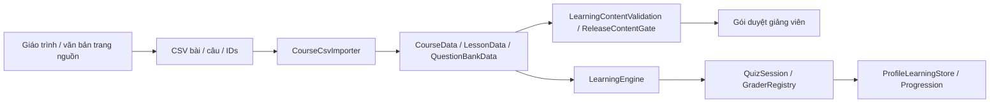

# 06 — Học tập, tiến trình và kinh tế

## Mục lục
- [Nội dung và pipeline](#nội-dung-và-pipeline)
- [Quiz và chấm điểm](#quiz-và-chấm-điểm)
- [Tu Vi và cảnh giới](#tu-vi-và-cảnh-giới)
- [Ôn tập, thẻ và sổ câu sai](#ôn-tập-thẻ-và-sổ-câu-sai)
- [Thi Đột Phá](#thi-đột-phá)
- [Linh Thạch và chống spam](#linh-thạch-và-chống-spam)
- [Nhiệm vụ ngày và Linh Bia](#nhiệm-vụ-ngày-và-linh-bia)
- [Cửa hàng, vật phẩm và pháp bảo](#cửa-hàng-vật-phẩm-và-pháp-bảo)
- [Telemetry và giới hạn kiểm chứng](#telemetry-và-giới-hạn-kiểm-chứng)

## Nội dung và pipeline

Nguồn hiện hành là [LearningCatalog](../Assets/Learning/Resources/LearningCatalog.asset) và [TTHCM Data](../Assets/Learning/Data/TTHCM/). P20 ghi 6 chương/21 bài/93 trang/449 câu/93 thẻ; câu được thêm là 9 câu từ văn bản đã có, không AI tự sáng tác giáo trình không nguồn. [Báo cáo P20](../task/p20/REPORT-P20.md) và gói P23 còn chờ giảng viên duyệt. Kế hoạch ghi “chờ nội dung” là trạng thái lịch sử, không trạng thái import hiện hành.



[CourseCsvImporter](../Assets/Learning/Editor/CourseCsvImporter.cs) chuyển type key tiếng Việt trong CSV sang type runtime; [LearningContentValidation](../Assets/Learning/Editor/LearningContentValidation.cs) kiểm ID, câu/option/answer, nguồn/giải thích và lượng nội dung. [ReleaseContentGate](../Assets/Learning/Editor/ReleaseContentGate.cs) kiểm điều kiện content khi build; validation cấu trúc không xác nhận câu học thuật đúng hay được giảng viên phê duyệt.

Các model dữ liệu ở [CourseData](../Assets/Learning/Runtime/CourseData.cs), [LessonData](../Assets/Learning/Runtime/LessonData.cs), [QuestionBankData](../Assets/Learning/Runtime/QuestionBankData.cs). Question gồm ID, lessonId/type, prompt, options có ID, correctOptionIds, explanation, sourcePage/difficulty cùng field VN. Giữ ID khi sửa chính tả để save/sổ sai không mồ côi. Text trang tách content/takeaway; không đưa tên lịch sử/môn học vào tên đòn đánh/quái. Nội dung môn học có thể chỉ Việt, UI vẫn EN/VN.

## Quiz và chấm điểm

[LearningEngine.Available/ReadPage/StartQuiz/Submit](../Assets/Learning/Runtime/LearningEngine.cs) mở bài theo prerequisite đã mastered (`rewarded`), không số giây sống sót. Đọc trang theo thứ tự, đến trang cuối đánh completed và thưởng đọc lần đầu; quiz yêu cầu completed. CourseAvailable chỉ kiểm catalog chứa course, không tự khóa mọi chương theo realm.

[QuizSession](../Assets/Learning/Runtime/QuizSession.cs) lấy mẫu câu bằng RNG, xáo option phù hợp type, giữ signature để tránh lặp thứ tự; `Committed` và active session chặn submit hai lần. Thời gian được truyền qua TimeSource để harness dùng clock riêng. Tỷ lệ đúng=correct/total×100, không cho một câu multi-choice được điểm một phần.

| Type key runtime | Cách chấm / nguồn |
|---|---|
| single-choice | đúng duy nhất ID đáp án; [SingleChoiceGrader trong QuizSession](../Assets/Learning/Runtime/QuizSession.cs) |
| true-false | đúng 1 ID `true`/`false`, đúng hai option; [Graders](../Assets/Learning/Runtime/Graders.cs) |
| ordering | danh sách chọn đủ, đúng từng vị trí với correctOptionIds; không set-equality |
| multi-choice | đúng số lượng, không trùng, HashSet.SetEquals; thiếu/thừa đều sai; [ExtendedGraders](../Assets/Learning/Runtime/ExtendedGraders.cs) |
| matching | cặp chuỗi `leftID:rightID`, hai phía đủ/không trùng và set cặp bằng nhau |
| fill-blank | prompt có `___`, chọn 1 cụm từ đúng từ options; không NLP chấm văn bản tự do |

GraderRegistry.For kiểm `Supports` trước `Grade`, nên dữ liệu type không hợp lệ bị loại hoặc validation báo lỗi. Phân biệt index hiển thị với ID ổn định; đảo thứ tự option không được làm đổi đáp án. UI nối cặp hỗ trợ chạm hai lần/kéo thả theo P20, logic grader độc lập thao tác.

## Tu Vi và cảnh giới

[CultivationService.AddTuVi/CompleteBreakthrough](../Assets/Progression/Runtime/CultivationService.cs) có 7 realm×5 tier. Tu Vi là tiến độ **trong tầng hiện tại**, không lifetime; totalEarned là thống kê. AddTuVi có thể qua nhiều tier, dừng tier 5 đầy; dư ở bình cảnh bị bỏ, không tích lại để sang realm ngay sau exam.

| Cảnh giới | EXP/tầng | HP tầng 1→5 | Công 1→5 | LL 1→5 | Defense |
|---|---:|---|---|---|---:|
| Luyện Khí |100|100→140|20→28|100→120|0%|
| Trúc Cơ |150|170→220|34→44|130→150|3%|
| Kết Đan |225|260→320|52→64|160→180|6%|
| Nguyên Anh |340|370→440|74→88|190→210|9%|
| Hóa Thần |510|500→580|100→116|220→240|12%|
| Luyện Hư |760|650→740|130→148|250→270|15%|
| Độ Kiếp |1140|820→920|164→184|280→300|18%|

Nguồn [CultivationTable.asset](../Assets/Progression/Resources/CultivationTable.asset) và [CultivationTable.cs](../Assets/Progression/Runtime/CultivationTable.cs): nội suy tầng, runBonusPerRealm 0,015/trần 0,1. [CultivationPlayerBridge](../Assets/Progression/Runtime/CultivationPlayerBridge.cs) đẩy chỉ số qua PlayerStats; UI không tự tăng HP bằng số đang hiển thị.

**Chia thưởng thật:** [StudyRewards trong StudyRewardRules](../Assets/Progression/Runtime/StudyRewardRules.cs) có ChapterShare 0,85, FirstRead 15/85, FirstQuiz 70/85, Review 0,1.

```text
realmTotal = TuViPerTier×5
lessonShare = realmTotal×.85 /lessonsInCourse
firstRead = lessonShare×15/85
firstQuiz = lessonShare×70/85×percent/100
onTimeReview = lessonShare×.10
practice = min(2×correct,150−practiceTuViToday)
firstClear = currentTuViPerTier×.05
```

Ví dụ chương 4 bài ở Luyện Khí: share 106,25; đọc 18,75/quiz tối đa 87,5 mỗi bài, tổng chương 425=85%500. Nhân tiếp 15%/70% share theo câu chữ kế hoạch sẽ chỉ 72,25% realm; code đã chuẩn hóa bằng chia 85. Quiz EXP chỉ thưởng **lần submit đầu**, ngay cả score thấp; làm lại cải thiện record/LT, không nhận lại EXP quiz đầu. Bình cảnh vẫn ghi readRewarded/quizRewarded dù Tu Vi thực nhận có thể 0; cần đọc/chọn thời điểm học hợp lý.

## Ôn tập, thẻ và sổ câu sai

[ReviewScheduler](../Assets/Learning/Runtime/ReviewScheduler.cs): mastered lần đầu chưa có huy hiệu, due 1 ngày; đậu review 5 câu≥80% lên Đồng và due 3 ngày; lần sau Bạc/due 7 ngày; Vàng dừng schedule. Trượt giữ huy hiệu/due 1 ngày. “1/3/7” là khoảng sau từng thành công, không ba mốc cố định cùng tính từ ngày học đầu.

[LearningEngine.PracticePool/SubmitPractice](../Assets/Learning/Runtime/LearningEngine.cs) lấy bài đã đọc, loại câu làm đúng trong 24 giờ, dedup ID, tối đa 10 câu/5 phút. Trần 150 TuVi/ngày, độc lập trần 300 LT. `correctLog` giữ tối đa 48 giờ, còn `solved` lifetime để phân firstCorrect.

[ExtendedLearning.Cards/ReviewCard](../Assets/Learning/Runtime/ExtendedLearning.cs) tạo flashcard từ takeaway có nguồn, ID`lesson/card/page`; nhớ hẹn 1440 phút, chưa nhớ 5 phút, sort nextUtc. Không dùng mô hình SM-2 hay Leitner nhiều hộp: đây là lịch hai mức. Không thưởng Tu Vi lật thẻ, nhưng ôn đủ bộ bài trong ngày tính nhiệm vụ học 1 bài.

Sổ câu sai được `RecordNotebookAnswer` ghi **mỗi AnsweredRecord**, kể cả rời session chưa submit. Sai reset consecutiveCorrect và tăng wrongCount; đúng 2 lần liên tiếp bỏ khỏi sổ. NotebookPool gồm exam-only đã gặp, không chỉ ngân hàng lesson. StartNotebook≤10 câu; SubmitExtra trả LT theo PayAnswers cho Notebook, Linh Bia không LT từ câu.

Clock là [ILearningClock/SystemLearningClock/FakeLearningClock](../Assets/Learning/Runtime/LearningClock.cs). `LearningEngine.Now=max(lastSeenUtc,systemUtc)` chặn quay đồng hồ lùi nhận thưởng cũ; đây là bảo vệ local, không server authority chống người sửa JSON/clock tiến. `DueReviewCountReadOnly` cho Hub không tạo lesson entry/đổi timestamp — sửa AR để trở về Hub không vô tình đổi profile.

## Thi Đột Phá

[BreakthroughExam.Pool](../Assets/Learning/Runtime/BreakthroughExam.cs) gộp examBank+câu của các lesson trong chương, dedup ID và Supports. [Course assets](../Assets/Learning/Data/TTHCM/) hiện examSize 20, pass 80, minutes 20; retry 30 phút, thưởng 300 LT.

```text
CanTakeExam: đúng realm chương +tier 5 đầy +chưa retry lock +pool>=examSize
StartExam: random 20 câu,entry.inProgress=true,Save ngay
Remaining = startedUnscaled+20×60−nowUnscaled
Submit: unanswered sai,grade,best/attempts;Committed chặn double
  đậu → realm+1/tier1/tuVi0,+300LT
  trượt → retryAtUtc+30phút
Abandon / restart inProgress → fail attempt và retry lock, không mất hồ sơ
```

Không kéo dài thời gian thi bằng setting đọc chậm: P23 slow-reading timer×1,5 áp quiz/luyện phù hợp, exam vẫn×1. BreakthroughExam.Expired/Remaining dựa unscaled time, pause game không dừng exam. UI phải submit khi timeout; không chỉ hiện 0 mà để session kéo dài. Nội dung câu/đáp án font đứng/trang trọng, cinematic sau đậu mới có tu tiên.

## Linh Thạch và chống spam

[EconomyConfig.asset](../Assets/Progression/Resources/EconomyConfig.asset), [StudyEconomy.PayAnswers/PayLesson](../Assets/Learning/Runtime/StudyEconomy.cs), [Wallet](../Assets/Progression/Runtime/Wallet.cs) là nguồn. Wallet không có giao dịch tiền thật/ad đổi thưởng trong code được đọc.

| Nguồn | LT / quy tắc |
|---|---|
| Câu đúng lần đầu |5, ghi solved ID |
| Đúng lại |2 nếu ngoài 24 giờ; trần 300/ngày |
| Lesson≥80% /100% |30/50 tổng; nâng 30→50 chỉ trả 20 chênh, không 50 mới |
| Review đúng hạn đậu |40 |
| Exam đậu |300 |
| Clear đầu màn |40×index; không lặp mỗi replay |
| Sao mới |20/mỗi bit mới |
| Nhiệm vụ ngày |30/mục |
| Chuỗi 7 ngày |150 mỗi chu kỳ 7 |

```text
PayAnswers trước LogCorrect để xem lịch đúng cũ
foreach answer:
  fastStreak += (seconds<1.5) ?1 :reset0
  nếu streak>=5:pausedUntil=now+2phút,không thưởng từ đây
  nếu correct và không paused:
    unsolved:+5;solved ngoài 24 h:+min(2,300−retryToday)
LogCorrect sau: cập nhật timestamp vàDaily.Correct
```

Fast streak xét tốc độ mọi câu, không chỉ câu đúng; tính trong session PayAnswers này. Đã trả bốn câu trước streak nhanh không bị rollback. Pause thưởng trong StudyEconomy chủ yếu gate **answer payouts**, không tự dừng exam/review/lesson bonus riêng hay gameplay. Sai không trừ LT/TuVi. Chống spam local giúp tránh nhấn bừa, không phải cơ chế chứng nhận người đã hiểu bài.

## Nhiệm vụ ngày và Linh Bia

[StudyDaily.Refresh/Activity/Lesson/Correct/Review](../Assets/Learning/Runtime/ExtendedLearning.cs) dùng ngày UTC, nhiệm vụ học 1 bài/đúng 20 câu/ôn 1 bài, mỗi mục trả một lần/ngày. Streak 7 ngày+150; gap 2 ngày có thể dùng một ngày nghỉ phép/tuần tính từ thứ Hai, dùng rồi lại gap thì mất chuỗi; gap>2 reset. State còn `ProfileData.daily` cũ nhưng P20 logic dùng `learning.studyDaily`, không lấy field tên gần giống làm nguồn thật.

[LearningShrines.Positions/Begin](../Assets/Learning/Runtime/LearningShrine.cs) tìm NavMesh indoor gần spawn, cách nhau≥10 m, tránh capsule chạm môi trường,1 bia L1–3/2 bia từL 4 nếu có điểm hợp lệ. [LearningShrine.Interact/Resolve/Choose](../Assets/Learning/Runtime/LearningShrine.cs): player trong 3 m, LOS, Indoor và không quái sống trong 8 m cùng tầng mới mở câu từ bài đã đọc. `UIStateManager.OpenShrine` tạm freeze combat/audio. Đúng chọn 3 buff khác từ 6 loại; sai/rời Used, không phạt LT/HP.

Buff: damage+20%90 s, heal 30%HP, cooldown−20%90 s, maxLL+30 hết màn, speed+15%90 s hoặc chống 1 lần control. Asset item tạm, cờ DontSave, cleanup sau màn. Bia không góp Kiếm Ý, không phải shop mới; không thưởng LT cho câu như Notebook. Tương tác học trong trận này là ngoại lệ đã thiết kế, thư viện đầy đủ vẫn ở Sảnh.

## Cửa hàng, vật phẩm và pháp bảo

Bảng dưới trích ItemCatalog và asset tham chiếu theo GUID; giá/max/realm là serialized. Mô tả asset chỉ để đọc nhanh; thực thi ở [PlayerItems](../Assets/Progression/Runtime/PlayerItems.cs)/[BuffSystem](../Assets/Progression/Runtime/BuffSystem.cs) qua ItemEffect type/stat/flag.

| ID / asset | Tên | Giá LT | Max/màn | Bán từ | Hiệu ứng mô tả asset |
|---|---|---:|---:|---|---|
| [hoi-khi-dan](../Assets/Progression/Data/Items/hoi-khi-dan.asset) | Hồi Khí Đan | 25 | 5 | Luyện Khí | Hồi ngay 20% máu. |
| [hoi-xuan-dan](../Assets/Progression/Data/Items/hoi-xuan-dan.asset) | Hồi Xuân Đan | 60 | 3 | Trúc Cơ | Hồi 45% máu trong 3 giây. |
| [tu-linh-dan](../Assets/Progression/Data/Items/tu-linh-dan.asset) | Tụ Linh Đan | 40 | 3 | Luyện Khí | Hồi 50% Linh Lực. |
| [ho-menh-phu](../Assets/Progression/Data/Items/ho-menh-phu.asset) | Hộ Mệnh Phù | 200 | 1 | Kết Đan | Tự hồi sinh 1 lần với 40% máu khi sắp gục. |
| [cuong-luc-dan](../Assets/Progression/Data/Items/cuong-luc-dan.asset) | Cuồng Lực Đan | 80 | 2 | Trúc Cơ | +30% sát thương trong 60 giây. |
| [kim-cuong-phu](../Assets/Progression/Data/Items/kim-cuong-phu.asset) | Kim Cương Phù | 80 | 2 | Trúc Cơ | Giảm 35% sát thương nhận vào trong 45 giây. |
| [than-hanh-phu](../Assets/Progression/Data/Items/than-hanh-phu.asset) | Thần Hành Phù | 50 | 2 | Luyện Khí | +30% tốc chạy trong 40 giây. |
| [ti-hoa-chau](../Assets/Progression/Data/Items/ti-hoa-chau.asset) | Tị Hỏa Châu | 120 | 2 | Hóa Thần | Giảm 50% sát thương Thiên Hỏa trong 90 giây. |
| [bang-tam-phu](../Assets/Progression/Data/Items/bang-tam-phu.asset) | Băng Tâm Phù | 90 | 2 | Hóa Thần | Miễn nhiễm Dư Hỏa, giảm 25% sát thương Thiên Hỏa trong 120 giây. |
| [kiem-tam-dan](../Assets/Progression/Data/Items/kiem-tam-dan.asset) | Kiếm Tâm Đan | 150 | 1 | Hóa Thần | Niệm Thiên Kiếm nhanh hơn 40% và không bị ngắt 1 lần. |
| [thanh-tam-dan](../Assets/Progression/Data/Items/thanh-tam-dan.asset) | Thanh Tâm Đan | 50 | 2 | Kết Đan | Hồi đầy Thể Lực; miễn khống chế 5 giây. |
| [cuu-chuyen-hoan-hon-dan](../Assets/Progression/Data/Items/cuu-chuyen-hoan-hon-dan.asset) | Cửu Chuyển Hoàn Hồn Đan | 250 | 1 | Nguyên Anh | Hồi đầy máu, xóa hiệu ứng xấu. Tối đa 1/màn. |
| [tu-khi-dan](../Assets/Progression/Data/Items/tu-khi-dan.asset) | Tụ Khí Đan | 90 | 2 | Kết Đan | Giảm 30% hồi chiêu trong 45 giây. |
| [bao-kich-dan](../Assets/Progression/Data/Items/bao-kich-dan.asset) | Bạo Kích Đan | 70 | 2 | Kết Đan | +25% tỉ lệ chí mạng trong 45 giây. |
| [ngu-hanh-phu](../Assets/Progression/Data/Items/ngu-hanh-phu.asset) | Ngũ Hành Phù | 100 | 1 | Nguyên Anh | Chọn hệ khi mua; hệ đó +40% sát thương trong 60 giây. |
| [tam-yeu-phu](../Assets/Progression/Data/Items/tam-yeu-phu.asset) | Tầm Yêu Phù | 60 | 2 | Trúc Cơ | Hiện vị trí mọi quái trong 30 giây. |

| Pháp bảo / asset | Tên | Giá từng cấp | perLevel | regenPerLevel | Effect enum |
|---|---|---|---:|---:|---:|
| [phi-kiem](../Assets/Progression/Data/Artifacts/phi-kiem.asset) | Phi Kiếm Thanh Trúc | 300 / 600 / 1000 / 1600 / 2500 | 0.06 | 0 | 0 |
| [ho-tam-kinh](../Assets/Progression/Data/Artifacts/ho-tam-kinh.asset) | Hộ Tâm Kính | 300 / 600 / 1000 / 1600 / 2500 | 0.05 | 0 | 1 |
| [tui-can-khon](../Assets/Progression/Data/Artifacts/tui-can-khon.asset) | Túi Càn Khôn | 800 / 2000 | 1 | 0 | 2 |
| [linh-luc-ho-lo](../Assets/Progression/Data/Artifacts/linh-luc-ho-lo.asset) | Linh Lực Hồ Lô | 250 / 500 / 850 / 1300 / 2000 | 8 | 0.4 | 3 |
| [ngoc-boi-ngu-hanh](../Assets/Progression/Data/Artifacts/ngoc-boi-ngu-hanh.asset) | Ngọc Bội Ngũ Hành | 400 / 800 / 1300 / 2000 / 3000 | 0.03 | 0 | 4 |

[ArtifactDefinition](../Assets/Progression/Runtime/ArtifactDefinition.cs) enum effects:0 BasicDamage,1 MaxHealth,2 ItemSlots,3 Spirit,4 ElementCounter. Hồ Lô+8 LL/+0,4 regen mỗi cấp; Ngọc Bội+3%elementcounter; Túi+1 slot/cấp 2. [ArtifactService.ApplyTo](../Assets/Progression/Runtime/ArtifactService.cs) dùng key source để apply hai lần thay thế, không cộng trùng. Lưu ý Phi Kiếm BasicDamage hiện đẩy **StatType.Attack** multiplier, vì vậy các skill đọc Attack cũng có thể hưởng; không khẳng định buff chỉ đánh thường theo câu chữ kế hoạch.

[ShopService.Check/Buy](../Assets/Progression/Runtime/ShopService.cs): kiểm realm, quantity positive, stack≤99 và LT; Ngũ Hành tạo item variant theo chosenElement, không đổi ID gốc hiện trong mọi trận. [ArtifactService.CanUpgrade](../Assets/Progression/Runtime/ArtifactService.cs) cap=min(MaxLevel, RealmIndex+1), tiền không vượt được cảnh giới.

[Inventory.SetCarry/BeginLevel/LevelBag.Consume](../Assets/Progression/Runtime/Inventory.cs):3 slot gốc→4/5 với Túi, slot là **loại vật phẩm**; mỗi loại có max/màn và owned. Không trừ inventory khi bắt đầu; dùng thì trừ vĩnh viễn 1, unused giữ cả thua/quit. Ngũ Hành chỉ một biến thể mang vào. Hộ Mệnh passive khi lethal, không nút manual; healing/restore từ chối khi đã đầy để tránh phí.

Stat buff keyed source, item flags riêng EmberImmune/SwordChannelSpeed/SwordUninterrupted/ControlImmune/RevealEnemies; item duration scaled time khi Pause freeze. Fire trần 80%và shield dùng receiver pipeline, không cộng mô tả−50/−60% tùy tiện để thành bất tử.

Hậu kết: [EndgameService](../Assets/Progression/Runtime/EndgameService.cs) Tháp 10 LT/tầng, Ác Mộng 20 LT/clear, trần chung 100/ngày UTC; không TuVi/first clear normal. High-water date chặn quay lùi ngày trả thưởng, save vẫn local.

## Telemetry và giới hạn kiểm chứng

[LocalTelemetry](../Assets/Progression/Runtime/LocalTelemetry.cs) chỉ opt-in; JSONL `telemetry/sessions-YYYY-MM-DD.jsonl` dưới persistentDataPath: runseconds/outcome/deathcause/firehits/stars, skill/item/reaction counts, quiz questionID+correct, mode/towerfloor. Không chứa text đáp án/PII/camera. `Transient` không ghi telemetry thật trừ TestFolder fixture; opt-out dọn pending run, nút xóa file local dùng DeleteLocalFiles.

P20 smoke 467/0 bao gồm Extended/Economy/Exam/UI/Hub/Shop; legacy Learning 19/2 được giữ ở report vì fixture HUD cũ. P23 có sửa/kiểm trợ năng mới hơn nhưng **chưa REPORT hoàn tất**. Content validation 0 errors không thay duyệt giảng viên. Số buổi học 250–350 LT, thời lượng boss và cân bằng kinh tế là ước lượng kế hoạch, chưa có telemetry người chơi đủ để xác nhận.
