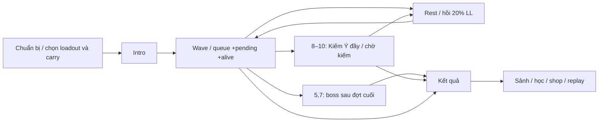

# 07 — Màn chơi, môi trường và UI

## Mục lục
- [Mười màn trên cùng campus](#mười-màn-trên-cùng-campus)
- [Đợt, thắng thua và sao](#đợt-thắng-thua-và-sao)
- [Môi trường, shelter và cự thú](#môi-trường-shelter-và-cự-thú)
- [Campus look](#campus-look)
- [UI comic và trợ năng](#ui-comic-và-trợ-năng)
- [Mobile và safe area](#mobile-và-safe-area)
- [Âm thanh và cinematic](#âm-thanh-và-cinematic)
- [Hậu kết và giới hạn](#hậu-kết-và-giới-hạn)

## Mười màn trên cùng campus

Mười [LevelDefinition](../Assets/Levels/Runtime/LevelDefinition.cs) dùng cùng [SampleScene](../Assets/Scenes/SampleScene.unity). Asset chọn sky, spawnPoint/yaw, zones, waves, spawnTable, scaling, realm/tier, bosses và parTime. Zone là vị trí/radius của khe nứt; RoomGraph cung cấp topology, không phải scene load riêng cho mỗi tòa nhà.

Bảng dưới được trích từ Level 01–10 và giải GUID của spawnTable; số wave là planned trước Shaban thêm riêng. Realm index 0–6 theo Luyện Khí→Độ Kiếp.

| Màn / asset | Tên | Quái theo đợt (chưa cộng Shaban riêng) | HP× / ST× / tốc× | AI | Realm index / tầng | Par (s) | Roster được phép |
|---|---|---|---|---|---|---:|---|
| [1](../Assets/Levels/Data/Level01.asset) | Khe Nứt Đầu Tiên | 3+3 | 1 / 1 / 1 | T1 | 0 / 1 | 240 | tieu-yeu, liem-hon, hoa-trung |
| [2](../Assets/Levels/Data/Level02.asset) | Độc Vụ Hành Lang | 5+5 | 1.3 / 1.25 / 1.03 | T1 | 0 / 3 | 300 | tieu-yeu, doc-nhan, liem-hon, hoa-trung |
| [3](../Assets/Levels/Data/Level03.asset) | Kẻ Săn Hồn | 4+5+4 | 1.8 / 1.8 / 1.06 | T1 | 1 / 1 | 420 | tieu-yeu, doc-nhan, liem-hon, thiet-giap-nguu |
| [4](../Assets/Levels/Data/Level04.asset) | Đêm Mất Điện | 6+6+6 | 2.2 / 2.1 / 1.09 | T1 | 1 / 3 | 480 | tieu-yeu, doc-nhan, liem-hon, thiet-giap-nguu, bao-thi |
| [5](../Assets/Levels/Data/Level05.asset) | Săn Hồn Giả | 7+7+8 | 3 / 2.8 / 1.12 | T2 | 2 / 1 | 600 | tieu-yeu, doc-nhan, liem-hon, thiet-giap-nguu, bao-thi |
| [6](../Assets/Levels/Data/Level06.asset) | Huyết Nguyệt | 5+6+6+9 | 3.5 / 3.2 / 1.16 | T2 | 2 / 3 | 660 | tieu-yeu, doc-nhan, liem-hon, thiet-giap-nguu, bao-thi, quang-ma, anh-yeu, trieu-hon-su, duc-yeu |
| [7](../Assets/Levels/Data/Level07.asset) | Săn Hồn Thức Tỉnh | 6+6+8+9 | 4.6 / 4.2 / 1.2 | T2 | 3 / 1 | 780 | tieu-yeu, doc-nhan, liem-hon, thiet-giap-nguu, bao-thi, quang-ma, anh-yeu, trieu-hon-su, duc-yeu |
| [8](../Assets/Levels/Data/Level08.asset) | Xích Hỏa Giáng Thế | 32 | 6.4 / 5.8 / 1.25 | T3 | 4 / 1 | 720 | tieu-yeu, doc-nhan, liem-hon, thiet-giap-nguu, bao-thi, quang-ma, hoa-trung, anh-yeu, trieu-hon-su, duc-yeu, hoa-linh |
| [9](../Assets/Levels/Data/Level09.asset) | Chu Tước Phần Thiên | 16+20 | 8.4 / 7.6 / 1.3 | T4 | 5 / 1 | 900 | tieu-yeu, doc-nhan, liem-hon, thiet-giap-nguu, bao-thi, quang-ma, hoa-trung, anh-yeu, trieu-hon-su, duc-yeu, hoa-linh |
| [10](../Assets/Levels/Data/Level10.asset) | Tam Thú Lâm Không | 13+15+17 | 10.5 / 9.6 / 1.35 | T4 | 6 / 1 | 1080 | tieu-yeu, doc-nhan, liem-hon, thiet-giap-nguu, bao-thi, quang-ma, hoa-trung, anh-yeu, trieu-hon-su, duc-yeu, hoa-linh |

Màn 3 có thêm ShabanElite ở đợt 3:13 quái trong waves +1 elite=14. Màn 5 có 22 quái+boss; màn 7 hiện 29 quái+boss=30. Asset màn 1–2 T1 và màn 7 T2 khác kế hoạch T0/T3. Roster 8–10 có 11 loại, giữ đủ 7 loại gốc cộng 4 P19; roster được phép không bảo đảm mọi loại xuất hiện trong mọi đợt random. FinalWave có cấu hình riêng trong [Spawn08](../Assets/Levels/Data/Spawn08.asset), [Spawn09](../Assets/Levels/Data/Spawn09.asset), [Spawn10](../Assets/Levels/Data/Spawn10.asset).

## Đợt, thắng thua và sao

[LevelDirector](../Assets/Levels/Runtime/LevelDirector.cs) kiểm queue/pending/countableAlive trước clear; summon không cản điều kiện counted wave, có cleanup riêng. Boss và sky có win-hold để không thắng sớm. Thua khi player Defeated sau xử lý Hộ Mệnh; kết quả trả sao/thời gian/kills, không trừ Tu Vi hoặc LT đã học. Vật phẩm đã dùng mất qua Inventory, vật phẩm chưa dùng giữ.

Rest mặc định 15 s hồi 20%maxLL. Chỉ 9–10 được `CanChangeSkills` trong Rest; mở panel rest tạm dừng countdown bằng đẩy phaseUntil và chu kỳ lửa không advance. Không cho đổi kỹ năng giữa active wave chỉ vì API Equip cấp thấp có thể được gọi.

[StarEvaluator.Evaluate](../Assets/Levels/Runtime/StarEvaluator.cs) trả bitmask:1 hoàn thành,2 không revive và seconds≤par,4 thử thách riêng. Ba bit có thể đánh giá độc lập; không bắt buộc đạt sao thời gian mới có bit thử thách.

| Màn | Điều kiện bit 4 hiện hành |
|---|---|
| 1 | giantHandKills≥3, lastDamage skillID đúng Đại Thủ của player |
| 2 | poison projectile hits≤3 |
| 3 | eliteKilled và encounter→kill≤60 s |
| 4 | IceLightning reactions≥5 của player |
| 5 | không dùng item hồi HP; kỹ năng hồi phục không tự là healUsed |
| 6 | có summoner được đếm, diệt đủ và không chủ nào summon lần 2 |
| 7 | seconds<780, khác dấu≤par của bit 2 |
| 8 | không nhận `thien-hoa`/`long-no` ngoài trời |
| 9 | readyCount=2 và cả 2 Summoned delay≤10 s |
| 10 | Generation Chain completions≥3 |

Firehit nhận trong nhà không làm mất bit 4 màn 8; Feather/Meteor cũng không được Hit() tính như outdoorFireHits chỉ từ tên “lửa”. Đọc skillId/source thay suy từ màu VFX.

## Môi trường, shelter và cự thú

[BlackoutEvent](../Assets/Levels/Runtime/LevelEvents/BlackoutEvent.cs) màn 4 và [BloodMoonEvent](../Assets/Levels/Runtime/LevelEvents/BloodMoonEvent.cs) màn 6 là event đặc biệt. [SkyLightingController](../Assets/CampusRiftUI/Runtime/SkyLightingController.cs) áp preset/brightness; BloodMoon outdoor quái×1,15 speed, không tăng trong nhà.

[Collision README](../Assets/Collision/README.md) mô tả collider tĩnh: BoxCollider cho hộp kín thật; MeshCollider không convex giữ lỗ cửa/sàn; cầu thang dùng mặt dốc đã xác minh. Không bọc cả phòng hoặc giếng thang bằng hộp. Cửa/cabin chuyển động có ownership riêng. [CampusAutomaticDoor.Update/PlayerNear](../Assets/Scripts/CampusAutomaticDoor.cs) nhận người từ hai phía, giữ mở khi ngưỡng có người, cộng khoảng dự báo theo tốc tiếp cận; default openingDistance 1,8 m, closeDelay 1,2 s. README cửa ghi 486 controller của lần setup lịch sử; không coi con số đó là audit mới. Tương tác thang máy hiện đi qua action Interact của CampusInput; phím E ghi trong README cũ không thay binding G hiện hành.

[ShelterDetector.Evaluate](../Assets/SkyBeast/Runtime/ShelterDetector.cs) dùng override rồi 3 ray lên 60 m, Environment mask, không cứng “ở tòa nào là Indoor”. Nút graph Yard có thể thực nằm dưới mái; P13 giữ 40 lệch baseline trong 2126 mẫu (98,1185% phù hợp nhãn), vì 39 Yard dưới mái và 1 observation bán che. Đây là khác biệt semantic label và physics, không tự gọi 40 bug mới.

Thiên Hỏa gây 8 tick/0,5 s trong 4 s; Outdoor/Partial/Indoor giảm khác nhau. Rồng orbit trên cao là visual/scheduler; mưa cosmetic quanh camera không định vị mọi damage. [Chương04 mục9](04-THUAT-TOAN-QUAI.md#9-cự-thú-bầu-trời-và-thiên-hỏa) và [chương03 Thiên Kiếm](03-CHIEN-DAU-KY-NANG-VFX.md#kiếm-ý-và-thiên-kiếm) giải thích thuật toán.

Ba model hiện hành:023 Xích Hỏa Giao,026 Tà Hóa Chu Tước,020 Cửu U Hỏa Long Vương. SkyBeastScheduler màn 10 xen nguồn phun rồi đổi từng pha; animation socketMouth tạo throat/cone đúng nguồn. Ordinary attack không hạ cự thú; SwordHit lấy một giai đoạn. Sau boss7 có reveal, sau màn 10 có dawn/credits, không phải màn kết quả xuất hiện ngay sau 0,5 s.

## Campus look

[CampusLookBuilder](../Assets/CampusLook/Editor/CampusLookBuilder.cs) và [CampusSurfaceQuality](../Assets/CampusLook/Runtime/CampusSurfaceQuality.cs) xử lý vật liệu campus. [LOOK report](../task/look/REPORT-LOOK.md) ghi 12 material chung,102 remap FBX, texture Poly Haven CC 0 với [LICENSES](../Assets/CampusLook/LICENSES.md). Tường ngà/vàng phai, bê tông/sân gạch, kim loại gỉ, mái tôn, gỗ/đất/cỏ và kính bụi tạo cảm giác cũ mà giữ geometry gốc.

Shader `Campus Rift/Weathered URP Lit` dùng BaseColor+Normal+ARM (ambient occlusion/roughness/metallic), triplanar/world-space, noise theo vị trí, vệt mưa/rêu chân tường. Triplanar chiếu từ nhiều hướng để tránh UV kéo dãn, đổi lại thêm sample GPU. Mobile quality chọn một hướng world-space và bỏ normal/detail/notice nặng. “Terrazzo” hiện là biến thể concrete, không bộ texture terrazzo riêng.

27 texture: bề mặt 1 K, sky 2 K, Android ASTC 6×6, mipmap, không Readable. Sky chụp thật có 6 material day/dusk/night/blood/inferno/eclipse; shader thêm trăng/nhật thực. Không thêm từng decal mesh cho vệt cũ; tránh tăng object/collider/draw overhead.

LOOK profile ghi saturation−7, contrast+3, exposure+0,12, white balance+3 và vignette nhẹ. Ink mặc định tắt, setting nhẹ PC strength 0,12; code PC renderer có feature không nghĩa người chơi luôn bật Ink. Mobile không SSAO. Unique material 254→164 theo report là số tài nguyên, **không phải số draw call giảm 90 hoặc FPS đã tăng**. Chưa kiểm mọi surface/góc cả 10 màn.

## UI comic và trợ năng

[ComicTheme](../Assets/CampusRiftUI/Runtime/ComicTheme.cs) là palette/font/sprite registry; [UiKit](../Assets/CampusRiftUI/Runtime/UiKit.cs) dựng widget, [UIFoundationBuilder](../Assets/CampusRiftUI/Editor/UIFoundationBuilder.cs)/[ComicUIBuilder](../Assets/CampusRiftUI/Editor/ComicUIBuilder.cs) dựng scene/prefab. UI “code-built” có runtime page và dữ liệu serialized, không toàn bộ là OnGUI mỗi frame.

| Quy ước | Tham số / source |
|---|---|
| Màu | Navy(13,27,42), Ink(2,5,10), Gold(245,179,1), Paper(255,243,212) |
| Nút | MinimumButtonHeight 68, Border 6 px, CornerRadius 14 |
| Text | Comic Vietnamese font; heading bold/italic/uppercase, body học font đứng |
| Clip góc bo | Mask với alpha sprite 9 slice; RectMask2D riêng không cắt góc bo |
| Readability plate | nền tối theo rect chữ, raycastTarget false để không chặn nút |
| Loading/transition | thời gian unscaled để panel vẫn animate khi Pause |

HubUI/HubPages/HubEndgame dựng các tab thư viện/công pháp/shop/cảnh giới/bản đồ/hậu kết. LoadoutUI chọn 4 skill/carry, LevelHUD hiện HP/LL/Energy/wave, boss/sky bars/fire warning/Kiếm Ý khi phù hợp. UIStateManager sở hữu pause/timeScale/cursor, không panel nào tự sửa Time.timeScale để làm hit-stop.

[Accessibility](../Assets/CampusRiftUI/Runtime/Accessibility.cs) P23 đã có 3 cỡ chữ 1/1,15/1,3; AccessibleText giữ authored size để không scale cộng dồn. Bảng màu colorblind kèm 9 ký hiệu khác silhouette; tắt/rút rung/flash tôn trọng settings. SlowReading×1,5 cho study, exam×1; ImportantCaptions phụ đề âm quan trọng. [P23 PROGRESS](../task/p23/PROGRESS.md) có smoke 68/0 trợ năng+25/0 gameplay nhưng chưa là REPORT hoàn thành phát hành.

[TutorialDirector.Update/Advance/Skip](../Assets/CampusRiftUI/Runtime/TutorialDirector.cs) dựng thẻ hướng dẫn theo ngữ cảnh, không tự pause gameplay. Ba nhóm gồm Sảnh 5 bước, combat màn 1 có 6 bước, Thiên Hỏa từ màn 8 có 2 bước; văn bản tách PC/mobile và EN/VN. PC H chuyển bước, Backspace bỏ nhóm; mobile có nút riêng. Một số bước tự chuyển khi mở Course, học bài mastered, mua đan, đi 2 m, đánh/né hoặc nhận callback dùng Đại Thủ/vật phẩm. Tiến độ và cờ bỏ qua nằm ở profile.tutorial; card ẩn khi consent hoặc cinematic đang chiếm màn hình. Câu hướng dẫn “đạt 80% để nhận Tu Vi” là diễn giải đơn giản của tutorial; quy tắc thưởng quiz đầu thực tế ở chương 06 vẫn trả theo score đầu tiên, không có gate 80% chung cho mọi EXP.

## Mobile và safe area

[CampusInput](../Assets/Controls/Runtime/CampusInput.cs) gom PC/mobile thành CampusAction. PC Q/E/R/F là 4 slot, Ctrl: Dash, V: Thiên Kiếm, G: Interact, Tab: Lock,1/2/3 Items; WASD/Shift/Space giữ movement/boost/jump. Cụm nút mobile theo loadout, drag aim bằng pointer ownership; circular ICanvasRaycastFilter bỏ chạm góc vuông nhưng vẫn giữ touch đang kéo ra ngoài vòng.

[MobileControlsHUD](../Assets/Controls/Runtime/MobileControlsHUD.cs)/[MobileTouchZone](../Assets/Controls/Runtime/MobileTouchZone.cs) dùng Screen.safeArea để tránh notch; safe area áp UI, camera vẫn full-screen. Điện thoại rộng có thể UI scale khác pixels; không dùng RectTransform width như pixelRect camera. AR có [ARScreenLayout](../Assets/ARRift/Runtime/ARScreenLayout.cs) riêng fit 1920×1080 vào safe area.

POLISH 2 mới nhất: joystick chỉ movement; BOOST riêng **giữ để chạy, thả để dừng**. `JoystickAutoSprint=false`, `BoostToggle=false` mặc định; migration MobileBoostSeparated reset auto một lần cho setting cũ, sau đó giữ lựa chọn người dùng. Hold BOOST khi idle không tốn Energy. Có opt-in auto/toggle trong Settings, không xóa cơ chế đó.

Layout hiện hành theo [POLISH2 fix2](../task/polish2/REPORT-POLISH2-fix2.md): BOOST ở tọa độ tham chiếu (−320,450), đường kính 104, cạnh Nhảy (−120,450), đường kính 112. Tấn công đường kính 210 ở góc phải dưới; bốn kỹ năng xếp vòng cung phía trên/trái nó. Tương tác/Khóa/Né/Hủy đường kính 88; trạng thái font 14. Tạm dừng đặt dưới toàn bộ panel thể trạng, gồm dòng Linh Lực.

[MobileControlsHUD.ApplySafeArea](../Assets/Controls/Runtime/MobileControlsHUD.cs) tính khung bao cả nút, caption, trạng thái rỗng, Hủy/Ultimate đang ẩn và pulse 7%. Cụm phải nằm ở x≥64%; joystick/Tạm dừng ở x≤30%; giữ vùng trung tâm x32–64%, y20–85% thoáng. Scale hiệu dụng được kẹp theo chỗ trống của cả cụm, không ghi lại setting người dùng: yêu cầu 1,2 cho khoảng 0,878 ở 2400×1080 hoặc 0,872 ở 1600×720; inset còn khoảng 0,848/0,827. MobileTouchZone dùng scale thực này cho kéo kỹ năng.

Hai touch joystick+BOOST độc lập; pause/chuyển mode reset latch. Fix1 có 52/0 smoke rồi kiểm bố trí cuối riêng; fix2 có 60/0 ở 8 cấu hình full/inset. Lượt fix2 bị assembly reload sau 49 check, lưu checkpoint và tiếp tục 11 check chưa chạy; báo cáo giữ exception lịch sử và Assertion InputSystem lúc dừng Play. Đây là bằng chứng Editor, Android vật lý chưa kiểm.

## Âm thanh và cinematic

[SettingsManager](../Assets/CampusRiftUI/Runtime/SettingsManager.cs) sở hữu mixer volume; [GameSfx](../Assets/Audio/Runtime/GameSfx.cs) mapping/audio UI/3D; [LevelMusicDirector](../Assets/Audio/Runtime/LevelMusicDirector.cs) có 2 AudioSource 2D streaming, crossfade 1,5 s theo sin/cos equal-power. Source volume 0,38 thường/0,1 Thiên Kiếm, mixer duck còn áp thêm; không sửa MusicVolume liên tục trong music director.

Track:1–2 dusk,3–7 night trừ boss;8 giao;9 bird→king;10 giao→bird→king; story ending dawn. AudioListener.pause freeze game nhưng UI jingle source được cho phép bỏ pause. [SkyBeastAudioDuck](../Assets/SkyBeast/Runtime/SkyBeastAudioDuck.cs) gầm rồng giảm music 10 dB và ambient 65%, khôi phục Settings nếu đổi trong duck.

Minion voice mapping **màn lẻ quai-nho-2/màn chẵn quai-nho-3**, một clip mỗi run, chỉ nearest alive audible, loop đồng phase DSP. Shaban/rồng/SFX không bị luật nearest minion triệt. Tháp dùng màn nguồn `(floor−1)%10+1`; không mô tả quai-nho-1 đã xóa là nguồn hiện hành.

[P21StoryCinematic](../Assets/SkyBeast/Runtime/P21StoryCinematic.cs) reveal 7 s, dawn 20 s, credits 13 trang theo [P21 report](../task/p21/REPORT-P21.md); [HeavenSwordShotTrack](../Assets/SkyBeast/Runtime/HeavenSwordShotTrack.cs) Timeline shot cho 3 cự thú. Cinematic có skip/cleanup và restore camera/AI/sky ownership; effects không che chữ học. Harness timeout 2,7 s có thể thấy chưa Victory do credits, không tự kết luận game kẹt.

## Hậu kết và giới hạn

[EndgameFactory.Tower/Nightmare](../Assets/Levels/Runtime/EndgameFactory.cs): Tháp mở sau clear 10, dùng source zones luân phiên 10 màn,1 wave đủ 11 loại, HP/damage `min(5,1+.08*(floor−1))`, tối đa 32 actor planned gồm boss; mỗi 5 tầng elite, mỗi 10 Shaban. Luật 3 tuần FireMoon/Lightning/Silence đổi thứ Hai UTC. Nightmare mở từng màn sau mask 7, HP/ST/speed×1,5, AI+1 đến T4,2 affix; fire timing×0,8 vẫn giữ rest 15 s/Fury 12 s.

[EndgameService](../Assets/Progression/Runtime/EndgameService.cs)20 achievements ở 3 nhóm, local records, title và cosmetic costume không stat buff. Trần thưởng hậu kết 100 LT/ngày UTC. [P22 report](../task/p22/REPORT-P22.md)112/0 smoke, chưa leo 30 tầng liên tục/cân bằng thực chiến. Báo cáo triển khai không thay người chơi/giảng viên/Android acceptance.

## Mobile HUD — batch 1007 (07/10/2026)

Bố cục Job1 thay phần POLISH2 ở trên: joystick, Tương tác, Khóa, Tạm dừng và Đồ ở trái; Đánh, Nhảy, Né, BOOST và bốn chiêu theo vòng cung ở phải. Caption ngắn nằm trong nút; trạng thái bằng màu/vòng hồi chiêu. Giữ safe area, vùng trung tâm x32–64%, y20–85% và kẹp scale hiệu dụng, không ghi lại scale người chơi.

Job7 bổ sung theo dõi `SafeRoot.localToWorldMatrix` ở LateUpdate sau FitFrame để đặt lại nút khi tổ tiên đổi scale/position sau resize. Caption Hư Không Bích dùng “HƯ KHÔNG” trên mobile, tên đầy đủ giữ trong công pháp. Settings bỏ offset chiều cao handle của slider ngang: Unity tự stretch handle theo parent, nên offset dương từng làm handle vượt track. Các sửa sau focused FAIL chưa được chạy lại đúng assertion; kết quả và giới hạn kiểm chứng sẽ ghi trong REPORT Job7.

[ItemWheelUI](../Assets/CampusRiftUI/Runtime/ItemWheelUI.cs) thay hàng ô vật phẩm trên mobile. Chạm Đồ dưới250ms dùng lựa chọn nhanh; giữ từ250ms mở vòng, kéo/thả chọn và dùng; tâm hoặc ngoài vòng hủy. Vật phẩm hết, passive, cooldown hoặc không cần dùng bị xám theo cùng `PlayerItems.Availability` mà `Use` kiểm lại. Vòng không pause và không giành touch joystick. PC giữ B mở vòng bằng chuột; 1/2/3 vẫn dùng vật phẩm. Khi vòng mở, camera/click tấn công được chặn, cursor được phục hồi khi đóng.

Dòng số lượng cao 38 px để chứa chữ ở cỡ 130% mà không giảm font. Focused audit mobile cỡ lớn của P23Gameplay đã PASS sau sửa này.

AR dùng canvas safe area riêng. Các nhãn trong nút tròn nằm trong hình vuông nội tiếp và autosize. Linh Ấn là thanh mảnh; chỉ hiện chuỗi đang khớp tiền tố. Nút ? giữ hướng dẫn đầy đủ. Hướng dẫn Chủ động/An toàn và thao tác tay chỉ hiện 5 giây đầu trận. Mục tiêu Đấu Long thành toast mép trên 3 giây, hiện lại khi giáp, điểm yếu hoặc trạng thái sẵn sàng đổi; Thiên Kiếm có vòng nhỏ cạnh rail. Tri Thức chỉ hiện bảng đáp án dưới cùng khi chữ phù văn bị cắt. Luyện Ấn là dải 1360×132 px tại 1/3 trên, nền bán trong suốt, hướng dẫn chỉ hiện 5 giây đầu.

[REPORT Job1](../task/batch-1007/REPORT-1-MOBILE-HUD.md) ghi thiết kế/ảnh; kết quả hồi quy và APK nằm ở REPORT Job7 khi hoàn tất. Ảnh posed Editor không chứng minh thao tác trên điện thoại.
