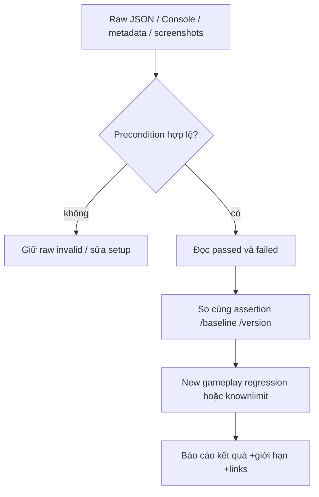

# 08 — Hiệu năng, build và kiểm thử

## Mục lục
- [Ngân sách runtime](#ngân-sách-runtime)
- [VFX batching, pool và LOD](#vfx-batching-pool-và-lod)
- [Render scale, adaptive quality và nhiệt](#render-scale-adaptive-quality-và-nhiệt)
- [Build Android và Windows](#build-android-và-windows)
- [Giấy phép và gói phát hành](#giấy-phép-và-gói-phát-hành)
- [Harness và chính sách test](#harness-và-chính-sách-test)
- [Đọc Artifacts và baseline](#đọc-artifacts-và-baseline)
- [Checklist máy thật](#checklist-máy-thật)
- [Trạng thái phát hành hiện hành](#trạng-thái-phát-hành-hiện-hành)

## Ngân sách runtime

Ngân sách là giới hạn thiết kế hoặc tuning code, khác số đo thiết bị. Chi phí có ba nhóm: CPU gameplay/physics/animation, GPU shader/geometry/overdraw, bộ nhớ/cấp phát. Giảm số quái không tự giảm cost shader toàn màn; giảm particle không sửa thuật toán tạo rác C#.

| Hệ thống | Giới hạn hiện hành / source |
|---|---|
| Quái queued campus | [LevelDirector](../Assets/Levels/Runtime/LevelDirector.cs): PC 14 /mobile 9; summon có đường riêng |
| Think minion | [MinionBrain](../Assets/Enemies/Runtime/MinionBrain.cs): gần 5 Hz, xa>40 m 2 Hz, jitter 0–0,05 s |
| Squad explicit path | [SquadTactics](../Assets/Enemies/Runtime/SquadTactics.cs): tối đa 3/frame, chia với Warning |
| Shaban particles | [ShabanEnemyBridge.Configure](../Assets/Enemies/Runtime/ShabanEnemyBridge.cs): runtime clone 320 PC/160 mobile, không sửa asset chung |
| Shelter | [ShelterDetector](../Assets/SkyBeast/Runtime/ShelterDetector.cs): player 5 Hz/quái 2 Hz,3 ray/mẫu |
| AR actor/inference | ≤6 quái; nominal 20 Hz 512 px /reduced 12 Hz 384 px; một frame pending |
| Mục tiêu AR | 30 FPS máy tầm trung, inference≤30 ms, RAM tăng thêm<60 MB — chưa nghiệm thu thiết bị |

Khi profile phải ghi target/build, resolution, pipeline/quality, camera, số actor thật trong frustum, pha fire, VSync/FPS cap, thời gian warmup/mẫu và có capture/MCP trong mẫu không. Một con tồn tại nhưng ngoài camera vẫn có AI, không có cùng render cost với con nhìn thấy.

## VFX batching, pool và LOD

[FireMeteorBatch](../Assets/SkyBeast/Runtime/FireMeteorBatch.cs) thay 216 LineRenderer/288 GameObject bằng 1 renderer+mesh 72 slot,1008 vertex/720 triangle. [SkyStrikeRibbonBatch](../Assets/SkyBeast/Runtime/Attacks/SkyStrikeRibbonBatch.cs) gom 6 ribbon cho meteor gameplay,84 vertex/60 triangle. Slot tồn tại rồi update mesh; không SetActive GameObject mỗi meteor khi vào/ra.

[PERF-FIRE report](../task/perf/REPORT-PERF-FIRE.md) isolation cho thấy Editor Hierarchy refresh do bật/tắt GO là phần lớn nguyên nhân, không đủ bằng chứng “shader GPU là thủ phạm”. Sau batching PC High Rest 97,65/Breath 96,92 FPS (giảm 0,75%), nhưng đây là Editor 1920×1080, cùng camera/AI giữ,5 s/mẫu. [Fix1](../task/perf/REPORT-PERF-FIRE-fix1.md) sửa hình vệt,106,88→106,30 FPS (0,54%); không so số tuyệt đối khác phiên để kết luận tốc độ tăng thêm.

| Cosmetic fire | High | Low | Mobile |
|---|---:|---:|---:|
| Meteor cap /rate mỗi giây |72/44|48/30|36/22|
| Spark mỗi impact |16|12|8|
| Cột smoke /scorch |6/24|4/16|3/12|
| Cap spark/smoke/flash/ember/plume |256|192|128|
| Rolling billow cap |96|64|48|
| Mouth flame rate/s |64|44|32|
| Dư Hỏa fire/smoke rate/s |10/4|7/3|5/2|

[FireVisualQuality.Current](../Assets/SkyBeast/Runtime/FireVisualQuality.cs) ưu tiên Mobile khi actual mobile hoặc mobilecontrols; nếu PC thì override/quality 0 Low, khác High. Preview Override không ép High trên mobile vì nhánh mobile được xét trước. Damage/timing không phụ thuộc chất lượng cosmetic.

Pool giảm Instantiate/Destroy nhưng vẫn cần reset subscriptions, status, shader property, coroutine, audio, path/targets. [SkillVfxPool](../Assets/Skills/Core/Runtime/SkillVfxPool.cs) và [SkillSet2VisualBatch](../Assets/Skills/Core/Runtime/SkillSet2VisualBatch.cs) tái dùng geometry; P18 shape 32 slot, mobile giảm mesh trang trí. Các phép ToArray/LINQ/List tại explosion/roster/retreat vẫn có allocation; không tuyên bố toàn game 0 GC vì một benchmark VFX 0 B.

[EnemyQuality](../Assets/Enemies/Runtime/EnemyQuality.cs) mobile lodBias≤0,55; enemy Animator CullUpdateTransforms, applyRootMotion false. LODGroup chuyển mesh theo tỷ lệ màn hình; animation bounds sai có thể cull mất cánh/đầu. ARForceLOD 1 nếu có, không chung cho Shaban/rồng. Texture ASTC 6×6/mipmap/không Readable và audio Streaming giảm RAM/IO phù hợp loại asset; không bật ReadWrite mọi mesh để chữa validator.

Frame Debugger 293→247**events** trong PERF-FIRE không phải 247 draw call GPU. Material unique giảm trong LOOK cũng không chứng minh draw call/FPS. Native Windows P11 có benchmark riêng; không dùng kết quả PC RTX 3060 thay Android tầm trung.

## Render scale, adaptive quality và nhiệt

PC_RPAsset scale 1, Mobile 0,8; AR session clone mặc định 1. [ARAdaptiveQuality.Update](../Assets/ARRift/Runtime/ARAdaptiveQuality.cs) chậm dưới 27 FPS liên tục 5 s hoặc thermal status≥3 thì giảm renderScale 0,85 cho lượt visit; không tự tăng lại trong visit. Thermal đọc Power Manager SDK 29+ mỗi 2 s, catch unsupported trả false; không có package Adaptive Performance độc lập trong manifest ngoài engine module.

[FrameSampler.Update](../Assets/ARRift/Runtime/FrameSampler.cs) hạ 20→12 Hz và 512→384 khi giảm tải/thermal; timer slow ở sampler còn decay 0,25×dt khi frame nhanh. Giảm render pixels và cadence giúp nhiệt nhưng phải đo trade-off precision/latency. Thoát scene phục hồi pipeline trước đó; không ghi Quality asset AR thay PC/mobile.

30 FPS có budget≈33,3 ms/frame,60 FPS≈16,7 ms. Median FPS không thay p95 frametime hoặc thermal 10 phút; GC spike/periodic bake có thể gây giật dù mean FPS đẹp. Không báo 139 FPS XR Simulation thành“Android≥30 FPS đã đạt”.

## Build Android và Windows

Job DOCS không chạy các lệnh dưới. Đây là quy trình tái hiện cho developer khi được giao build.

[AndroidApkBuild.BuildTo](../Assets/Editor/AndroidApkBuild.cs) yêu cầu EditMode, Android Build Support và active Android; lấy enabled scene từ EditorBuildSettings, kiểm file tồn tại. Script đặt IL2CPP/ARM64/min SDK 26/target API automatic, package com.campusrift.game, debug keystore, không AAB/split binary. BuildPlayer Report ghi result/duration/errors/warnings/bytes/scene; build thất bại throw BuildFailedException.

```text
Edit Mode → import/compile source mới → kiểm content gate
kiểm scene enabled / Android API / XR optional / graphics GLES3
BuildTo(path, development)
đọc build-summary +warnings +Console
xác minh APK: manifest /DEX /ABI /model compression/hash
ghi hash và provenance bản build
```

[ARAndroidBuildProcessor.OnPostGenerateGradleAndroidProject](../Assets/ARRift/Editor/ARAndroidBuildProcessor.cs) copy Kotlin source mới vào generated project kể cả incremental, viết keep ProGuard, manifest VIBRATE/sensorLandscape. Templates [main](../Assets/Plugins/Android/mainTemplate.gradle)/[launcher](../Assets/Plugins/Android/launcherTemplate.gradle) có placeholder Unity; không sửa generated Gradle rồi kỳ vọng lần build sau còn. Model.task phải STORED/noCompress, DEX có Bridge/Listener/GestureRecognizer, JNI ARM64; chỉ APK file tồn tại không đủ.

PlayerSettings GLES3-only/pre-transform false là quyết định fix 2; target SDK 0 là automatic, phải đọc merged manifest/APK để biết API thật. Landscape activity manifest và Scene LandscapeLeft là hai lớp cấu hình. Compile hook mới chưa import có thể build sử dụng hook cũ: fix 2 hai attempt đầu còn userLandscape, compile/refresh rồi lần 3 sensorLandscape.

Windows tools [p17_builds.py](../Tools/p17_builds.py), [p23_builds.py](../Tools/p23_builds.py) điều phối development/release và evidence. P17 Windows dùng Mono; không suy Windows cũng IL2CPP chỉ vì Android IL2CPP. Bàn giao cả EXE+Data+UnityPlayer/Mono/runtime, không một EXE đơn. Với release phải xác nhận không DEV shortcut/harness/QA define, hồ sơ QA đặt riêng, save/settings thật giữ nguyên.

APK lịch sử ký debug để nội bộ, không là gói đã publish store. Keystore phát hành, versioning, ABI/store policy phải được review khi phát hành thật; Docs không cung cấp keystore password/key hoặc trạng thái phê duyệt store không có trong project.

## Giấy phép và gói phát hành

Ghi attribution theo [CampusLook LICENSES](../Assets/CampusLook/LICENSES.md), [P19 Replacement LICENSES](../Assets/Enemies/Models/ReplacementP19/LICENSES.md), [Audio LICENSES](../Assets/Audio/LICENSES-P17.md), [AR LICENSES](../Assets/ARRift/LICENSES.md) và license từng skill/dragon. Model Mage CC-BY-SA 3 giữ source/dẫn xuất license tương ứng; CC 0/CC-BY không tự đồng nhất mọi tài nguyên.

Credits P21 tập hợp provenance; asset người dùng giữ nguồn đã cung cấp. Kiểm ZIP archive gồm source cần theo giấy phép và manifest/hash; không gửi BackUpThisFolder_ButDontShipItWithYourGame/log/save/người dùng/account settings. Không kết luận pháp lý toàn bộ app chỉ từ việc License file tồn tại.

## Harness và chính sách test

Harness là script chạy fixture+assertions rồi ghi kết quả, không test người thật. [V2RegressionRunner.Begin](../Assets/Levels/Validation/V2RegressionRunner.cs) chạy từng suite trong scene fresh, reset input/settings, đưa UI vào Gameplay; nhận outputfolder và danh sách suite. Runner ghi Summary.json/DONE.txt, child suite có JSON/screens riêng.

[TEST-POLICY](../task/TEST-POLICY.md) yêu cầu smoke trực tiếp mỗi harness 1 lượt, không broad benchmark/bot 50 trial/ma trận ảnh cho job thường. P23 brief có ngoại lệ cho một lượt hồi quy đầy đủ/mẫu PC ngắn, được ghi ở PROGRESS; không áp ngoại lệ P23 cho DOCS. Trong DOCS chỉ kiểm Markdown/dữ liệu trên đĩa.

| Loại kiểm | Chọn khi nào / ví dụ |
|---|---|
| Logic thuần/Edit | công thức ngũ hành/cultivation/content/roster; không cần giả lập GPU |
| PlayMode smoke | cast→hit/status/death/pool, wave→clear, UI input; fixture đáp ứng precondition |
| Visual | framebuffer game+Canvas, kiểm clipping/glyph/material hồng do shader lỗi/pose/scale; ảnh có metadata |
| Build/package | compile/manifest/ABI/DEX/noCompress/hash, không đồng nghĩa gameplay device |
| Máy thật | camera/AR/thermal/touch/haptic/precision/save lifecycle |
| Playtest người | usability/nhịp học–chơi/balance, không dùng DEV lethal |

Before fixture cần UIState Gameplay, player Revive, Application.runInBackground và focus/lifecycle đúng. UIStateManager.OnApplicationFocus(false)pause; Editor ẩn/minimized có thể làm FPS/timer timeout không hợp lệ. Chạy validator stair mesh trong Play không Readable từng làm 0 trial; không đổi model import toàn project chỉ để làm test xanh.

## Đọc Artifacts và baseline



`DONE` chỉ kết thúc, không phải PASS. Một JSON có failed[]cần giữ thô, dù focused probe sau đó PASS. Console cuối được clear về 0 không xóa warnings/errors trong lượt raw. Lượt focused không được thay thế kết quả full suite.

| Bằng chứng | Cách đọc |
|---|---|
| [Baseline](../Artifacts/V2/Baseline.md) | lỗi/lifecycle legacy trước V2; cần cùng assertion/fixture khi so |
| [P17 REPORT](../task/p17/REPORT-P17.md) |71 nhóm 54 PASS/17 FAIL lịch sử, có timeout/fixture; không tuyên bố tất cả PASS |
| [STABILIZE](../task/stabilize/REPORT-STABILIZE.md) | xử lý 17 FAIL và polish, giữ Shelter 40 baseline; không xóa raw P17 |
| [AI fix1](../task/ai/REPORT-AI-SQUAD-fix1.md) |33/0 squad, mẫu coverage/escape định nghĩa rõ; không mọi tốc player |
| [AR fix3](../task/ar/REPORT-AR-fix3.md) | unit 27/0, AR 25/0, Hub 42/0; placement timing vẫn chưa đạt gates, device chưa đo |
| [P23 PROGRESS](../task/p23/PROGRESS.md) | đang tiếp tục regression/build; không REPORT hoàn thành ở snapshot |
| [POLISH2](../task/polish2/REPORT-AUDIO-MOVE.md) | Boost 22/0, Look 36/0, AudioOnly 28/0; mới hơn mapping P23 cũ |
| [POLISH2 fix1](../task/polish2/REPORT-POLISH2-fix1.md) / [fix2](../task/polish2/REPORT-POLISH2-fix2.md) | Layout mobile mới: fix1 52/0 + kiểm bố trí cuối riêng; fix2 60/0, tiếp tục 11 check sau reload ở mốc 49; giữ log gián đoạn/Assertion lịch sử |

Truy một số đo phải biết source hash ở thời điểm nào. Có source fix mới sau artifact thì ghi “artifact lịch sử”, không tự xem kết quả đó là test của bản hiện tại. DOCS có [source-inventory](../task/docs/source-inventory.json) SHA256 source/config/brief/report và [source-audit](../task/docs/source-audit.json) đối chiếu bảng asset. Trong lúc viết Docs, ba source mobile đã thay đổi qua job POLISH2; tài liệu đã đọc fix1/fix2 và cập nhật layout. Job DOCS không sửa những source này và không tạo artifact FPS mới.

## Checklist máy thật

| Nhóm | Thao tác / ghi nhận |
|---|---|
| Cài đặt | ghi APK hash, model máy, Android/GPU/RAM/API, package; Camera denied/granted, ARCore Optional |
| Game thường | menu→Hub→đọc/quiz→shop→4 skill/carry→L1; touch movement/boost/aim/cast/dodge/item/pause; đóng–mở save |
| Heavy combat | L7 boss, L10 Breath/Fury/Thiên Kiếm; ghi CPU/GPU/GC, p50/p95 frametime, actor, VFX quality |
| Thermal | chơi 10 phút, tải đầu/cuối, máy nóng, quality drop, không chỉ mẫu 5 s |
| AR placement | Bàn/Sàn ít texture/ánh sáng yếu; reticle timing, tap/auto, pinch/drag/world anchor/drift |
| AR camera | viewport full/rotation/display matrix/autofocus/Depth/light; preview đúng không đủ chứng minh background |
| Cử chỉ |5 gesture×30 lần, tay trái/phải/30–80 cm; latency p50/p95, nhầm không tay≤1/phút, combos |
| Lifecycle | mất tracking/app background/menu, resume ổn 1 s, thoát scene 2 lần, camera released/pipeline game khôi phục |
| Tiện nghi |haptic/reduce shake/reduce flash/3 cỡ chữ/palette/captions/safearea |
| Nội dung/usability |3–5 sinh viên và giảng viên; không DEV/hồ sơ cheat, telemetry opt-in |

Xem [AR DEVICE-TEST](../task/ar/DEVICE-TEST.md) và [Perf-Mobile](../Artifacts/V2/Perf-Mobile.md). Nếu không có số device, đánh“chưa đo”; không điền Editor/mock vào ô Android.

## Trạng thái phát hành hiện hành

P17 có 4 build lịch sử và Windows startup smoke; Mốc 5 còn chờ người chơi/Android/giảng viên. AR fix 3 APK 548.558.335 bytes,0 build errors/**58 warnings**, debug ký; chưa cài/chơi thiết bị trong report. P23 chưa có REPORT cuối, không ghi Mốc 6 đã hoàn thành chỉ vì runtime 21 skill/P22 tồn tại. DOCS không tạo build mới và không thay trạng thái phát hành của các job đó.
