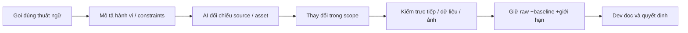

# 09 — Thuật ngữ và khái niệm

**Dev chỉ cần nắm chắc các khái niệm và thuật ngữ sau là có thể vibe coding toàn bộ Campus Rift.**

“Vibe coding” ở đây là biết gọi đúng tên thứ cần làm, mô tả đúng yêu cầu cho AI, đọc và kiểm được kết quả. Danh sách là bản đồ học và ra lệnh, không bảo đảm chỉ dùng AI là tự động có game tốt; developer vẫn chịu trách nhiệm kiểm hành vi, dữ liệu và bằng chứng.

## Mục lục

- [01. C# và Unity cơ bản](#nhóm-01)
- [02. Rendering và URP](#nhóm-02)
- [03. Vật lý và va chạm](#nhóm-03)
- [04. Animation](#nhóm-04)
- [05. Input và mobile](#nhóm-05)
- [06. UI](#nhóm-06)
- [07. Âm thanh](#nhóm-07)
- [08. AI quái](#nhóm-08)
- [09. Toán game](#nhóm-09)
- [10. Chiến đấu và game design](#nhóm-10)
- [11. AR](#nhóm-11)
- [12. Deep Learning và thị giác máy tính](#nhóm-12)
- [13. Dữ liệu, save và nội dung học](#nhóm-13)
- [14. Hiệu năng](#nhóm-14)
- [15. Build và phát hành](#nhóm-15)
- [16. Quy trình làm việc với AI agent](#nhóm-16)
- [Lộ trình học tối thiểu](#lộ-trình-học-tối-thiểu)
- [Bẫy thường gặp khi vibe coding game này](#bẫy-thường-gặp-khi-vibe-coding-game-này)

<a id="nhóm-01"></a>
## 01. C# và Unity cơ bản

| # | Thuật ngữ | Định nghĩa | Dùng ở đâu trong Campus Rift | Câu lệnh mẫu cho AI |
|---:|---|---|---|---|
| 1 | **Class (lớp)** | Kiểu dữ liệu gom trạng thái và hành vi của một đối tượng. | LevelDirector giữ vòng đời một màn. [Nguồn/hệ thống](../Assets/Levels/Runtime/LevelDirector.cs) | “Tạo lớp quản lý đợt quái, tách dữ liệu màn khỏi hành vi runtime.” |
| 2 | **Object / Instance (đối tượng)** | Một bản cụ thể được tạo từ một lớp hoặc prefab, có trạng thái riêng. | Mỗi EnemyInstance có HP và scaling riêng. [Nguồn/hệ thống](../Assets/Enemies/Runtime/EnemyInstance.cs) | “Reset trạng thái của từng instance khi trả quái về pool.” |
| 3 | **Component (thành phần)** | Một chức năng gắn trên GameObject; nhiều component hợp thành hành vi. | Player có Combat, SpiritPower và SkillLoadout. [Nguồn/hệ thống](../Assets/Combat/Runtime/SpiritPower.cs) | “Thêm component dùng Linh Lực, tìm dependency trong Awake.” |
| 4 | **GameObject** | Đối tượng Unity chứa Transform và các component. | Root director, quái, ARCaster và UI. [Nguồn/hệ thống](../Assets/Levels/Runtime/LevelDirector.cs) | “Tạo GameObject cho caster AR dưới battlefield root, quản lý cleanup theo scene.” |
| 5 | **MonoBehaviour** | Lớp component nhận callback Unity như Awake, Update, OnDisable. | LevelDirector, MinionBrain và các HUD. [Nguồn/hệ thống](../Assets/Levels/Runtime/LevelDirector.cs) | “Dùng MonoBehaviour cho lifecycle scene, giữ công thức trong lớp logic thuần.” |
| 6 | **Transform** | Lưu vị trí, xoay, scale và quan hệ cha con. | Actor campus và root chiến trường AR. [Nguồn/hệ thống](../Assets/Levels/Runtime/LevelDirector.cs) | “Đặt visual dưới root có scale, giữ collider và navigation root riêng.” |
| 7 | **Prefab** | Mẫu GameObject serialized để tạo nhiều bản giống cấu trúc. | EnemyArchetype tham chiếu prefab quái. [Nguồn/hệ thống](../Assets/Enemies/Runtime/EnemyArchetype.cs) | “Sửa visual prefab quái và giữ GUID cùng component gameplay.” |
| 8 | **Serialization (tuần tự hóa)** | Chuyển dữ liệu thành dạng lưu trữ; Unity chỉ hỗ trợ một số kiểu/field theo quy tắc. | LevelDefinition asset và ProfileData JSON. [Nguồn/hệ thống](../Assets/Levels/Runtime/LevelDefinition.cs) | “Dùng list key/count trong save JsonUtility thay dictionary.” |
| 9 | **ScriptableObject** | Asset dữ liệu có thể dùng chung, không cần tồn tại như object trong scene. | LevelDefinition, SkillDefinition và AI profile. [Nguồn/hệ thống](../Assets/Levels/Runtime/LevelDefinition.cs) | “Đưa bảng hệ số HP theo màn vào ScriptableObject, không sửa asset khi chạy.” |
| 10 | **Awake / Start** | Awake khởi tạo component; Start chạy trước Update đầu khi component được bật. | LevelBootstrap đợi Start player/UI. [Nguồn/hệ thống](../Assets/Levels/Runtime/LevelBootstrap.cs) | “Cache component trong Awake, chờ hai frame trước bắt đầu màn đã chọn.” |
| 11 | **Update / FixedUpdate / LateUpdate** | Update theo frame, FixedUpdate theo bước physics, LateUpdate sau Update để hoàn thiện pose/camera. | Brain Update, animation LateUpdate, camera player. [Nguồn/hệ thống](../Assets/Levels/Runtime/LevelDirector.cs) | “Đặt chỉnh pose phụ thêm trong LateUpdate và tránh cộng offset lặp.” |
| 12 | **Coroutine** | Hàm có thể tạm nhường thực thi rồi tiếp tục, vẫn chạy trên main thread Unity. | Boss Execute và cinematic. [Nguồn/hệ thống](../Assets/Levels/Runtime/LevelDirector.cs) | “Viết coroutine warning rồi impact, hủy và dọn token khi owner chết.” |
| 13 | **Event / Delegate (sự kiện)** | Delegate biểu diễn lời gọi hàm; event cho listener đăng ký nhận thông báo. | LevelEvents và EnemyDied. [Nguồn/hệ thống](../Assets/Levels/Runtime/LevelEvents.cs) | “Phát event chết một lần, hủy đăng ký khi component bị disable.” |
| 14 | **Interface (giao diện)** | Hợp đồng hàm/property để nhiều loại đối tượng được gọi thống nhất. | IDamageable, IQuestionGrader, ILearningClock. [Nguồn/hệ thống](../Assets/Levels/Runtime/LevelDirector.cs) | “Định nghĩa interface chấm câu hỏi rồi thêm grader nối cặp.” |
| 15 | **Singleton / Service** | Singleton cung cấp một instance dùng chung; service thực hiện một trách nhiệm của hệ thống. | ProfileService và EnemyDirector.Ensure. [Nguồn/hệ thống](../Assets/Progression/Runtime/ProfileService.cs) | “Tạo Ensure tránh hai director, reset static khi SubsystemRegistration.” |
| 16 | **Namespace / Assembly** | Namespace tổ chức tên; assembly là đơn vị biên dịch và dependency thật. | Namespace CampusRift.*, không asmdef game. [Nguồn/hệ thống](../Assets/Levels/Runtime/LevelDirector.cs) | “Kiểm vòng dependency trước khi tách module thành asmdef.” |

<a id="nhóm-02"></a>
## 02. Rendering và URP

| # | Thuật ngữ | Định nghĩa | Dùng ở đâu trong Campus Rift | Câu lệnh mẫu cho AI |
|---:|---|---|---|---|
| 17 | **Render Pipeline** | Chuỗi bước dựng hình từ scene thành ảnh trên màn hình. | URP PC/mobile và bản sao AR. [Nguồn/hệ thống](../Assets/Settings/PC_RPAsset.asset) | “Chọn pipeline riêng cho AR, khôi phục pipeline cũ khi thoát.” |
| 18 | **Renderer Feature** | Pass bổ sung của URP, gắn trên renderer asset. | ComicInk và AR Background. [Nguồn/hệ thống](../Assets/CampusRiftUI/Runtime/ComicInkFeature.cs) | “Thêm AR Background vào renderer AR, giữ renderer game thường độc lập.” |
| 19 | **Shader** | Chương trình GPU xác định cách vertex và pixel được dựng. | Weathered URP Lit và meteor batch. [Nguồn/hệ thống](../Assets/Settings/PC_RPAsset.asset) | “Sửa shader vệt lửa có lõi sáng, gradient và fade gần camera.” |
| 20 | **Material** | Bộ shader cùng texture/tham số dùng để vẽ bề mặt. | CampusLook dùng vật liệu chung. [Nguồn/hệ thống](../Assets/Settings/PC_RPAsset.asset) | “Dùng sharedMaterial cho campus, tránh tạo một material mỗi renderer.” |
| 21 | **PBR** | Mô hình vật liệu/ánh sáng dựa trên đặc tính vật lý như kim loại và độ nhám. | Quái P19 và campus cũ kỹ. [Nguồn/hệ thống](../task/models/PIPELINE.md) | “Gắn albedo, normal, metallic/smoothness đúng kênh của shader URP.” |
| 22 | **Albedo / Base Color** | Màu nền bề mặt trước hiệu ứng ánh sáng, thường không chứa bóng mạnh đã vẽ sẵn. | Texture tường và model. [Nguồn/hệ thống](../Assets/Settings/PC_RPAsset.asset) | “Giảm bão hòa albedo nguồn rồi kiểm dưới ánh sáng màn đêm.” |
| 23 | **Normal Map** | Texture mã hóa hướng pháp tuyến nhỏ để tạo cảm giác gồ ghề mà không thêm mesh. | Bề mặt CampusLook và P19. [Nguồn/hệ thống](../Assets/Settings/PC_RPAsset.asset) | “Import normal đúng loại và tắt detail nặng trên mobile.” |
| 24 | **Roughness / Smoothness** | Độ nhám/độ bóng chi phối độ rộng phản xạ; thường là hai đại lượng đảo chiều theo shader. | ARM nguồn chuyển cho URP. [Nguồn/hệ thống](../Assets/Settings/PC_RPAsset.asset) | “Kiểm roughness chuyển sang smoothness, không dùng trực tiếp sai kênh.” |
| 25 | **Emission / HDR** | Emission là ánh sáng bề mặt phát ra; HDR cho giá trị sáng vượt miền màu thông thường. | Lửa, rune và Hỏa Linh. [Nguồn/hệ thống](../Assets/Settings/PC_RPAsset.asset) | “Giảm emission che silhouette quái nhưng giữ lõi dung nham.” |
| 26 | **Bloom / SSAO** | Bloom tạo quầng điểm sáng; SSAO ước tính bóng tiếp xúc trong không gian màn hình. | PC renderer và volume, mobile giảm tính năng. [Nguồn/hệ thống](../Assets/Settings/PC_Renderer.asset) | “Đo chi phí SSAO riêng và giữ mobile không bật pass nặng.” |
| 27 | **Render Scale** | Tỷ lệ kích thước ảnh 3D trung gian so với viewport. | PC 1, mobile 0,8, AR reduced 0,85. [Nguồn/hệ thống](../Assets/Settings/Mobile_RPAsset.asset) | “Hạ render scale phiên AR mà giữ camera rect toàn màn hình.” |
| 28 | **Triplanar / World-space Projection** | Chiếu texture theo tọa độ thế giới hoặc nhiều hướng để bớt lệ thuộc UV. | Shader campus chống kéo UV. [Nguồn/hệ thống](../Assets/Settings/PC_RPAsset.asset) | “Dùng triplanar PC và một hướng world-space cho mobile.” |

<a id="nhóm-03"></a>
## 03. Vật lý và va chạm

| # | Thuật ngữ | Định nghĩa | Dùng ở đâu trong Campus Rift | Câu lệnh mẫu cho AI |
|---:|---|---|---|---|
| 29 | **Collider** | Hình thể đơn giản hoặc mesh dùng cho va chạm/truy vấn physics. | Campus, quái, cửa và shrine. [Nguồn/hệ thống](../Assets/Combat/Runtime/CombatLine.cs) | “Giữ capsule gameplay khi thay rig visual.” |
| 30 | **Rigidbody** | Component để physics mô phỏng động lực học, vận tốc và va chạm. | Hệ physics Unity; không tự thêm cho NavMesh actor. [Nguồn/hệ thống](../Assets/Scripts/CampusExplorer.cs) | “Kiểm ownership trước khi thêm Rigidbody vào quái đang do agent điều khiển.” |
| 31 | **CharacterController** | Capsule điều khiển chuyển động bằng code, không phải Rigidbody động. | CampusExplorer và proxy legacy AR disabled. [Nguồn/hệ thống](../Assets/Scripts/CampusExplorer.cs) | “Đặt stepOffset bằng 0 trước khi proxy nhận scale AR nhỏ.” |
| 32 | **Trigger** | Collider báo vào/ra vùng mà không chặn vật lý như collider rắn. | Vùng tương tác và thể tích môi trường. [Nguồn/hệ thống](../Assets/Combat/Runtime/CombatLine.cs) | “Tạo trigger chỉ báo tương tác, bỏ nó khỏi solid raycast.” |
| 33 | **Layer / LayerMask** | Layer phân nhóm object; mask chọn nhóm được truy vấn hoặc va chạm. | Environment và lớp actor/sky. [Nguồn/hệ thống](../Assets/Combat/Runtime/CombatLine.cs) | “Giữ Environment trong solid mask và loại actor khỏi kiểm mái.” |
| 34 | **Raycast** | Bắn tia tìm giao hình thể để kiểm mặt đất, vật cản hoặc điểm ngắm. | CombatLine và ShelterDetector. [Nguồn/hệ thống](../Assets/SkyBeast/Runtime/ShelterDetector.cs) | “Dùng ba ray lên 60 m để phân shelter, không suy từ tên tòa nhà.” |
| 35 | **SphereCast / CapsuleCast** | Quét thể tích dọc một đoạn để không lọt vật cản mà tia mảnh bỏ sót. | Charge, FlyingMotor và clearance. [Nguồn/hệ thống](../Assets/Enemies/Runtime/FlyingMotor.cs) | “Quét sphere trước mỗi bước charge, dừng ở tường thật.” |
| 36 | **Line of Sight (LOS)** | Kiểm đường nhìn giữa hai điểm có bị vật rắn cản không. | Attack và reaction lan qua CombatLine. [Nguồn/hệ thống](../Assets/Combat/Runtime/CombatLine.cs) | “Kiểm LOS lại tại impact để không đánh xuyên cửa vừa đóng.” |
| 37 | **NavMeshObstacle / Carving** | Vật cản có thể khoét tạm vùng đi được của NavMesh, thường có độ trễ cập nhật. | Void Wall và Ngũ Chỉ Sơn. [Nguồn/hệ thống](../Assets/Skills/VoidWall/Runtime/VoidWallSkill.cs) | “Invalidate path ngay và sau carving settle, thêm swept collision guard.” |
| 38 | **Swept Collision** | Kiểm cả đoạn chuyển động giữa hai frame thay chỉ vị trí cuối. | Đạn và dash/charge tốc độ cao. [Nguồn/hệ thống](../Assets/Combat/Runtime/CombatLine.cs) | “Kiểm va chạm từ vị trí trước tới sau để đạn không xuyên tường.” |
| 39 | **Physics Query NonAlloc** | Truy vấn ghi vào buffer có sẵn để giảm cấp phát mảng mới. | RaycastNonAlloc/SphereCastNonAlloc trong runtime. [Nguồn/hệ thống](../Assets/Combat/Runtime/CombatLine.cs) | “Dùng buffer 24 hit, kiểm khi đầy và lọc collider của owner.” |

<a id="nhóm-04"></a>
## 04. Animation

| # | Thuật ngữ | Định nghĩa | Dùng ở đâu trong Campus Rift | Câu lệnh mẫu cho AI |
|---:|---|---|---|---|
| 40 | **Rig / Bone** | Bộ xương biến đổi mesh qua quan hệ các bone. | Model quái/rồng và visual avatar. [Nguồn/hệ thống](../Assets/Enemies/Runtime/EnemyAnimationDriver.cs) | “Giữ rig wrapper riêng, không orbit collider root khi bị hút.” |
| 41 | **Skinning / Bone Weight** | Trọng số quyết định vertex chịu ảnh hưởng của từng bone. | Pipeline Blender P19 tối đa 4 weights. [Nguồn/hệ thống](../Assets/Enemies/Runtime/EnemyAnimationDriver.cs) | “Chuẩn hóa weights và kiểm vertex không có bone influence.” |
| 42 | **Animator Controller** | State graph chọn clip và transition dựa parameter hoặc lời gọi. | EnemyAnimationDriver và boss. [Nguồn/hệ thống](../Assets/Enemies/Runtime/EnemyAnimationDriver.cs) | “Thêm state Stun và kiểm HasState trước khi CrossFade.” |
| 43 | **Animation Clip** | Dữ liệu pose theo thời gian, có thể in-place hoặc có chuyển động root. | 24 clip chung và 4 clip vai P19. [Nguồn/hệ thống](../Assets/Enemies/Runtime/EnemyAnimationDriver.cs) | “Map clip theo profile, không đổi gameplay windup chỉ vì clip dài.” |
| 44 | **Root Motion** | Chuyển động lấy từ animation root thay code/agent. | Enemy driver tắt root motion. [Nguồn/hệ thống](../Assets/Enemies/Runtime/EnemyAnimationDriver.cs) | “Tắt root motion để NavMesh sở hữu translation của quái.” |
| 45 | **Crossfade / Blend** | Chuyển mượt giữa pose/clip trong khoảng thời gian. | Driver blend 0,12 s và cự thú 0,18 s. [Nguồn/hệ thống](../Assets/Enemies/Runtime/EnemyAnimationDriver.cs) | “CrossFade từ clip time 0 và giữ impact clock đúng warning.” |
| 46 | **Impact Frame** | Thời điểm đòn chạm trong clip, cần đồng bộ damage với hình. | BeginAttack dùng authoredImpact/windup. [Nguồn/hệ thống](../Assets/Enemies/Runtime/EnemyAnimationDriver.cs) | “Chỉnh playback rate để impact clip rơi đúng cuối telegraph.” |
| 47 | **Playback Rate** | Hệ số tốc độ phát animation, khác tốc độ di chuyển object. | Run/strafe và boss warnings. [Nguồn/hệ thống](../Assets/Enemies/Runtime/EnemyAnimationDriver.cs) | “Clamp rate 0,45–1,8 khi FootPlant để torso không chạy quá nhanh.” |
| 48 | **Inverse Kinematics (IK)** | Tính pose bone để đạt mục tiêu đầu/cuối, ví dụ chân tiếp đất. | Pipeline rig và EnemyFootPlant. [Nguồn/hệ thống](../Assets/Enemies/Runtime/EnemyFootPlant.cs) | “Giữ bàn chân stance theo chuyển động NavMesh, kiểm trượt chân.” |
| 49 | **Additive Pose** | Offset pose thêm sau animation chính, cần gỡ offset cũ trước áp mới. | AirborneHeight và head look. [Nguồn/hệ thống](../Assets/Enemies/Runtime/EnemyAnimationDriver.cs) | “Undo offset hips cũ rồi áp độ cao nhảy trong world space.” |
| 50 | **Animator Culling** | Giảm cập nhật transform animation khi không nhìn thấy. | CullUpdateTransforms cho quái và rồng. [Nguồn/hệ thống](../Assets/Enemies/Runtime/EnemyAnimationDriver.cs) | “Kiểm bounds cánh dơi trước bật culling để không biến mất khi vẫn thấy.” |

<a id="nhóm-05"></a>
## 05. Input và mobile

| # | Thuật ngữ | Định nghĩa | Dùng ở đâu trong Campus Rift | Câu lệnh mẫu cho AI |
|---:|---|---|---|---|
| 51 | **Input Action** | Ý định thao tác như Attack hoặc Dash, độc lập phím cụ thể. | CampusAction và action map. [Nguồn/hệ thống](../Assets/Controls/Runtime/CampusInput.cs) | “Route Q/E/R/F tới Skill1–4, không hardcode tên skill trong UI.” |
| 52 | **Binding** | Liên kết thiết bị/phím với action. | Phím PC và button mobile. [Nguồn/hệ thống](../Assets/Controls/Runtime/CampusInput.cs) | “Đổi Interact sang G, kiểm không trùng skill slot E.” |
| 53 | **Control Mode** | Chế độ input đang chọn, không luôn trùng nền tảng đang build. | CampusInput.Mobile trong Editor/Android. [Nguồn/hệ thống](../Assets/Controls/Runtime/CampusInput.cs) | “Test mobile mode trong Editor rồi ghi rõ chưa test thiết bị.” |
| 54 | **Touch / Pointer ID** | Mã phân biệt các ngón hoặc con trỏ trong cùng thời điểm. | Joystick và BOOST hai contact độc lập. [Nguồn/hệ thống](../Assets/Controls/Runtime/CampusInput.cs) | “Giữ ownership mỗi pointer, không lấy primaryTouch cho mọi nút.” |
| 55 | **Joystick Dead Zone** | Vùng quanh tâm không tính chuyển động để tránh nhiễu tay. | Move vector và điều kiện sprint. [Nguồn/hệ thống](../Assets/Controls/Runtime/CampusInput.cs) | “Chỉ yêu cầu BOOST khi joystick thật sự di chuyển.” |
| 56 | **Hold / Toggle** | Hold duy trì khi nhấn; toggle đổi trạng thái mỗi lần bấm. | BOOST mặc định hold, toggle opt-in. [Nguồn/hệ thống](../Assets/Controls/Runtime/CampusInput.cs) | “Giữ BOOST chạy nhanh, thả dừng, reset latch khi Pause.” |
| 57 | **Drag Aim / Quick Cast** | Kéo để chọn hướng/điểm rồi thả cast; quick cast dùng ngắm sẵn. | CampusInput.SkillDrag và SkillRuntime. [Nguồn/hệ thống](../Assets/Controls/Runtime/CampusInput.cs) | “Giữ touch khi kéo ra ngoài vòng nút, cancel aim khi đổi state.” |
| 58 | **Safe Area** | Vùng màn hình tránh notch/camera cutout và system inset. | MobileControlsHUD và ARScreenLayout. [Nguồn/hệ thống](../Assets/Controls/Runtime/MobileControlsHUD.cs) | “Clamp cả biên pulse của BOOST trong Screen.safeArea.” |
| 59 | **Screen Orientation** | Hướng hiển thị portrait/landscape, áp bất đồng bộ trên Android. | ARXRLoaderControl khóa LandscapeLeft. [Nguồn/hệ thống](../Assets/ARRift/Runtime/ARXRLoaderControl.cs) | “Đợi surface ngang rồi mới InitializeLoader ARCore.” |
| 60 | **Haptics** | Rung ngắn làm feedback thao tác trên thiết bị. | ARHaptics khi cast thành công. [Nguồn/hệ thống](../Assets/ARRift/Runtime/ARHaptics.cs) | “Rung 30 ms khi cast thành công và tôn trọng setting giảm rung.” |
| 61 | **Input Reset / Latch** | Xóa trạng thái giữ/bấm đã tích để không tiếp tục thao tác sau đổi UI. | CampusInput.ResetAll. [Nguồn/hệ thống](../Assets/Controls/Runtime/CampusInput.cs) | “Reset touch và ultimate lock khi cinematic/scene kết thúc.” |

<a id="nhóm-06"></a>
## 06. UI

| # | Thuật ngữ | Định nghĩa | Dùng ở đâu trong Campus Rift | Câu lệnh mẫu cho AI |
|---:|---|---|---|---|
| 62 | **Canvas / CanvasScaler** | Canvas chứa UI; scaler đổi đơn vị layout theo kích thước màn hình. | UI menu/HUD và AR Overlay. [Nguồn/hệ thống](../Assets/CampusRiftUI/Runtime/UiKit.cs) | “Giữ Canvas toàn màn hình, fit nội dung vào safe area riêng.” |
| 63 | **RectTransform / Anchor / Pivot** | RectTransform đặt vùng UI; anchor bám cha, pivot là gốc xoay/định vị. | Hub, skill rail và nút mobile. [Nguồn/hệ thống](../Assets/CampusRiftUI/Runtime/UiKit.cs) | “Dùng anchor góc phải cho HUD, kiểm rect tại 1600×720 và 2400×1080.” |
| 64 | **Layout Group** | Component xếp các child theo hàng/cột và quy tắc kích thước. | Danh sách card Hub/loadout. [Nguồn/hệ thống](../Assets/CampusRiftUI/Runtime/UiKit.cs) | “Dùng layout group cho danh sách 21 skill, tránh tọa độ mỗi card rời rạc.” |
| 65 | **Mask / RectMask2D** | Mask alpha cắt theo hình; RectMask2D cắt hình chữ nhật. | ComicTheme.ClipThumbnail/ClipBar. [Nguồn/hệ thống](../Assets/CampusRiftUI/Runtime/ComicTheme.cs) | “Dùng Mask alpha bo góc cho thumbnail, không chỉ RectMask2D.” |
| 66 | **EventSystem / UI Raycast** | Hệ chuyển thao tác pointer tới widget qua graphic raycast. | Button/drag quiz/mobile. [Nguồn/hệ thống](../Assets/CampusRiftUI/Runtime/UiKit.cs) | “Giữ raycastTarget false cho nền trang trí để không che button.” |
| 67 | **CanvasGroup** | Điều khiển alpha, tương tác và chặn raycast cả một nhóm UI. | Panel transition và item HUD mobile. [Nguồn/hệ thống](../Assets/CampusRiftUI/Runtime/UiKit.cs) | “Đồng bộ interactable/blocksRaycasts theo Gameplay state.” |
| 68 | **TextMeshPro / SDF** | TMP dựng chữ từ atlas signed distance field để phóng rõ. | ComicVietnamese và nội dung học. [Nguồn/hệ thống](../Assets/CampusRiftUI/Runtime/ComicTheme.cs) | “Kiểm glyph tiếng Việt và clipping ở cỡ chữ 130%.” |
| 69 | **9-slice Sprite** | Chia sprite thành 9 vùng để kéo khung mà giữ góc/viền. | ComicTheme panel/button/frame. [Nguồn/hệ thống](../Assets/CampusRiftUI/Runtime/ComicTheme.cs) | “Dùng sliced sprite cho panel, không kéo giãn nguyên border.” |
| 70 | **UI State Machine** | Quy tắc chuyển màn UI và sở hữu pause/input/cursor. | UIStateManager.Set/Back. [Nguồn/hệ thống](../Assets/CampusRiftUI/Runtime/UIStateManager.cs) | “Chỉ mở Library từ Hub, giữ ngoại lệ OpenShrine trong gameplay.” |
| 71 | **Accessibility (trợ năng)** | Giúp người có nhu cầu thị giác/đọc/âm thanh dùng được sản phẩm. | P23 text size/palette/captions/slow reading. [Nguồn/hệ thống](../Assets/CampusRiftUI/Runtime/UiKit.cs) | “Thêm ký hiệu hệ khác silhouette và không kéo dài exam khi bật đọc chậm.” |
| 72 | **Text Overflow / Clipping** | Chữ vượt rect hoặc bị mask cắt mất dù string đúng. | ComicTextAudit và các lần sửa label. [Nguồn/hệ thống](../Assets/CampusRiftUI/Validation/ComicTextAudit.cs) | “Kiểm lại label dài tiếng Việt sau tăng cỡ chữ, giữ raw audit trước sửa.” |

<a id="nhóm-07"></a>
## 07. Âm thanh

| # | Thuật ngữ | Định nghĩa | Dùng ở đâu trong Campus Rift | Câu lệnh mẫu cho AI |
|---:|---|---|---|---|
| 73 | **AudioSource / AudioListener** | Source phát âm từ object; listener là vị trí nghe của người chơi. | Quái, rồng, SFX/UI và camera. [Nguồn/hệ thống](../Assets/Audio/Runtime/GameSfx.cs) | “Mute minion voice cũ trước mở nguồn nearest mới.” |
| 74 | **Audio Mixer / Bus** | Mixer gom nhóm âm và áp volume/effect theo bus. | Music/Monster trong SettingsManager. [Nguồn/hệ thống](../Assets/CampusRiftUI/Runtime/SettingsManager.cs) | “Route gầm vào Monster, giữ người dùng sở hữu MusicVolume.” |
| 75 | **Spatial Blend / Rolloff** | SpatialBlend trộn 2D/3D; rolloff giảm âm theo khoảng cách. | Minion voice 3D, rumble rồng 2D. [Nguồn/hệ thống](../Assets/Audio/Runtime/GameSfx.cs) | “Scale min/max distance theo chiến trường AR và đặt doppler 0.” |
| 76 | **Decibel (dB)** | Đơn vị logarit cho mức âm; slider tuyến tính cần đổi 20 log 10. | Mixer volume và duck−10 dB. [Nguồn/hệ thống](../Assets/CampusRiftUI/Runtime/SettingsManager.cs) | “Đổi volume 0 thành−80 dB thay log 10(0).” |
| 77 | **Ducking** | Tạm giảm âm nền khi âm quan trọng phát, rồi phục hồi. | SkyBeastAudioDuck khi gầm. [Nguồn/hệ thống](../Assets/SkyBeast/Runtime/SkyBeastAudioDuck.cs) | “Duck music 10 dB và ambient 65%, restore khi component disable.” |
| 78 | **Crossfade / Equal-power** | Trộn hai track để đổi nhạc mượt; sin/cos giữ năng lượng tương đối. | LevelMusicDirector hai voice 1,5 s. [Nguồn/hệ thống](../Assets/Audio/Runtime/LevelMusicDirector.cs) | “Crossfade track theo phase cự thú, không reset nhạc mỗi Update.” |
| 79 | **DSP Time / Phase Alignment** | Đồng hồ audio chính xác hơn frame để các loop cùng vị trí playback. | SmallMonsterVoiceStartDsp và voice.time. [Nguồn/hệ thống](../Assets/Enemies/Runtime/EnemyDirector.cs) | “Khởi loop ở(dspNow−runStart)%clip.length để nearest đổi không giật phase.” |
| 80 | **Loop / One Shot** | Loop phát lặp; one-shot phát một âm sự kiện không cần thay clip nền. | Growl loop và roar/hit/UI transient. [Nguồn/hệ thống](../Assets/Audio/Runtime/GameSfx.cs) | “Dùng one-shot impact, tránh tạo loop mới mỗi hit.” |
| 81 | **Streaming / Compression** | Streaming nạp dần audio dài; compression đổi dung lượng/CPU/quality. | Nhạc dài P17/P21. [Nguồn/hệ thống](../Assets/Audio/LICENSES-P17.md) | “Import nhạc dài Streaming, đo latency và RAM trên Android.” |
| 82 | **Nearest Voice Selection** | Chọn một nguồn minion gần nhất có thể nghe, các nguồn khác mute. | EnemyDirector.UpdateVoices. [Nguồn/hệ thống](../Assets/Enemies/Runtime/EnemyDirector.cs) | “Giữ chỉ 0/1 minion voice audible, loại boss khỏi luật này.” |

<a id="nhóm-08"></a>
## 08. AI quái

| # | Thuật ngữ | Định nghĩa | Dùng ở đâu trong Campus Rift | Câu lệnh mẫu cho AI |
|---:|---|---|---|---|
| 83 | **Finite State Machine (FSM)** | Tập trạng thái và luật chuyển rõ, phù hợp hành vi hữu hạn. | MinionBrain Spawn/Chase/Windup/Strike/Recover/Dead. [Nguồn/hệ thống](../Assets/Enemies/Runtime/MinionBrain.cs) | “Vẽ FSM và giữ Stun/Freeze ở status overlay thay bịa state mới.” |
| 84 | **Steering / Separation** | Chọn hướng chuyển động cục bộ và tách actor sát nhau. | ARMinionBrain fallback khi NavMesh không có. [Nguồn/hệ thống](../Assets/ARRift/Runtime/ARMinionBrain.cs) | “Cộng separation trong 0,7×scale rồi clamp actor trong đĩa.” |
| 85 | **NavMesh / NavMeshAgent** | NavMesh biểu diễn mặt đi được; agent tìm/follow path trên mặt đó. | MinionMotor/MonsterNavigation. [Nguồn/hệ thống](../Assets/Enemies/Runtime/MinionMotor.cs) | “Chỉ nhận PathComplete cho đường vòng squad.” |
| 86 | **Off-mesh Link** | Đoạn nối hai vùng NavMesh không liên tục, cần traversal riêng hoặc tự động. | Stair flights và Shaban.TraverseLink. [Nguồn/hệ thống](../Assets/MonsterShaban/Scripts/MonsterNavigation.cs) | “Giữ link khi stun và plan lại sau CompleteOffMeshLink.” |
| 87 | **Attack Token** | Quyền tạm để một số ít quái vào windup/strike cùng lúc. | EnemyDirector.TryAcquire/Release. [Nguồn/hệ thống](../Assets/Enemies/Runtime/EnemyDirector.cs) | “Giới hạn melee 4/ranged 4 T4, trả token khi interrupt/death.” |
| 88 | **Encirclement / Flanking** | Bao vây từ nhiều hướng; flanking tiếp cận cánh thay phía sau. | AssignSectors/SectorTarget. [Nguồn/hệ thống](../Assets/Enemies/Runtime/SquadTactics.cs) | “Chia front±22,5° và rear/cánh, đừng cho mọi actor đuổi cùng điểm.” |
| 89 | **Interception / ETA** | Chọn điểm chặn đầu khi thời gian tới của quái tốt hơn player. | Squad lead và Shaban InterceptionPlanner. [Nguồn/hệ thống](../Assets/MonsterShaban/Scripts/InterceptionPlanner.cs) | “Tính ETA bằng chiều dài path thật, bỏ shortcut không reachable.” |
| 90 | **Utility Score** | Chấm nhiều tiêu chí để chọn mục tiêu/đường có ích nhất. | SearchCandidate và PathCost. [Nguồn/hệ thống](../Assets/MonsterShaban/Scripts/MonsterSearch.cs) | “Chấm route length, shared cells, LOS và escape penalty riêng.” |
| 91 | **Route Reservation** | Nhớ các ô đường đã chọn để tuyến sau bị tăng cost. | SquadTactics.PathCost/Reserve. [Nguồn/hệ thống](../Assets/Enemies/Runtime/SquadTactics.cs) | “Dùng reservation cost, không carve geometry để tách tuyến.” |
| 92 | **Coverage / Escape Corridor** | Coverage đo góc actor phủ; escape là hành lang planner giữ cho player. | Coverage=360−maxgap, ProtectEscape. [Nguồn/hệ thống](../Assets/Enemies/Runtime/SquadTactics.cs) | “Đo actor coverage average và chừa PathComplete thay dùng target angles.” |
| 93 | **Particle Filter / Belief** | Nhiều giả thuyết có trọng số ước lượng vị trí khi mất sight. | MonsterBelief 320/160 particle. [Nguồn/hệ thống](../Assets/MonsterShaban/Scripts/MonsterBelief.cs) | “Cập nhật belief chỉ từ sight/sound/lift evidence, không hidden transform.” |
| 94 | **Negative Evidence / Memory Decay** | Chỗ thấy trống giảm tin tưởng; bằng chứng cũ mất giá trị theo thời gian. | MonsterBelief/MonsterMemory. [Nguồn/hệ thống](../Assets/MonsterShaban/Scripts/MonsterMemory.cs) | “Downweight nơi đã nhìn trống, giữ một cửa sổ grace mất sight.” |
| 95 | **Herding / Adaptation** | Lùa bằng áp lực/cửa; thích nghi từ thống kê trong run, không tự là ML. | T4 escape memory và AoE queue 60 s. [Nguồn/hệ thống](../Assets/Enemies/Runtime/SquadTactics.cs) | “Sau 3 AoE/phút mở radius 8 m, vẫn giữ một lối shelter reachable.” |

<a id="nhóm-09"></a>
## 09. Toán game

| # | Thuật ngữ | Định nghĩa | Dùng ở đâu trong Campus Rift | Câu lệnh mẫu cho AI |
|---:|---|---|---|---|
| 96 | **Vector / Magnitude / Normalize** | Vector có hướng và độ dài; normalize lấy hướng dài 1. | Move/Aim/direction của combat. [Nguồn/hệ thống](../Assets/Combat/Runtime/PlayerCombat.cs) | “Kiểm sqrMagnitude trước normalize để tránh hướng 0.” |
| 97 | **Dot Product (tích vô hướng)** | Cho mức cùng hướng và projection giữa hai vector. | Aim score, facing và intercept. [Nguồn/hệ thống](../Assets/Combat/Runtime/PlayerCombat.cs) | “Dùng dot lọc điểm trước camera, không lấy khoảng cách thay hướng.” |
| 98 | **Cross Product (tích có hướng)** | Tạo vector vuông góc và xác định bên/hướng trong 3D. | Sidestep, sword offset và rotation. [Nguồn/hệ thống](../Assets/Combat/Runtime/PlayerCombat.cs) | “Dùng Cross(up, heading) để tạo hướng né ngang.” |
| 99 | **Quaternion** | Biểu diễn xoay 3D tránh nhiều hạn chế của Euler. | Actor/camera/rồng orientation. [Nguồn/hệ thống](../Assets/Combat/Runtime/PlayerCombat.cs) | “Dùng LookRotation rồi Slerp, không cộng quaternion như vector.” |
| 100 | **Local / World Space** | Local theo parent; world theo hệ tọa độ scene. | Rig wrapper và battlefield root. [Nguồn/hệ thống](../Assets/Combat/Runtime/PlayerCombat.cs) | “Chuyển điểm sang local để giới hạn trong đĩa, giữ offset visual khác collider.” |
| 101 | **Matrix / Inverse Transform** | Ma trận gom biến đổi; inverse đưa tọa độ về hệ trước. | GestureCoordinates và TransformPoint. [Nguồn/hệ thống](../Assets/ARRift/Runtime/GestureCoordinates.cs) | “Đảo display matrix affine một lần, không double-rotate landmark.” |
| 102 | **Lerp / Slerp** | Lerp nội suy tuyến tính; Slerp nội suy xoay theo cung. | Anchor smoothing và facing. [Nguồn/hệ thống](../Assets/Combat/Runtime/PlayerCombat.cs) | “Lerp vị trí/Slerp xoay trong 0,15 s khi anchor nhảy.” |
| 103 | **Exponential Smoothing / Decay** | Dùng hàm mũ để giảm ảnh hưởng theo thời gian thực. | Evidence exp(−dt/.25) và facing. [Nguồn/hệ thống](../Assets/ARRift/Runtime/GestureStateMachine.cs) | “Dùng exp theo dt để decay không phụ thuộc frame render.” |
| 104 | **Projection / Planar Distance** | Chiếu vector lên mặt phẳng để bỏ chiều không cần thiết. | Combat distanceXZ và cone. [Nguồn/hệ thống](../Assets/Combat/Runtime/PlayerCombat.cs) | “Tính phẳng nhưng thêm gate dy để không đánh xuyên tầng.” |
| 105 | **Clamp / Saturation** | Giới hạn giá trị trong miền hợp lệ để tránh vượt thiết kế. | Defense≤.8, radius/scale và stamina. [Nguồn/hệ thống](../Assets/Combat/Runtime/PlayerCombat.cs) | “Clamp giảm damage tối đa 80%, kiểm NaN trước áp modifier.” |
| 106 | **Polygon / Convex Hull / Incenter** | Polygon là biên; convex hull bao lồi; incenter ở đây là xấp xỉ tâm tròn lớn nhất. | ARPlaneScoring. [Nguồn/hệ thống](../Assets/ARRift/Runtime/ARPlaneScoring.cs) | “Dùng shoelace/edge-distance/grid 10 cm và ghi rõ incenter xấp xỉ.” |
| 107 | **Weighted Random / Seed** | Bốc mẫu theo trọng số; seed làm kết quả có thể tái hiện. | LevelSpawnTable.Generate và RunSeed. [Nguồn/hệ thống](../Assets/Levels/Runtime/LevelSpawnTable.cs) | “Giữ seed/constraints khi thử roster, không chọn lượt đẹp để báo PASS.” |

<a id="nhóm-10"></a>
## 10. Chiến đấu và game design

| # | Thuật ngữ | Định nghĩa | Dùng ở đâu trong Campus Rift | Câu lệnh mẫu cho AI |
|---:|---|---|---|---|
| 108 | **DPS / Burst** | DPS là sát thương trung bình mỗi giây; burst là lượng lớn trong cửa sổ ngắn. | TrueFire ticks và Fire Lotus impact. [Nguồn/hệ thống](../Assets/Skills/TrueFire/Runtime/TrueFireRuntime.cs) | “Tính DPS từ hit thật/cadence, không nhân số kiếm VFX thành số hit.” |
| 109 | **Cooldown / Charge** | Cooldown là chờ dùng lại; charge là số lượt tích với hồi riêng. | SkillRuntime và VoidWall 3 charge/12 s. [Nguồn/hệ thống](../Assets/Skills/Core/Runtime/SkillRuntime.cs) | “Tách cooldown deploy 0,35 s khỏi charge recharge 12 s.” |
| 110 | **Telegraph / Anticipation** | Dấu báo trước đòn để người chơi có thời gian phản ứng. | EnemyTelegraph/windup. [Nguồn/hệ thống](../Assets/Enemies/Runtime/EnemyTelegraph.cs) | “Khóa hướng vùng warn để né ngang vẫn hợp lệ tại impact.” |
| 111 | **I-frame (miễn thương)** | Khoảng thời gian bỏ hit sau né hoặc nhận damage. | PlayerMonsterHealth và DodgeAbility. [Nguồn/hệ thống](../Assets/Combat/Runtime/DodgeAbility.cs) | “Cho Environment tick bỏ hit invulnerability nhưng vẫn đi qua receiver defense.” |
| 112 | **Crowd Control (CC)** | Hiệu ứng hạn chế di chuyển/tấn công như Freeze/Stun/Pull. | StatusEffectHost. [Nguồn/hệ thống](../Assets/Combat/Runtime/StatusEffectHost.cs) | “Boss Freeze đổi Chill 50%, Stun cap 1 s và kiểm reset trạng thái pool.” |
| 113 | **Damage Pipeline** | Chuỗi xác định damage, phòng thủ, shield, HP và phản ứng. | DamageCalculator→MonsterVitality→ReactionResolver. [Nguồn/hệ thống](../Assets/Skills/GiantHandSeal/Runtime/MonsterVitality.cs) | “Chốt multiplier một lần, không tính ngũ hành hai lần.” |
| 114 | **Elemental Counter / Generation** | Counter tăng/giảm hit theo hệ; generation nối ba cast theo vòng sinh. | ElementChart và GenerationChainTracker. [Nguồn/hệ thống](../Assets/Combat/Runtime/GenerationChainTracker.cs) | “Phân biệt khắc hệ×1,5 và chuỗi 3 cast 6 s tăng skill thứ 3×1,3.” |
| 115 | **Critical Chance / Critical Damage** | Xác suất hit chí mạng và hệ số khi xảy ra, hai tham số khác nhau. | PlayerStats/Compute và Linh Nhãn. [Nguồn/hệ thống](../Assets/Combat/Runtime/PlayerStats.cs) | “Cộng 0,2 crit chance trong kiếm trận, không tăng damage 20% mọi hit.” |
| 116 | **AoE / Hitbox / Hurtbox** | AoE đánh vùng; hitbox/hurtbox là hình thể gây/nhận hit. | isArea và các kiểm radius/cone. [Nguồn/hệ thống](../Assets/Combat/Runtime/DamageInfo.cs) | “Đánh dấu isArea đúng, kiểm LOS/floor trước lan reaction.” |
| 117 | **Faction / Aggro / Decoy** | Faction là phe; aggro là ưu tiên săn; decoy là mục tiêu giả. | SoulAlly và Shaban Target Assessment. [Nguồn/hệ thống](../Assets/Skills/SoulSummon/Runtime/SoulAlly.cs) | “Ally không nhận hoặc cộng kill như hostile, đánh giá phantom theo evidence.” |
| 118 | **Internal Cooldown (ICD)** | Thời gian khóa riêng phản ứng dù skill khác vẫn có thể hit. | readyAt[9] của ReactionResolver. [Nguồn/hệ thống](../Assets/Combat/Runtime/ReactionResolver.cs) | “Dùng ICD 1 s/receiver, loại Reaction/Environment để tránh đệ quy.” |
| 119 | **Balance / Time-to-kill / Par Time** | Balance là cân bằng trải nghiệm; TTK là thời gian hạ mục tiêu; par là mốc chấm sao. | LevelDefinition.parTimeSeconds và kế hoạch. [Nguồn/hệ thống](../Assets/Levels/Runtime/LevelDefinition.cs) | “Ghi “chưa đo thực chiến”, đo TTK bằng người chơi thay DEV lethal.” |
| 120 | **Sword Intent / Phase Gate** | Meter dựa đủ quái đợt; gate yêu cầu điều kiện trước đổi pha. | SwordIntent.Full và SkyBeastScheduler. [Nguồn/hệ thống](../Assets/SkyBeast/Runtime/SwordIntent.cs) | “Không để Fraction 100% trước WaveCleared hoặc summon cộng meter.” |

<a id="nhóm-11"></a>
## 11. AR

| # | Thuật ngữ | Định nghĩa | Dùng ở đâu trong Campus Rift | Câu lệnh mẫu cho AI |
|---:|---|---|---|---|
| 121 | **AR Foundation / Provider** | ARFoundation đưa API Unity; provider ARCore triển khai nhận không gian trên Android. | ARRift và package 6.6.2. [Nguồn/hệ thống](../Assets/ARRift/Runtime/RiftPlacementService.cs) | “Giữ provider ownership theo scene, không mở XR ở Hub.” |
| 122 | **ARSession / Tracking State** | Session quản lý phiên AR; tracking state nói mức tin cậy pose. | ARBattlefield pause/recovery. [Nguồn/hệ thống](../Assets/ARRift/Runtime/ARBattlefield.cs) | “Chỉ resume sau SessionTracking ổn 1 s, phân biệt AnchorNone/ Limited.” |
| 123 | **Plane Detection / Boundary** | Nhận mặt phẳng thật và polygon vùng đã quan sát. | HorizontalUp plane placement. [Nguồn/hệ thống](../Assets/ARRift/Runtime/RiftPlacementService.cs) | “Lọc plane subsumed, kiểm tracking height ổn 0,3 s.” |
| 124 | **AR Raycast Types** | Các loại nguồn giao: polygon, estimated plane, depth, feature point. | Choose ưu tiên theo provider hỗ trợ. [Nguồn/hệ thống](../Assets/ARRift/Runtime/RiftPlacementService.cs) | “Fallback Depth/Feature phải kiểm normal gần up và khoảng cách.” |
| 125 | **Reticle / Placement Gate** | Dấu ngắm đặt chiến trường cùng điều kiện hợp lệ. | RiftPlacementService.Evaluate. [Nguồn/hệ thống](../Assets/ARRift/Runtime/RiftPlacementService.cs) | “Tự đặt khi hit dịch<4 cm trong 0,8 s hoặc chạm để đặt ngay.” |
| 126 | **World Anchor / Attached Anchor** | Neo thế giới giữ pose độc lập plane; attached neo theo trackable plane. | Confirm world-first/fallback attach. [Nguồn/hệ thống](../Assets/ARRift/Runtime/RiftPlacementService.cs) | “Thử world anchor trước, giữ root độc lập plane để giảm merge drift.” |
| 127 | **Drift / Pose Refinement** | Pose có thể được provider điều chỉnh khi hiểu không gian tốt hơn. | FollowAnchor smoothing. [Nguồn/hệ thống](../Assets/ARRift/Runtime/RiftPlacementService.cs) | “Lerp 0,15 s khi anchor jump>3 cm, không gọi đó là bảo đảm không trôi trên thiết bị.” |
| 128 | **Light Estimation / SH** | Ước lượng hướng/cường độ ánh sáng và hệ số ánh sáng môi trường. | ARBattlefield.LightFrame. [Nguồn/hệ thống](../Assets/ARRift/Runtime/ARBattlefield.cs) | “Áp main light/ambientSH nếu provider trả, và restore ambient khi thoát.” |
| 129 | **Shadow Catcher** | Bề mặt virtual trong suốt giữ bóng 3D để hòa với bàn thật. | AR ShadowCatcher trên fixed disc. [Nguồn/hệ thống](../Assets/ARRift/Shaders/ARShadowCatcher.shader) | “Dùng đĩa 64 segment riêng cho shadow/NavMesh, không follow boundary mới.” |
| 130 | **Depth / Occlusion** | Depth ước lượng khoảng cách; occlusion dùng vật thật che virtual. | AROcclusionManager.Fastest. [Nguồn/hệ thống](../Assets/ARRift/Runtime/ARBattlefield.cs) | “Chỉ bật Depth khi provider hỗ trợ và kiểm FPS/device.” |
| 131 | **XR Loader / Simulation** | Loader khởi/dừng provider; simulation giả lập AR trong Editor. | ARXRLoaderControl và QA. [Nguồn/hệ thống](../Assets/ARRift/Runtime/ARXRLoaderControl.cs) | “Cleanup anchor trước StopSubsystems; ghi MOCK metrics không là device.” |
| 132 | **World Scale / Battlefield Disc** | Scale chuyển gameunits sang mét thật; disc là vùng chiến trường cố định. | ActualScale và ARCombatContext. [Nguồn/hệ thống](../Assets/ARRift/Runtime/ARCombatContext.cs) | “Scale cả range/speed/VFX/audio, giới hạn actor ở 90%radius.” |

<a id="nhóm-12"></a>
## 12. Deep Learning và thị giác máy tính

| # | Thuật ngữ | Định nghĩa | Dùng ở đâu trong Campus Rift | Câu lệnh mẫu cho AI |
|---:|---|---|---|---|
| 133 | **Inference / Model** | Inference chạy mô hình đã học để dự đoán từ input mới. | MediaPipe GestureBridge on-device. [Nguồn/hệ thống](../Assets/ARRift/Runtime/GestureRecognizerBridge.cs) | “Dùng model có sẵn, không tự train cử chỉ ngoài canned labels.” |
| 134 | **TFLite / .task Bundle** | TFLite là định dạng/runtime model nhẹ;.task gói model và metadata. | Streaming Assets/gesture_recognizer.task. [Nguồn/hệ thống](../Assets/ARRift/Runtime/GestureRecognizerBridge.cs) | “Đóng model STORED trong APK và xác minh hash đúng bundle.” |
| 135 | **Float16 / Quantization** | Giảm độ chính xác biểu diễn để giảm kích thước/băng thông; không luôn giảm latency. | Model bundle float16 theo nguồn Google. [Nguồn/hệ thống](../Assets/ARRift/LICENSES.md) | “Ghi đúng quantization của model, đo CPU/GPU thay suy float16 luôn nhanh.” |
| 136 | **Palm Detector / SSD Anchor** | Detector tìm vùng lòng bàn tay một lượt qua các prior box. | BlazePalm trong bundle, khác AR anchor. [Nguồn/hệ thống](../Docs/05-AR-VA-DEEP-LEARNING.md) | “Giải thích palm detection→crop→landmark, không nhầm anchor box với world anchor.” |
| 137 | **Landmark / Handedness** | Landmark là điểm hình học bàn tay; handedness dự đoán tay trái/phải. | 21 điểm 63 float và label handed. [Nguồn/hệ thống](../Assets/ARRift/Runtime/GestureRecognizerBridge.cs) | “Vẽ overlay 21 điểm, kiểm transform landmark tay trái/phải.” |
| 138 | **Embedding / MLP Classifier** | Embedding nén đặc trưng thành vector; MLP dense phân nhãn từ vector đó. | Gesture classifier 128 D và 8 classes theo model card. [Nguồn/hệ thống](../Docs/05-AR-VA-DEEP-LEARNING.md) | “Giữ classifier không đọc RGB trực tiếp, không bịa kiến trúc tự train.” |
| 139 | **Confidence / Threshold** | Score tin tưởng model và ngưỡng quyết định chấp nhận, không bảo đảm xác suất đúng thực tế. | Detector.4 và fusion.6/.45. [Nguồn/hệ thống](../Assets/ARRift/Runtime/GestureStateMachine.cs) | “Loại geometry mâu thuẫn dù score cao, đo accuracy thật.” |
| 140 | **CPU / GPU Delegate** | Backend thực thi graph model; hiệu quả phụ thuộc thiết bị/model. | Kotlin trial 30 GPU+30 CPU/cache. [Nguồn/hệ thống](../Assets/Plugins/Android/GestureBridge.kt) | “Benchmark delegate và fallback CPU khi GPU lỗi, không ép 2 thread không có API.” |
| 141 | **LIVE_STREAM / Timestamp** | Chế độ input liên tục bất đồng bộ, cần thời gian tăng đơn điệu. | recognizeAsync và timestampMs. [Nguồn/hệ thống](../Assets/Plugins/Android/GestureBridge.kt) | “Timestamp max(last+1, realtimeMs), bỏ callback cũ không khớp frame.” |
| 142 | **JNI / DirectByteBuffer** | JNI nối Java/native; direct buffer đưa memory không qua obsolete byte-array call. | Submit NativeArray→Kotlin owned copy. [Nguồn/hệ thống](../Assets/ARRift/Runtime/GestureRecognizerBridge.cs) | “Copy vào Kotlin owned buffer trước return và đóng MPImage đúng callback.” |
| 143 | **Backpressure / Latest-frame Queue** | Khi xử lý chậm, giữ frame mới nhất thay tích backlog. | FrameSampler một pending, ConcurrentQueue latest. [Nguồn/hệ thống](../Assets/ARRift/Runtime/FrameSampler.cs) | “Convert N+1 trong khi inference N, không xếp chờ 10 frame camera.” |
| 144 | **Sensor Orientation / Display Matrix** | Sensor rotation và mapping display ảnh camera cần xét để overlay đúng. | RotationFor và GestureCoordinates. [Nguồn/hệ thống](../Assets/ARRift/Runtime/GestureCoordinates.cs) | “Đảo display matrix một lần, không xoay landmark lần hai khi matrix đã có.” |
| 145 | **Geometry Fusion / Evidence** | Luật hình học kiểm model; evidence tích tín hiệu qua thời gian để bớt nhầm. | GestureGeometry/GestureStateMachine. [Nguồn/hệ thống](../Assets/ARRift/Runtime/GestureGeometry.cs) | “Duỗi 150°, gập 120°, score.6/.45, E threshold 1.5/lead.6/decay.25.” |
| 146 | **Hysteresis / Lockout / Release** | Giữ quyết định qua nhiễu, khóa bắn ngắn và chờ đổi/nhả để tránh lặp. | held và lockout.35 s/release.2 s. [Nguồn/hệ thống](../Assets/ARRift/Runtime/GestureStateMachine.cs) | “Cho đổi cử chỉ sau 350 ms để combo, giữ tay không auto fire.” |
| 147 | **One-Euro Filter** | Low-pass thích nghi: đứng yên mượt hơn, chuyển nhanh bớt trễ. | OneEuroAim pixel input, min cutoff 1.4, beta.02. [Nguồn/hệ thống](../Assets/ARRift/Runtime/OneEuroAim.cs) | “Lọc palm pixel, vHat cutoff 1, reset khi gap>.5 s.” |
| 148 | **Latency / Accuracy / False Positive** | Latency là độ trễ; accuracy là tỷ lệ đúng; false positive là kích nhầm. | AR device checklist và telemetry aggregate. [Nguồn/hệ thống](../task/ar/DEVICE-TEST.md) | “Đo end-to-end p50/p95,30 lần/gesture và nhầm không tay mỗi phút.” |

<a id="nhóm-13"></a>
## 13. Dữ liệu, save và nội dung học

| # | Thuật ngữ | Định nghĩa | Dùng ở đâu trong Campus Rift | Câu lệnh mẫu cho AI |
|---:|---|---|---|---|
| 149 | **Stable ID / Schema Version** | ID cố định liên kết nội dung/save; version mô tả cấu trúc dữ liệu. | ProfileData.version 2 và question/skillID. [Nguồn/hệ thống](../Assets/Progression/Runtime/ProfileData.cs) | “Đổi tên hiển thị mà giữ ID, có migration nếu đổi schema.” |
| 150 | **JSON / JSONL / CSV** | JSON lưu object, JSONL từng record một dòng, CSV bảng cột. | Profile/telemetry/import content. [Nguồn/hệ thống](../Assets/Learning/Runtime/LearningEngine.cs) | “Đọc CSV UTF-8 giữ newline/quote, không đổi mọi ID khi import.” |
| 151 | **Atomic Save / Backup** | Ghi temp rồi replace giúp tránh file chính bị ghi dở, backup cho recovery. | JsonProfileStore.tmp/.bak. [Nguồn/hệ thống](../Assets/Progression/Runtime/JsonProfileStore.cs) | “Nếu main/backup hỏng thì WriteBlocked, không ghi đè save người dùng.” |
| 152 | **Migration / Transient Profile** | Migration chuyển/lưu schema cũ; transient là dữ liệu QA không ghi store thật. | ProfileService.ArchiveLegacy/UseTransient. [Nguồn/hệ thống](../Assets/Progression/Runtime/ProfileService.cs) | “Archive v1 rồi test hồ sơ RAM, khôi phục profile thật và settings sau QA.” |
| 153 | **UTC / Monotonic Clock** | UTC là mốc ngày giờ; monotonic time không lùi dùng timing runtime. | ILearningClock và FrameSampler timestamp. [Nguồn/hệ thống](../Assets/Learning/Runtime/LearningClock.cs) | “Dùng UTC cho trần ngày, unscaled time cho exam và phân biệt hai loại clock.” |
| 154 | **Grader / Set Equality / Ordering** | Grader chấm đáp án; set không xét thứ tự, ordering phải đúng từng vị trí. | GraderRegistry sáu loại. [Nguồn/hệ thống](../Assets/Learning/Runtime/ExtendedGraders.cs) | “Multi Choice SetEquals, Ordering SequenceEqual, kiểm thiếu/thừa/trùng.” |
| 155 | **Spaced Repetition** | Ôn lại cách quãng để củng cố, không bắt buộc là thuật toán SM-2. | ReviewScheduler 1/3/7 ngày. [Nguồn/hệ thống](../Assets/Learning/Runtime/ReviewScheduler.cs) | “Trượt giữ badge, hẹn 1 ngày; Vàng dừng schedule.” |
| 156 | **Wrong-answer Notebook / Flashcard** | Sổ lưu câu sai để ôn; flashcard hỏi–đáp để tự nhớ. | Extended Learning/93 thẻ. [Nguồn/hệ thống](../Assets/Learning/Runtime/ExtendedLearning.cs) | “Lưu sai mỗi answer, rời sổ sau 2 đúng liên tiếp, không EXP cho lật thẻ.” |
| 157 | **Reward Cap / Anti-spam** | Trần thưởng và hạn chế phản hồi quá nhanh để giảm cày vô nghĩa. | LT 300/EXP 150 retry ngày và fast streak 5. [Nguồn/hệ thống](../Assets/Learning/Runtime/StudyEconomy.cs) | “PayAnswers trước LogCorrect, giữ lock 24 h và pause 2 phút.” |
| 158 | **Bottleneck / Breakthrough** | Bình cảnh là tier 5 đầy; đột phá bằng exam để lên realm. | CultivationService và BreakthroughExam. [Nguồn/hệ thống](../Assets/Progression/Runtime/CultivationService.cs) | “Bỏ EXP dư khi bình cảnh, thi 20 câu 80%/20 phút, retry 30 phút.” |
| 159 | **Source Attribution / Content Gate** | Nguồn trang giải trình nội dung; gate kiểm cấu trúc trước build. | CourseCsvImporter/ReleaseContentGate. [Nguồn/hệ thống](../Assets/Learning/Runtime/LearningEngine.cs) | “Giữ source/explanation mỗi câu, xuất gói để giảng viên duyệt.” |
| 160 | **Local Telemetry / Consent** | Thống kê lưu trên máy, chỉ sau đồng ý rõ ràng. | LocalTelemetry JSONL. [Nguồn/hệ thống](../Assets/Progression/Runtime/LocalTelemetry.cs) | “Ghi tên ID/count/đúng sai, không lưu ảnh camera/PII/text đáp án.” |

<a id="nhóm-14"></a>
## 14. Hiệu năng

| # | Thuật ngữ | Định nghĩa | Dùng ở đâu trong Campus Rift | Câu lệnh mẫu cho AI |
|---:|---|---|---|---|
| 161 | **Frame Budget / FPS / Frame Time** | FPS là tần suất frame, frametime là thời gian một frame; budget phụ thuộc mục tiêu. | 30 FPS AR≈33,3 ms và PC bench. [Nguồn/hệ thống](../task/perf/REPORT-PERF-FIRE.md) | “Đo p95 frame time cùng mean FPS, ghi quality/resolution/actor.” |
| 162 | **Draw Call / Render Event** | Draw call gửi lệnh vẽ; Frame Debugger event còn gồm các thao tác render khác. | PERF-FIRE 293→247 events. [Nguồn/hệ thống](../task/perf/REPORT-PERF-FIRE.md) | “Không đổi số events thành draw calls GPU, truy Profiler đúng counter.” |
| 163 | **Batching / Instancing** | Gom nhiều hình để bớt submission/renderer; instancing tái dùng mesh cho nhiều transform. | FireMeteorBatch và SkillSet2VisualBatch. [Nguồn/hệ thống](../Assets/SkyBeast/Runtime/FireMeteorBatch.cs) | “Gom 72 meteor vào một mesh pool, không SetActive 288 GO mỗi chu kỳ.” |
| 164 | **Garbage Collection (GC) / Allocation** | Cấp phát tạo object; GC thu bộ nhớ có thể gây spike. | LINQ/ToArray/queues và benchmark VFX. [Nguồn/hệ thống](../Assets/Skills/Core/Runtime/SkillVfxPool.cs) | “Đọc GC Alloc đúng scope, không nói cả game 0 B từ một harness.” |
| 165 | **Object Pool / Prewarm** | Pool tái dùng object; prewarm tạo trước để bớt spike khi lần đầu. | EnemyPool/SkillVfxPool. [Nguồn/hệ thống](../Assets/Enemies/Runtime/EnemyPool.cs) | “Prewarm đạn 20 slot, reset coroutine/status/audio khi Release.” |
| 166 | **LOD / Culling / Frustum** | LOD giảm độ chi tiết; culling bỏ vẽ ngoài vùng nhìn. | EnemyQuality/LODGroup/rồng. [Nguồn/hệ thống](../Assets/Enemies/Runtime/EnemyQuality.cs) | “Kiểm actor trong frustum và bounds animation khi so chi phí GPU.” |
| 167 | **Profiler / Frame Debugger** | Công cụ tìm cost CPU/GPU/alloc và trình tự render. | PERF-FIRE isolation và device profile. [Nguồn/hệ thống](../task/perf/REPORT-PERF-FIRE.md) | “Tách mẫu performance khỏi MCP/chụp ảnh, có metadata đúng target.” |
| 168 | **Thermal Throttling / Adaptive Quality** | Máy nóng giảm clock; quality adapt giảm tải giữ nhịp. | ARAdaptiveQuality/Sampler. [Nguồn/hệ thống](../Assets/ARRift/Runtime/ARAdaptiveQuality.cs) | “Giảm render.85 và input 12 Hz/384 khi thermal status≥3.” |
| 169 | **Texture Compression / Mipmap / Readable** | Compression giảm lưu/memory; mipmap cho mức xa; Readable giữ bản CPU. | ASTC 6×6/mipmap CampusLook. [Nguồn/hệ thống](../Assets/SkyBeast/Runtime/FireMeteorBatch.cs) | “Tắt Readable texture production, giữ normal import đúng type.” |
| 170 | **Overdraw / Transparency** | Nhiều lớp trong suốt vẽ chồng làm GPU xử lý pixel nhiều lần. | Flame/afterimage/dome. [Nguồn/hệ thống](../Assets/SkyBeast/Runtime/FireMeteorBatch.cs) | “Giảm opacity/area/particle layers và đo GPU, không chỉ đếm triangle.” |
| 171 | **Time Slicing / Cache / NonAlloc Buffer** | Chia việc qua frame và tái dùng kết quả/buffer để bớt spike. | Squad query 3/frame, corner 128, voice cache. [Nguồn/hệ thống](../Assets/Enemies/Runtime/SquadTactics.cs) | “Giữ path bank cũ trong khi plan bank mới, tối đa 3 explicit query/frame.” |

<a id="nhóm-15"></a>
## 15. Build và phát hành

| # | Thuật ngữ | Định nghĩa | Dùng ở đâu trong Campus Rift | Câu lệnh mẫu cho AI |
|---:|---|---|---|---|
| 172 | **APK / AAB** | APK là gói cài Android; AAB là bundle để kênh phân phối tạo APK phù hợp. | AndroidApkBuild xuất APK nội bộ. [Nguồn/hệ thống](../Assets/Editor/AndroidApkBuild.cs) | “Build APK development riêng, không gọi nó là AAB đã phát hành trên store.” |
| 173 | **IL2CPP / Mono** | Hai backend C#: IL2CPP chuyển qua C++ native, Mono dùng runtime Mono. | Android IL2CPP/Windows P17 Mono. [Nguồn/hệ thống](../Assets/Editor/AndroidApkBuild.cs) | “Xác minh backend mỗi target, không suy cả hai giống nhau.” |
| 174 | **ABI / ARM64** | ABI là giao ước nhị phân; ARM64 là kiến trúc Android 64 bit. | Android TargetArchitectures 2. [Nguồn/hệ thống](../ProjectSettings/ProjectSettings.asset) | “Kiểm native MediaPipe thư viện ARM64 trong APK.” |
| 175 | **Graphics API / GLES3 / Vulkan** | API đồ họa là giao diện GPU; hai đường Android khác nhau. | GLES3-only AR fix2. [Nguồn/hệ thống](../ProjectSettings/ProjectSettings.asset) | “Giữ manual GLES3 và kiểm background camera trên máy thật.” |
| 176 | **Manifest / Permission** | Manifest mô tả activity/features/permissions ứng dụng. | Camera/VIBRATE/sensorLandscape/AR optional. [Nguồn/hệ thống](../Assets/Editor/AndroidApkBuild.cs) | “Kiểm merged manifest API/orientation, không chỉ PlayerSettings.” |
| 177 | **Gradle Template / Build Hook** | Template tạo Gradle project; hook áp điều chỉnh lúc generate/build. | ARAndroidBuildProcessor copy Kotlin. [Nguồn/hệ thống](../Assets/Editor/AndroidApkBuild.cs) | “Sửa source template/hook, verify generated output không stale bridge.” |
| 178 | **DEX / JNI Library / Stripping** | DEX chứa Java byte code; thư viện JNI chứa native code; stripping bỏ code được cho là không dùng. | Bridge Listener[Preserve]/ProGuard keep. [Nguồn/hệ thống](../Assets/ARRift/Runtime/GestureRecognizerBridge.cs) | “Kiểm class/signatures trong DEX và keep callback trước release.” |
| 179 | **Keystore / Signing** | Khóa ký chứng minh nguồn/cập nhật Android, phân biệt debug/release. | Build nội bộ useCustomKeystore false. [Nguồn/hệ thống](../Assets/Editor/AndroidApkBuild.cs) | “Ghi signing debug trong report, không đưa mật khẩu/khóa vào Docs.” |
| 180 | **Development Build / Define Guard** | Build dev có diagnostics; compile guard loại shortcut QA khỏi release. | UNITY_EDITOR/DEVELOPMENT_BUILD/harness. [Nguồn/hệ thống](../Assets/Editor/AndroidApkBuild.cs) | “Rà release không DEV buttons/harness/bench define, sau đó verify package.” |
| 181 | **SHA256 / Provenance / Artifact** | Hash nhận diện bytes; provenance giữ nguồn/quy trình; artifact là sản phẩm bằng chứng. | Build index/source-inventory/LICENSES. [Nguồn/hệ thống](../task/docs/source-inventory.json) | “Ghi APK hash/source hash/license/metadata, không đoán bản đang cài.” |

<a id="nhóm-16"></a>
## 16. Quy trình làm việc với AI agent

| # | Thuật ngữ | Định nghĩa | Dùng ở đâu trong Campus Rift | Câu lệnh mẫu cho AI |
|---:|---|---|---|---|
| 182 | **Brief / Scope** | Brief quy định mục tiêu/phạm vi/deliverables; scope xác định việc được phép làm. | PROMPT-DOCS chỉ đọc game. [Nguồn/hệ thống](../task/docs/PROMPT-DOCS.md) | “Chỉ đọc code viết Docs, không Play/build/sửa run-*.ps1.” |
| 183 | **Progress / Handoff** | Nhật ký mốc và điểm còn lại giúp agent tiếp quản sau ngắt. | task/docs/PROGRESS.md. [Nguồn/hệ thống](../task/docs/PROGRESS.md) | “Kiểm disk/PROGRESS trước làm lại, cập nhật sau mỗi file.” |
| 184 | **Gate / Acceptance Criteria** | Điều kiện xác nhận mốc, phải khác một lệnh kết thúc thành công. | Content gate/testpolicy/máy thật. [Nguồn/hệ thống](../task/TEST-POLICY.md) | “Liệt kê điều kiện đạt/chưa đạt với evidence, không tự tick nghiệm thu.” |
| 185 | **Harness / Fixture / Precondition** | Harness chạy kiểm tra; fixture dựng tình huống; precondition là điều kiện đầu hợp lệ. | AR Simulation/quái player Revive. [Nguồn/hệ thống](../task/docs/PROMPT-DOCS.md) | “Giữ raw invalid fixture, đừng đổi lỗi setup thành game PASS.” |
| 186 | **Regression / Baseline** | Regression là lỗi trở lại sau thay đổi; baseline là kết quả gốc để so. | P17/STABILIZE/Shelter 40. [Nguồn/hệ thống](../Artifacts/V2/Baseline.md) | “So assertion cùng version và phân FAIL mới với known baseline.” |
| 187 | **Smoke Test / Focused Check** | Smoke kiểm luồng chính nhanh; focused check kiểm nhánh vừa đổi. | TEST-POLICY mỗi harness 1 lượt. [Nguồn/hệ thống](../task/TEST-POLICY.md) | “Chạy harness liên quan 1 lượt, focused PASS không ghi đè full raw FAIL.” |
| 188 | **Read-only Audit / Source of Truth** | Audit chỉ đọc check; source of truth là nguồn ưu tiên khi tài liệu mâu thuẫn. | DOCS theo source/asset hiện hành. [Nguồn/hệ thống](../task/docs/PROMPT-DOCS.md) | “Ghi asset GUID/class/function/params, không copy kế hoạch như code đã làm.” |
| 189 | **Visual Review / Screenshot Evidence** | Xem ảnh xác nhận layout/pose/material, không thay đo algorithm hoặc device. | Ảnh LOOK/AR/UI trong REPORT. [Nguồn/hệ thống](../task/look/REPORT-LOOK.md) | “Soi 1–2 ảnh framebuffer, ghi fixture/scale/ngôn ngữ và chỗ chưa thấy.” |
| 190 | **Raw Evidence / Report** | Raw là kết quả gốc; report giải thích kết luận và giới hạn. | JSON/Console/screens/DONE. [Nguồn/hệ thống](../task/p17/REPORT-P17.md) | “Giữ warnings/FAIL cũ, không nói DONE=PASS hoặc MOCK=Android.” |
| 191 | **Idempotence / Preservation** | Tác vụ idempotent lặp không cộng dồn; preservation giữ dữ liệu ngoài scope. | Setup/material giảm bão hòa/save backup. [Nguồn/hệ thống](../Assets/Progression/Runtime/ArtifactService.cs) | “Apply modifier keyed, kiểm hash geometry/save và không restore đè thay đổi mới.” |


## Lộ trình học tối thiểu

Học 36 khái niệm dưới theo thứ tự. Mỗi bước thử đọc một class/asset liên quan và mô tả một thay đổi nhỏ có tiêu chí kiểm rõ; không cần học thuộc mọi API Unity trước khi sửa game.

| Thứ tự | Khái niệm | Bài tập đọc/kiểm |
|---|---|---|
| 1 | Class | Phân biệt LevelDefinition và LevelDirector |
| 2 | Object/Instance | Tìm trạng thái riêng của hai EnemyInstance |
| 3 | GameObject/Component | Đọc các component của player prefab |
| 4 | Transform/local/world | Chỉ ra root và rig visual của quái |
| 5 | MonoBehaviour/Awake/Start | Giải thích LevelBootstrap đợi hai frame |
| 6 | Update/FixedUpdate/LateUpdate | Tìm ai sở hữu movement và pose |
| 7 | Interface | Theo IDamageable từ caster đến receiver |
| 8 | Event/Delegate | Theo EnemyDied và nơi unsubscribe |
| 9 | ScriptableObject | Tra một skill và level asset |
| 10 | Serialization/StableID | Đọc enum Element và ID save |
| 11 | Vector/Normalize | Đọc hướng dash khi joystick 0 |
| 12 | Dot/Product/Projection | Giải thích aim cone và cùng tầng gate |
| 13 | Quaternion/Lerp/Slerp | Theo anchor smoothing/facing |
| 14 | Collider/LayerMask | Phân Environment và actor |
| 15 | Raycast/LOS/Swept Collision | Tìm kiểm hit xuyên tường |
| 16 | InputAction/Binding | Theo Q từ phím đến slot/runtime |
| 17 | Touch/PointerID/SafeArea | Giải thích joystick+BOOST độc lập |
| 18 | UIState/Canvas/RectTransform | Theo Pause và luồng Hub→Loadout |
| 19 | DamagePipeline/ElementCounter | Tính một hit trước/sau defense |
| 20 | Cooldown/Charge/ICD | Phân ba đồng hồ khác nhau |
| 21 | Telegraph/Impact/I-frame | Tìm thời điểm có thể né đòn |
| 22 | CC/Status/Faction | Phân Freeze boss và ally |
| 23 | FSM/AttackToken | Vẽ luồng Windup→Recover |
| 24 | NavMesh/Link/PathComplete | Theo một đường stairs và một fail path |
| 25 | Flank/Intercept/ETA | Tính vì sao quái chọn front wing |
| 26 | Coverage/RouteReservation/Escape | Phân targetangle và actor coverage |
| 27 | Animation/RootMotion/LOD | Tìm translation ownership và chi phí visual |
| 28 | Pool/GC/FrameBudget | Tìm field cần reset và allocation hot path |
| 29 | JSON/AtomicSave/Transient | Mô tả file hỏng và recovery WriteBlocked |
| 30 | Grader/Review/RewardCap | Chấm multi-choice và lock 24 h |
| 31 | ARSession/Plane/Raycast | Theo reticle từ scan đến gate |
| 32 | WorldAnchor/Scale/Depth | Giải thích root độc lập plane và đĩa cố định |
| 33 | Inference/Landmark/Delegate | Theo ảnh đến model và score |
| 34 | Geometry/Evidence/OneEuro | Phân quyết định cast và lọc điểm ngắm |
| 35 | APK/IL2CPP/Manifest/Gradle | Kiểm build summary/DEX/model STORED |
| 36 | Brief/Gate/Harness/Regression | Ghi raw PASS/FAIL và giới hạn trước báo cáo |



Mẫu brief có thể dùng:

```text
Mục tiêu: [hành vi người chơi nhìn thấy]
Source: [class/function/asset ID hiện hành]
Giữ nguyên: [geometry/NavMesh/save/file được bảo vệ theo scope thật]
Tham số: [đơn vị, giá trị và source]
Hoàn thành khi: [kết quả quan sát và kiểm trực tiếp]
Evidence: [raw/ảnh/metadata, phân biệt Editor và device]
Giới hạn: [chưa đo/chưa duyệt]
```

## Bẫy thường gặp khi vibe coding game này

| Bẫy | Vì sao sai / cách tránh | Bằng chứng |
|---|---|---|
| PowerShell 5.1 đọc/ghi tiếng Việt sai | Default encoding hoặc cp1252 không phù hợp UTF-8; ghi explicit encoding và đọc lại dấu, không cố chữa bằng xóa dấu | [PERF-FIRE readerUTF-8](../task/perf/REPORT-PERF-FIRE.md) |
| Unity ghi lại Gradle hoặc incremental dùng Kotlin cũ | Sửa generated file không bền; sửa source/template/hook, Refresh/compile và kiểm DEX signature | [AR gốc](../task/ar/REPORT-AR.md), [fix2](../task/ar/REPORT-AR-fix2.md) |
| Camera AR đen do đường render chưa hỗ trợ | CPU preview có ảnh không chứng minh background GPU; thiếu feature Vulkan cần kiểm, GLES3 fix chưa được nghiệm thu máy | [AR fix2](../task/ar/REPORT-AR-fix2.md) |
| Editor mất focus làm test timeout/FPS sai | UIStateManager tự Pause khi mất focus; fixture ẩn/hot reload XR có precondition khác | [P23 PROGRESS](../task/p23/PROGRESS.md), [AR fix2](../task/ar/REPORT-AR-fix2.md) |
| Quái xếp thành hàng một dù target đặt vòng | NavMesh shortest path chung; cần reservation/detour/ETA và đo actor coverage thật | [AI bản1/fix1](../task/ai/REPORT-AI-SQUAD-fix1.md) |
| VFX chỉ scale mesh mà không scale offset/range/audio | Effect ngoài đĩa và damage không cùng tâm; scale WorldScale mọi thành phần | [AR fix1](../task/ar/REPORT-AR-fix1.md) |
| Đảo enum/đổi ID để đổi tên | Asset/save lưu số và chuỗi; chỉ đổi display name hoặc có migration | [ProfileData](../Assets/Progression/Runtime/ProfileData.cs), [Element](../Assets/Combat/Runtime/Element.cs) |
| Pool đời mới giữ gate/token/coroutine cũ | Reset HP chưa đủ; reset assignment, status, audio, collider và subscription | [AI fix1](../task/ai/REPORT-AI-SQUAD-fix1.md) |
| Static pass/global unlock AR sửa save thường | AR override theo caster context, không ghi SkillUnlockService/loadout thật | [AR REPORT](../task/ar/REPORT-AR.md) |
| 248° số đo thành threshold 250° hoặc peak thành average | Phải ghi metric definition/source/raw, không đổi ngưỡng để đạt | [AI fix1](../task/ai/REPORT-AI-SQUAD-fix1.md) |
| DONE hoặc Console clear 0 thành toàn PASS | DONE chỉ kết thúc, raw failed/warnings vẫn cần giữ; focused PASS không xóa full FAIL | [P17](../task/p17/REPORT-P17.md), [P20](../task/p20/REPORT-P20.md) |
| MOCK/Editor FPS thành Android FPS/latency | Mock không inference camera, EditorGPU/thermal khác device; bảng chưa kiểm cần giữ | [AR fix3](../task/ar/REPORT-AR-fix3.md) |
| “Cap 14” áp tuyệt đối mọi summon | Cap queue/pending khác đường direct spawn/adds; đọc source thay tên constant | [LevelDirector](../Assets/Levels/Runtime/LevelDirector.cs) |
| Prototype CSV/validation làm giảng viên đã duyệt | Structural gate không thay duyệt học thuật; giữ biên bản chờ duyệt | [P20 REPORT](../task/p20/REPORT-P20.md) |
| BasicDamage artifact chắc chỉ buff đánh thường | Implementation đẩy modifier Attack, skill cũng đọc Attack; review trigger receiver | [ArtifactService.ApplyTo](../Assets/Progression/Runtime/ArtifactService.cs) |
| Bật ReadWrite mọi mesh chữa stair validator | Lỗi đường đọc Edit/Play fixture không đòi sửa data/runtime budget toàn project | [P23 PROGRESS](../task/p23/PROGRESS.md) |
| Background resize nhầm safeArea | Safe area UI khác viewport camera; renderScale 0,85 không được làm nửa ảnh đen | [AR fix2](../task/ar/REPORT-AR-fix2.md) |

Không tự mở rộng task tài liệu thành sửa code/build để làm bằng chứng mới. Hãy ghi giới hạn và để job gameplay/QA được giao xử lý riêng.

## Thuật ngữ AR mới — batch 1007

| Thuật ngữ | Ý nghĩa trong source |
|---|---|
| Linh Ấn / Seal Energy |Meter0–100, hit+2/phảnứng+15/né+10; ngân sách tuyệt kỹ, khác Linh Lực |
| Kết Ấn / seal sequence |Chuỗi intentD1, gap1.2s; giữ tiền tố khi đầymeter, fallback chiêuđầu nếu hụt |
| Vạn Kiếm Quy Tông |V→Lên→Mở; SwordRain empowered quét disc |
| Băng Thiên Lôi Ngục |Xuống→Nắm→Lên; Freeze toàn sân+sét trễ1s |
| Thiên Thủ Hấp Tinh |Mở→Nắm; hút/gom tới6actor, damage theo sốgom |
| Kim Chung Tráo |ThumbUp; khiên1đòn/6s; perfectblock250ms phảnđạn |
| Chủ động |Opt-in Sàn+capabilityDodge; đạn vềcamera, né6DoF25cm |
| Kiếm Ý / Thiên Kiếm AR |Dọn groundqueue+bosslộ; PointingUp giữ1.5s/pitch>35° để kếtliễu |
| Rift phụ / Rift tường |Portalpolygon+anchor riêng; entrance xong quái vềdiscngang |
| Ấn Tri Thức |Quiz trong break10s, centreaim+ClosedFist; P08 vàcapAR60 dùng chung |
| Luyện Ấn |Mode90s/6pose theo nhịp100BPM; Perfect90ms/Great200ms |
| Vệt ấn |CosmeticVàng/Lam tại3/15sao, landmarkhiển thị chỉRAM |
| Thiên Thủ đôi |HaiOpenPalm ghéptrong180ms;1cost/CD,2visual vàdamage2× |
| Depth contact / Hidden |ProviderDepthray/max10frame vàcachevậtche; khôngroommesh |
| Voice keyword window |Voskngoại tuyến, chỉKếtẤn,3keyword; multiplier1.3snapshot |
| MediaProjection clip |QuyềnOSriêng từng lầnquay; video cóphòngthật, silent/max90s/gallery |

Tham chiếu runtime và giới hạn thiết bị ở [chương05](05-AR-VA-DEEP-LEARNING.md#các-mode-và-công-nghệ-ar--batch-1007-07102026). Không suy kết quả nhận dạng hoặc FPS máy thật từ screenshot/mock.
