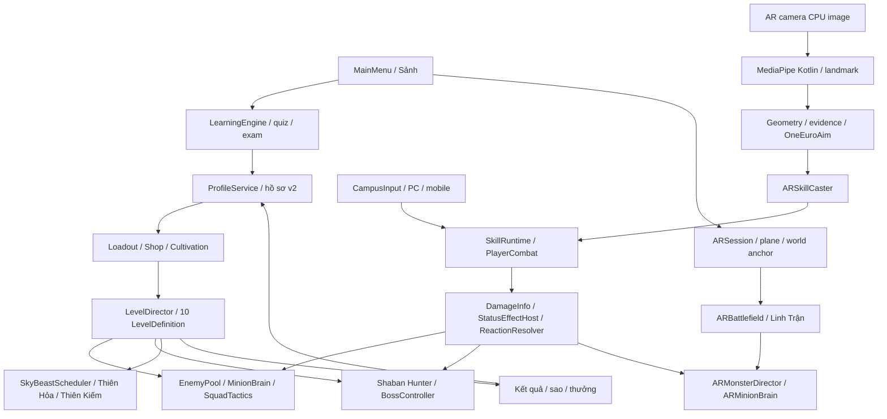

# Campus Rift — Tài liệu kỹ thuật

## Mục lục
- [Phạm vi và nguồn](#phạm-vi-và-nguồn)
- [Sơ đồ tổng thể](#sơ-đồ-tổng-thể)
- [Các chương](#các-chương)
- [Cách đọc theo vai trò](#cách-đọc-theo-vai-trò)
- [Đọc số liệu đúng cách](#đọc-số-liệu-đúng-cách)

## Phạm vi và nguồn

Bộ tài liệu giải thích bản trên đĩa ngày 06/10/2026: game hành động 3D PC/Android, học Tư tưởng Hồ Chí Minh để tăng Tu Vi và Linh Thạch, cùng AR Rift Battle điều khiển bằng cử chỉ. Code và asset là nguồn sự thật; [kế hoạch V2](../KE_HOACH_V2_HOC_DE_THANG.md), [bản đồ phase](../task/README.md) và [đặc tả AR](../task/ar/SPEC-AR-RIFT-BATTLE.md) giải thích ý định ban đầu.

Đây là job tài liệu: không chạy Play Mode, không build, không sửa code game. Các kết quả test được dẫn từ báo cáo lịch sử, không phải xác nhận mới. P23 còn đang tiếp tục theo [PROGRESS P23](../task/p23/PROGRESS.md); thiếu REPORT-P23 không có nghĩa các tính năng trợ năng P23 chưa có code. Audio/BOOST theo [POLISH2](../task/polish2/REPORT-AUDIO-MOVE.md), bố trí mobile mới nhất theo [POLISH2 fix2](../task/polish2/REPORT-POLISH2-fix2.md).

## Sơ đồ tổng thể

## Các chương

| Chương | Đọc để làm gì |
|---|---|
| [01 — Công nghệ và công cụ](01-CONG-NGHE-VA-CONG-CU.md) | Biết phiên bản, pipeline rendering/XR, plugin Android và nguồn asset |
| [02 — Kiến trúc và luồng game](02-KIEN-TRUC-VA-LUONG-GAME.md) | Tìm module, service, dữ liệu, save và vòng đời scene |
| [03 — Chiến đấu, kỹ năng, VFX](03-CHIEN-DAU-KY-NANG-VFX.md) | Hiểu damage, ngũ hành, 21 kỹ năng, combo và tài nguyên |
| [04 — Thuật toán quái](04-THUAT-TOAN-QUAI.md) | Theo từng bước spawn, FSM, vây/lùa, navigation, boss, rồng, âm thanh |
| [05 — AR và Deep Learning](05-AR-VA-DEEP-LEARNING.md) | Theo ba tầng AR → inference → quyết định → cast |
| [06 — Học tập, tiến trình, kinh tế](06-HOC-TAP-TIEN-TRINH-KINH-TE.md) | Nhập nội dung, chấm điểm, chống thưởng lặp, thi và cửa hàng |
| [07 — Màn chơi, môi trường, UI](07-MAN-CHOI-MOI-TRUONG-UI.md) | Tra bảng 10 màn, shelter, sky, comic UI, mobile và audio |
| [08 — Hiệu năng, build, kiểm thử](08-HIEU-NANG-BUILD-KIEM-THU.md) | Đọc ngân sách, artifact, baseline, cấu hình phát hành và checklist máy thật |
| [09 — Thuật ngữ và khái niệm](09-THUAT-NGU-VA-KHAI-NIEM.md) | Gọi đúng tên yêu cầu cho AI, đọc và kiểm kết quả |

## Cách đọc theo vai trò

| Vai trò | Thứ tự đọc | Điểm bắt đầu trong source |
|---|---|---|
| Gameplay | 02 → 03 → 07 → 08 | [LevelDirector.Begin](../Assets/Levels/Runtime/LevelDirector.cs), [SkillRuntime.CommitCast](../Assets/Skills/Core/Runtime/SkillRuntime.cs) |
| AI quái | 02 → 04 → 03 → 08 | [MinionBrain.Tick](../Assets/Enemies/Runtime/MinionBrain.cs), [SquadTactics.Tick](../Assets/Enemies/Runtime/SquadTactics.cs) |
| AR / CV | 01 → 05 → 03 → 08 | [RiftPlacementService.Choose](../Assets/ARRift/Runtime/RiftPlacementService.cs), [FrameSampler.Update](../Assets/ARRift/Runtime/FrameSampler.cs) |
| UI / mobile | 02 → 07 → 09 → 08 | [UiKit](../Assets/CampusRiftUI/Runtime/UiKit.cs), [CampusInput](../Assets/Controls/Runtime/CampusInput.cs) |
| Nội dung học | 06 → 02 → 07 → 08 | [LearningEngine](../Assets/Learning/Runtime/LearningEngine.cs), [QuestionBankData](../Assets/Learning/Runtime/QuestionBankData.cs) |
| Dev mới | 09 lộ trình tối thiểu → 01 → 02 → chương chuyên môn | Mỗi thuật ngữ có vị trí dùng và câu lệnh mẫu |

## Đọc số liệu đúng cách

- **Asset hiện hành:** số serialized trên đĩa. Khi asset đã gán, giá trị khởi tạo C# chỉ là fallback, không tự ghi đè asset.
- **Code hiện hành:** quy tắc và công thức thực thi, đôi khi hardcode; dự án chưa dữ liệu hóa mọi tham số như kế hoạch muốn.
- **Báo cáo lịch sử:** kiểm trong fixture cụ thể. DEV lethal và giữ AI chứng minh luồng thắng, không chứng minh cân bằng.
- **Mục tiêu / chưa xác nhận:** FPS Android, nhiệt, chính xác cử chỉ, thời lượng thực chiến và duyệt giáo trình phải kiểm riêng. MOCK Editor không phải MediaPipe trên điện thoại.

Đường dẫn nguồn trong bộ này tính từ `Docs/`. Thuật ngữ tiếng Anh được giải thích ở lần dùng hoặc tại chương 09. Không có đáp án giáo trình dài, thông tin tài khoản hoặc khóa bí mật trong bộ tài liệu.
